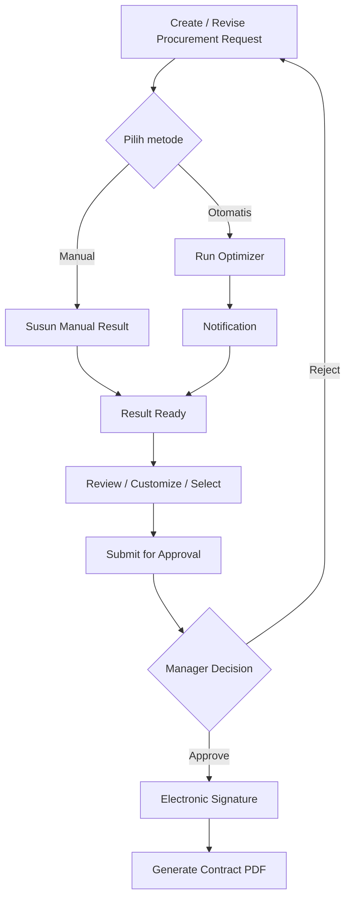

# Product Overview

## Mini Procurement Contract Optimizer

> Status: Acuan produk MVP 
> Terakhir diperbarui: 28 Agustus 2026

## 1. Ringkasan

Mini Procurement Contract Optimizer adalah aplikasi web berbasis Django untuk memproses kebutuhan procurement sebuah instansi menggunakan vendor, product, dan vendor offer yang tersedia pada master data internal.

Sistem membantu Procurement Staff menyusun result secara manual atau melalui optimizer, memilih result final, meminta approval Manager, mencatat electronic signature sederhana, dan menghasilkan kontrak PDF.

Vendor dan product dianggap sudah melalui validasi bisnis di luar aplikasi.

## 2. Tujuan Produk

MVP bertujuan untuk:

* menjaga kebutuhan asli instansi sebagai source of truth;
* menghitung biaya, gross profit, dan margin secara konsisten;
* memberi rekomendasi kombinasi vendor offer berdasarkan gross profit;
* menyediakan workflow review, approval, signing, dan kontrak yang dapat ditelusuri.

## 3. Pengguna dan Tanggung Jawab

| Role | Tanggung jawab |
|---|---|
| Admin | Mengelola master product, vendor, dan vendor offer |
| Procurement Staff | Membuat request, menyusun atau memilih result, menjalankan optimizer, melakukan customization, dan submit untuk approval |
| Manager | Review, approve/reject, dan menandatangani request yang disetujui |

Admin tidak mengubah kebutuhan instansi atau menentukan result final. Optimizer memberikan rekomendasi; keputusan result final tetap berada pada Procurement Staff dan Manager.

## 4. Konsep Utama

### Procurement Request

Procurement request menyimpan kebutuhan asli instansi, termasuk product, quantity, dan target unit price. Data ini tidak boleh diubah hanya untuk memperoleh hasil yang lebih baik.

### Procurement Result

Procurement result menyimpan cara memenuhi seluruh request item menggunakan vendor offer. Result memiliki salah satu sumber:

* `MANUAL`: disusun langsung oleh Procurement Staff;
* `OPTIMIZER`: dihasilkan dan diberi ranking oleh optimizer;
* `CUSTOMIZED`: result baru yang diturunkan dari result sebelumnya.

Customization tidak menimpa result sumber. Procurement Staff memilih satu result valid sebagai `selected_result` sebelum submission.

### Optimization Run

Optimization run adalah proses background yang membentuk dan mengevaluasi alternatif vendor offer berdasarkan request dan master data aktif. Setiap run menyimpan input, hasil kalkulasi, ranking, dan status sebagai snapshot historis.

## 5. Alur Utama

## 6. Product Requirements

| ID | Requirement |
|---|---|
| PRD-001 | Sistem menyediakan authentication dan akses berbasis role untuk Admin, Procurement Staff, dan Manager. |
| PRD-002 | Admin dapat mengelola master product, vendor, dan vendor offer tanpa mengubah histori transaksi. |
| PRD-003 | Procurement Staff dapat membuat request dengan minimal satu item valid; kebutuhan asli tetap menjadi source of truth. |
| PRD-004 | Procurement Staff dapat menyusun result manual yang mencakup seluruh request item. |
| PRD-005 | Procurement Staff dapat menjalankan optimizer secara background dan menerima ranked result. |
| PRD-006 | Procurement Staff dapat review, customize, dan memilih satu result final tanpa menimpa result sumber. |
| PRD-007 | Sistem memberikan in-app notification untuk hasil optimization dan rejection. |
| PRD-008 | Procurement Staff dapat submit result valid; Manager dapat approve atau reject dengan alasan. |
| PRD-009 | Manager yang melakukan approval dapat memberikan electronic signature sederhana. |
| PRD-010 | Sistem menghasilkan kontrak PDF dari data yang disetujui dan ditandatangani, serta menjaga audit trail dan snapshot historis. |

## 7. Scope MVP

Termasuk:

* authentication dan role-based access;
* master product, vendor, dan vendor offer;
* procurement request dan request item;
* manual, optimized, dan customized result;
* background optimization dan in-app notification;
* approval, rejection, dan electronic signature sederhana;
* contract PDF, snapshot, dan audit trail.

Tidak termasuk:

* vendor onboarding, qualification, discovery, dan negotiation;
* OCR, fuzzy matching, dan advanced or multi-objective optimization;
* multi-level approval dan cryptographic digital signature;
* email atau WhatsApp notification;
* payment, accounting, inventory, shipping, dan ERP integration.

## 8. Prinsip Produk

* **Preserve the request:** optimizer dan editor result tidak mengubah kebutuhan asli.
* **Separate requirement from solution:** request menjelaskan kebutuhan; result menjelaskan pemenuhannya.
* **Human-controlled decision:** ranking optimizer adalah rekomendasi, bukan keputusan final.
* **Traceable history:** result, approval, signature, dan kontrak dapat ditelusuri ke actor dan data sumber.
* **Controlled finalization:** kontrak hanya dibuat setelah approval dan signature.

## 9. Kriteria Keberhasilan

MVP berhasil jika alur manual dan optimizer dapat diselesaikan end-to-end, kalkulasi konsisten, permission dan status transition diterapkan di server, serta perubahan master data tidak mengubah result atau kontrak historis.

Traceability requirement terhadap business rules, user flows, dan komponen arsitektur dijelaskan pada dokumen 02–04.
