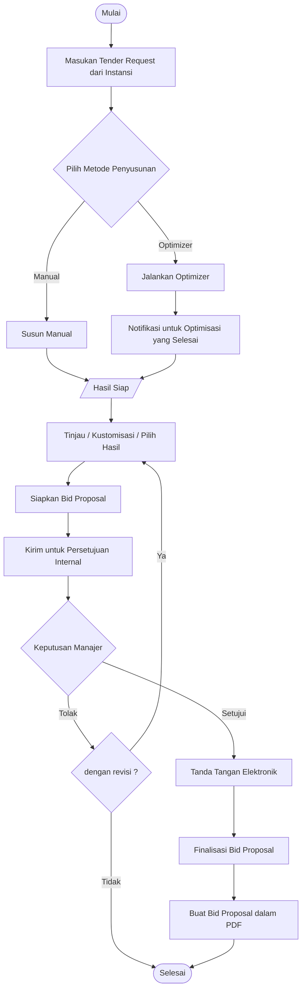

# Product Overview

## Medical Procurement Bid Optimizer

> Status: Acuan produk MVP 
> Terakhir diperbarui: 28 Agustus 2026

## 1. Ringkasan

Medical Procurement Bid Optimizer adalah MVP dari aplikasi web berbasis Django yang membantu perusahaan menyusun penawaran untuk tender pengadaan alat kesehatan dan obat-obatan. Aplikasi ini membandingkan harga dan ketersediaan barang dari berbagai supplier, menentukan kombinasi pengadaan yang optimal, serta menghitung biaya dan margin keuntungan sebelum penawaran difinalisasi dan siap diajukan kepada instansi.

## 2. Tujuan Produk

Aplikasi ini bertujuan untuk:

* Membantu perusahaan menyusun penawaran tender pengadaan alat kesehatan dan obat-obatan dengan merekomendasikan kombinasi penawaran supplier berdasarkan ketersediaan barang, biaya pengadaan, dan estimasi laba kotor (gross profit).
* Menyediakan alur kerja penyusunan, peninjauan, persetujuan, penandatanganan, dan finalisasi penawaran tender yang terdokumentasi serta dapat ditelusuri.
* Membantu pengguna mengevaluasi kelayakan finansial suatu penawaran sebelum penawaran tersebut difinalisasi.

## 3. Pengguna dan Tanggung Jawab

| Role              | Tanggung Jawab                                                                                                                                                                                       |
| ----------------- | ---------------------------------------------------------------------------------------------------------------------------------------------------------------------------------------------------- |
| Admin             | Mengelola  product, supplier, dan supplier offer.                                                                                                                                              |
| Procurement Staff | Membuat tender request berdasarkan kebutuhan instansi, menyusun result secara manual atau menggunakan optimizer, melakukan kustomisasi, memilih hasil, dan mengajukannya untuk persetujuan internal. |
| Manager           | Melakukan peninjauan, persetujuan/penolakan terhadap penawaran yang diajukan Procurement Staff, serta memberikan tanda tangan elektronik terhadap penawaran yang telah disetujui.                        |

Optimizer hanya memberikan rekomendasi kombinasi dari alat/oba yang ditawarkan supplier. Keputusan mengenai hasil akhir  yang digunakan tetap berada pada Procurement Staff dan Manager melalui workflow review dan approval.

---

## 4. Konsep Utama

### Tender Request

Tender request menyimpan kebutuhan asli yang diterbitkan oleh instansi, termasuk product, quantity, spesifikasi yang relevan, dan informasi harga target apabila tersedia.

Tender request merupakan **source of truth** terhadap kebutuhan instansi dan tidak boleh dimodifikasi hanya untuk memperoleh hasil optimasi yang lebih menguntungkan.

### Procurement Result

Procurement result merepresentasikan cara memenuhi seluruh item pada tender request menggunakan satu atau lebih supplier offer.

Result memiliki salah satu sumber:

* `MANUAL`: disusun langsung oleh Procurement Staff;
* `OPTIMIZER`: dihasilkan dan diberi ranking oleh optimizer;
* `CUSTOMIZED`: result baru yang diturunkan dari result sebelumnya.

Customization tidak mengubah atau menimpa result sumber.

Procurement Staff dapat membandingkan beberapa result dan memilih satu result valid sebagai `selected_result` sebelum penawaran diajukan untuk approval.

### Optimization Run

Optimization run merupakan proses background yang membentuk dan mengevaluasi alternatif kombinasi supplier offer berdasarkan tender request dan data supplier offer yang tersedia.

Setiap run menyimpan informasi input, hasil kalkulasi, ranking, status proses, dan referensi terhadap result yang dihasilkan sehingga proses optimasi dapat ditelusuri secara historis.

### Bid Proposal

Bid proposal merupakan penawaran tender yang disusun Perusahaan B untuk instansi berdasarkan tender request dan `selected_result`.

Bid proposal menyimpan nilai penawaran kepada instansi, estimasi biaya pengadaan, gross profit, serta informasi komersial lain yang diperlukan.

Setelah memperoleh approval dan electronic signature internal, bid proposal dapat difinalisasi dan dibuat menjadi dokumen PDF yang siap diajukan kepada instansi melalui proses eksternal.

---

## 5. Alur Utama

Pengajuan dokumen kepada instansi berada di luar scope aplikasi.

---

## 6. Product Requirements

| ID      | Requirement                                                                                                                                        |
| ------- | -------------------------------------------------------------------------------------------------------------------------------------------------- |
| PRD-001 | Sistem menyediakan authentication dan role-based access untuk Admin, Procurement Staff, dan Manager.                                               |
| PRD-002 | Admin dapat mengelola master product, supplier, dan supplier offer tanpa mengubah histori transaksi yang telah menggunakan data tersebut.          |
| PRD-003 | Procurement Staff dapat mencatat tender request berdasarkan kebutuhan yang diterbitkan instansi.            |
| PRD-004 | Procurement Staff dapat menyusun procurement result manual yang memenuhi seluruh request item.                                                     |
| PRD-005 | Procurement Staff dapat menjalankan optimizer secara background dan memperoleh ranked procurement result.                                          |
| PRD-006 | Procurement Staff dapat melakukan review, customization, dan memilih satu result tanpa menimpa result sumber.                                      |
| PRD-007 | Sistem memberikan in-app notification ketika optimization selesai atau suatu bid proposal ditolak.                                                 |
| PRD-008 | Procurement Staff dapat membuat bid proposal berdasarkan selected result dan mengajukannya untuk approval internal.                                |
| PRD-009 | Manager dapat melakukan review serta approve atau reject bid proposal dengan alasan.                                                               |
| PRD-010 | Manager dapat memberikan tanda tangan elektronik sederhana terhadap bid proposal yang telah disetujui.                                                |
| PRD-011 | Sistem dapat memfinalisasi dan menghasilkan PDF bid proposal berdasarkan data yang telah disetujui dan ditandatangani.                             |
| PRD-012 | Sistem menjaga audit trail dan historical snapshot sehingga perubahan master data tidak mengubah result atau bid proposal yang telah difinalisasi. |

---

## 7. Scope MVP

### Termasuk

* authentication dan role-based access;
* master product, supplier, dan supplier offer;
* tender request dan tender request item;
* manual, optimized, dan customized procurement result;
* background optimization;
* ranked recommendation;
* in-app notification;
* selected result;
* bid proposal;
* internal approval dan rejection;
* electronic signature sederhana;
* finalisasi bid proposal;
* bid proposal PDF;
* historical snapshot;
* audit trail.

### Tidak termasuk

* supplier onboarding, qualification, discovery, dan negotiation;
* integrasi langsung dengan portal tender atau sistem rumah sakit;
* OCR dan fuzzy product matching;
* advanced atau multi-objective optimization;
* multi-level approval;
* cryptographic digital signature;
* email atau WhatsApp notification;
* procurement contract setelah tender dimenangkan;
* payment;
* accounting;
* inventory;
* shipping;
* ERP integration.

---

## 8. Prinsip Produk

* **Preserve the tender request:** optimizer dan result editor tidak mengubah kebutuhan asli instansi.
* **Separate requirement from sourcing solution:** tender request menjelaskan kebutuhan; procurement result menjelaskan bagaimana kebutuhan tersebut dapat dipenuhi menggunakan supplier offer.
* **Separate sourcing result from bid proposal:** procurement result menentukan sumber pengadaan, sedangkan bid proposal merupakan penawaran komersial Perusahaan B kepada instansi.
* **Human-controlled decision:** ranking optimizer merupakan rekomendasi, bukan keputusan final.
* **Immutable historical context:** perubahan product, supplier, atau supplier offer tidak boleh mengubah result dan bid proposal historis.
* **Traceable history:** optimization run, result, selection, approval, rejection, signature, dan finalisasi dapat ditelusuri ke actor dan data sumber.
* **Controlled finalization:** bid proposal hanya dapat difinalisasi setelah memenuhi workflow approval dan signature yang diperlukan.

---

## 9. Kriteria Keberhasilan

MVP dianggap berhasil apabila:

* alur manual maupun optimizer dapat diselesaikan secara end-to-end;
* seluruh kebutuhan pada tender request dapat divalidasi terhadap procurement result;
* optimizer menghasilkan rekomendasi yang konsisten berdasarkan supplier offer yang tersedia;
* kalkulasi procurement cost, bid value, dan gross profit konsisten;
* permission dan status transition ditegakkan di sisi server;
* selected result dapat ditelusuri ke supplier offer yang menjadi sumbernya;
* perubahan master data tidak mengubah procurement result atau bid proposal historis;
* bid proposal yang telah disetujui dan ditandatangani dapat difinalisasi menjadi PDF;
* seluruh aktivitas penting memiliki audit trail.

Traceability antara requirement, business rules, user flow, domain model, dan komponen arsitektur dijelaskan pada dokumen 02–04.
