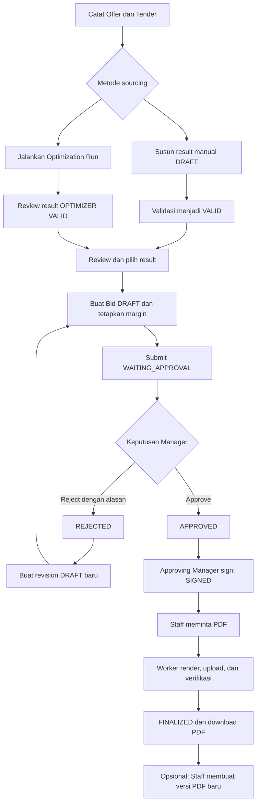

# Product Overview

## Medical Procurement Bid Optimizer

> Status: Dokumentasi implementasi saat ini 
> Terakhir diperbarui: 15 September 2026

## 1. Ringkasan

Aplikasi web internal berbasis Django ini membantu satu perusahaan menyusun penawaran tender pengadaan medis. Procurement Staff mencatat kebutuhan instansi dan supplier offer, menyusun atau mengoptimalkan sourcing, memilih result, menghitung harga penawaran, lalu mengajukannya kepada Manager. Setelah approval dan tanda tangan, Staff membuat serta mengunduh PDF final.

Aplikasi berhenti pada penyusunan dokumen. Pengiriman proposal kepada instansi dilakukan di luar aplikasi.

## 2. Pengguna dan akses

| Role | Fitur yang tersedia |
|---|---|
| Admin | Membuat, mengubah, menonaktifkan Product/Supplier; mengaktifkan kembali Product; mengelola akun melalui Django Admin |
| Procurement Staff | Mengelola Offer dan Tender, result manual/customized, optimization, selection, Bid pricing/submission/revision, finalization, regeneration PDF, dan download |
| Manager | Meninjau Bid, approve/reject, menandatangani Bid yang disetujuinya sendiri, melihat job dokumen, dan download PDF |
| Semua pengguna aktif | Login/logout, dashboard sesuai role, profil sendiri, dan notifikasi sendiri |

Halaman katalog hanya dapat dibuka Admin. Halaman Offer, Tender, Result, Optimization, dan daftar Bid hanya dapat dibuka Staff. Detail Bid dan dokumen dapat dibuka Staff/Manager. Akses bisnis mengikuti role; superuser tidak melewati aturan tersebut. Profil saat ini berupa halaman baca, tanpa edit profil mandiri.

## 3. Konsep utama

- **Tender Request** memiliki root dan revision immutable. Setiap revision menyimpan instansi, kebutuhan item, snapshot Product, dan HPS opsional.
- **Supplier Offer** menyimpan harga dasar, diskon, harga net, kapasitas opsional, dan tanggal berlaku. Offer yang sudah digunakan harus diganti melalui supersede, bukan dikoreksi langsung.
- **Procurement Result** menyimpan alokasi supplier untuk kebutuhan Tender revision. Sumbernya `MANUAL`, `OPTIMIZER`, atau `CUSTOMIZED`. Result `VALID` menjadi immutable.
- **Optimization Run** memproses frozen input melalui background worker dan menyimpan rekomendasi terurut serta alasan penolakan kandidat.
- **Bid Proposal** mempunyai revision dengan snapshot result terpilih, pricing, submission, keputusan Manager, dan signature.
- **Final Document** menyimpan metadata serta snapshot PDF privat. Staff dapat membuat versi PDF baru tanpa mengubah file versi sebelumnya.

## 4. Alur utama

Customization membuat result DRAFT baru dari result VALID, yang harus divalidasi sebelum dipilih. Optimizer memberi rekomendasi; selection tetap tindakan eksplisit Staff.

## 5. Fitur produk saat ini

| ID | Realisasi |
|---|---|
| PRD-001 | Django session authentication, role server-side, login rate limit, logout POST dengan CSRF |
| PRD-002 | Master Product/Supplier, version, inactive policy, Product reactivation, dan Offer correction/supersede |
| PRD-003 | Tender dengan immutable revision/item, snapshot Product, dan HPS opsional |
| PRD-004 | Manual result DRAFT, edit allocation, validation, dan cost calculation |
| PRD-005 | Background optimizer `greedy-bounded-v1`, frozen snapshot, ranking, dan polling |
| PRD-006 | Review result, customization tanpa menimpa sumber, dan selection history |
| PRD-007 | In-app notification untuk optimization, submission, keputusan, signing, serta dokumen |
| PRD-008 | Bid dari selected VALID result, target margin, HPS feasibility, dan submission snapshot/hash |
| PRD-009 | Single-level Manager approve/reject; reject wajib alasan; revision baru setelah rejection |
| PRD-010 | Signature metadata dan upload PNG/JPEG opsional oleh approving Manager |
| PRD-011 | PDF A4 asynchronous, private MinIO, SHA-256, authorized download, dan regeneration melalui UI |
| PRD-012 | Historical snapshot, revision, serta append-only AuditEvent pada mutation bisnis |

Audit disimpan pada model; belum ada halaman timeline audit tersendiri. Dashboard saat ini berisi tautan modul sesuai role, tanpa statistik bisnis agregat.

## 6. Batas implementasi

- Single-company, single-currency IDR; tidak ada tenant atau master Institution terpisah.
- Tidak ada supplier login/onboarding, negosiasi, OCR, fuzzy matching, atau import spreadsheet.
- Tidak ada API publik/SPA, integrasi portal tender, purchasing, reservation stok, inventory, shipping, payment, accounting, atau ERP integration.
- Tidak ada multi-level approval, certified cryptographic signature, email/WhatsApp business notification, self-registration, SSO, atau MFA.
- Optimizer menggunakan pencarian greedy terbatas, bukan enumerasi seluruh kombinasi atau multi-objective optimization.
- Belum tersedia pagination umum, signature profile yang dapat dipakai ulang, layanan Grafana/Telegram, atau generic HTTP idempotency-key store.

Rincian perilaku dan batas teknis dijelaskan dalam dokumen 02–07.
