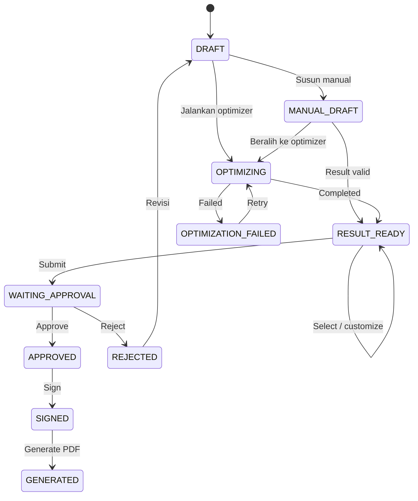

# Business Rules

## Mini Procurement Contract Optimizer

> Status: Acuan aturan bisnis MVP 
> Terakhir diperbarui: 28 Agustus 2026

## 1. Tujuan

Dokumen ini mendefinisikan aturan bisnis yang harus dijaga oleh validation, application service, database constraint, background worker, dan test.

## 2. Access dan Master Data

| ID | Rule |
|---|---|
| BR-ACCESS-001 | Setiap tindakan hanya dapat dilakukan oleh role yang berwenang dan tetap divalidasi di server. |
| BR-MASTER-001 | Admin mengelola product, vendor, dan vendor offer; data tersebut dianggap telah divalidasi melalui proses bisnis di luar sistem. |
| BR-MASTER-002 | Product, vendor, dan vendor offer yang inactive tidak boleh dipakai untuk result baru. |
| BR-MASTER-003 | Master data yang pernah digunakan tidak boleh dihapus dengan cara yang merusak histori. |
| BR-MASTER-004 | Perubahan master data tidak boleh mengubah result atau kontrak yang sudah tersimpan. |

## 3. Procurement Request

| ID | Rule |
|---|---|
| BR-REQ-001 | Procurement request adalah source of truth kebutuhan instansi. |
| BR-REQ-002 | Optimizer dan editor result tidak boleh mengubah product, quantity, atau target unit price pada request. |
| BR-REQ-003 | Perubahan resmi atas kebutuhan dilakukan melalui update request yang dapat ditelusuri dan hanya pada status yang mengizinkan. |
| BR-REQ-004 | Request harus memiliki minimal satu item sebelum diproses. |
| BR-REQ-005 | Quantity setiap request item harus lebih besar dari `0`; target unit price tidak boleh negatif. |

## 4. Vendor Offer dan Kalkulasi

| ID | Rule |
|---|---|
| BR-OFFER-001 | Setiap vendor offer terkait dengan satu vendor dan satu product. |
| BR-OFFER-002 | HNA tidak boleh negatif dan discount harus berada pada rentang `0..100` persen. |
| BR-OFFER-003 | Net purchase price harus lebih besar dari `0` agar offer eligible. |
| BR-OFFER-004 | Nilai uang dihitung menggunakan `Decimal` dan aturan pembulatan yang sama pada semua jalur result. |
| BR-CALC-001 | `net_purchase_price = HNA - (HNA × discount_percent / 100)`. |
| BR-CALC-002 | `total_selling_price = quantity × target_unit_price`. |
| BR-CALC-003 | `total_purchase = quantity × net_purchase_price`. |
| BR-CALC-004 | `gross_profit = total_selling_price - total_purchase`. |
| BR-CALC-005 | `margin_percent = (gross_profit / total_selling_price) × 100`; jika total selling price `0`, margin tidak boleh menyebabkan division-by-zero. |

## 5. Procurement Result

| ID | Rule |
|---|---|
| BR-RESULT-001 | Result merepresentasikan cara memenuhi satu procurement request dan harus mencakup seluruh request item. |
| BR-RESULT-002 | Setiap result item memakai vendor offer dengan product dan quantity yang sesuai request item. |
| BR-RESULT-003 | Result memiliki source type `MANUAL`, `OPTIMIZER`, atau `CUSTOMIZED`. |
| BR-RESULT-004 | Result manual, optimizer, dan customized menggunakan validation dan calculation policy yang sama. |
| BR-RESULT-005 | Customization membuat result baru yang merujuk result sumber; result sumber tidak ditimpa. |
| BR-RESULT-006 | Setiap result menyimpan snapshot product, vendor, harga, quantity, kalkulasi, actor, dan timestamp. |
| BR-RESULT-007 | `selected_result` harus valid, berasal dari request yang sama, dan dikunci saat submission. |

## 6. Optimization

| ID | Rule |
|---|---|
| BR-OPT-001 | Optimization berjalan sebagai background job. |
| BR-OPT-002 | Hanya satu optimization run `PENDING` atau `RUNNING` yang boleh aktif untuk request yang sama. |
| BR-OPT-003 | Optimizer hanya menggunakan request dan master data eligible pada saat input snapshot dibuat. |
| BR-OPT-004 | Optimizer membentuk dan mengevaluasi alternatif vendor offer tanpa mengubah procurement request. |
| BR-OPT-005 | Status run adalah `PENDING`, `RUNNING`, `COMPLETED`, atau `FAILED`. |
| BR-OPT-006 | Ranked result diurutkan berdasarkan objective utama gross profit tertinggi dengan tie-break yang deterministik. |
| BR-OPT-007 | Run menyimpan input snapshot, versi algoritma, result, ranking, dan alasan kandidat ditolak. |
| BR-OPT-008 | Kegagalan mencatat safe error, membuat notification, dan dapat di-retry melalui run baru. |
| BR-OPT-009 | Re-run tidak menimpa run atau result sebelumnya. |

## 7. Notification

| ID | Rule |
|---|---|
| BR-NOTIF-001 | Staff pemicu menerima in-app notification ketika optimization selesai atau gagal. |
| BR-NOTIF-002 | Submitter menerima in-app notification ketika request ditolak. |
| BR-NOTIF-003 | Notification dapat ditelusuri ke request atau optimization run dan tidak dibuat ganda untuk event yang sama. |

## 8. Approval dan Rejection

| ID | Rule |
|---|---|
| BR-APP-001 | Submission hanya dapat dilakukan dari `RESULT_READY` jika terdapat `selected_result` yang valid, terlepas dari source type-nya. |
| BR-APP-002 | Submission mengubah request menjadi `WAITING_APPROVAL` dan mencatat audit event. |
| BR-APP-003 | Hanya Manager yang dapat approve atau reject request `WAITING_APPROVAL`. |
| BR-APP-004 | Rejection wajib memiliki alasan dan mengubah status menjadi `REJECTED`. |
| BR-APP-005 | Approval mengubah status menjadi `APPROVED`; submission, approval, dan rejection dicatat secara append-only. |
| BR-APP-006 | Request yang ditolak dapat direvisi dari `DRAFT` tanpa menghapus histori sebelumnya. |

## 9. Signature dan Contract

| ID | Rule |
|---|---|
| BR-SIGN-001 | Signature hanya dapat diberikan setelah approval dan hanya oleh Manager yang melakukan approval. |
| BR-SIGN-002 | Sistem menyimpan `signed_by`, `signed_at`, `signer_name`, dan signature image opsional. |
| BR-SIGN-003 | Setelah signing, data final tidak boleh diubah secara diam-diam. |
| BR-CONTRACT-001 | Contract PDF hanya dapat dibuat dari request berstatus `SIGNED`. |
| BR-CONTRACT-002 | Contract menggunakan request, approved selected result, approval, dan signature yang telah dibekukan. |
| BR-CONTRACT-003 | Contract menyimpan version, private file reference, content snapshot, dan checksum SHA-256. |
| BR-CONTRACT-004 | Perubahan material atau regeneration tidak boleh menimpa PDF lama; proses membuat versi baru atau mengulang approval. |

## 10. Lifecycle

`RESULT_READY` digunakan untuk result valid dari jalur manual maupun optimizer. Istilah `OPTIMIZED` tidak digunakan sebagai status procurement.

## 11. Auditability

Sistem minimal mencatat actor dan timestamp untuk pembuatan request/result, optimization, pemilihan result, submission, approval/rejection, signing, dan contract generation. Audit event status bersifat append-only dan menyimpan `from_status`, `to_status`, serta note jika diperlukan.

## 12. Traceability ke Product Requirements

| Product requirement | Business rules |
|---|---|
| PRD-001 | BR-ACCESS-001 |
| PRD-002 | BR-MASTER-001–004, BR-OFFER-001–004 |
| PRD-003 | BR-REQ-001–005 |
| PRD-004 | BR-RESULT-001–004, BR-CALC-001–005 |
| PRD-005 | BR-OPT-001–009, BR-RESULT-001–004 |
| PRD-006 | BR-RESULT-005–007 |
| PRD-007 | BR-NOTIF-001–003 |
| PRD-008 | BR-APP-001–006 |
| PRD-009 | BR-SIGN-001–003 |
| PRD-010 | BR-CONTRACT-001–004, BR-MASTER-004, Bagian 11 |
