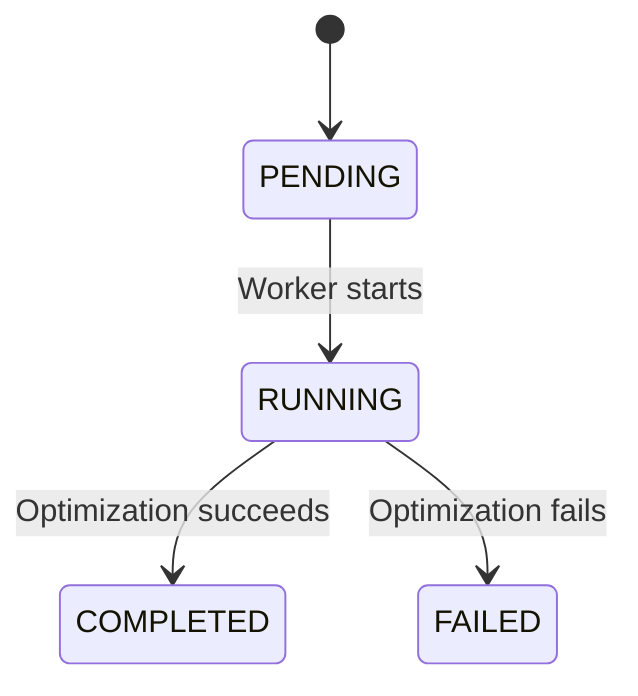
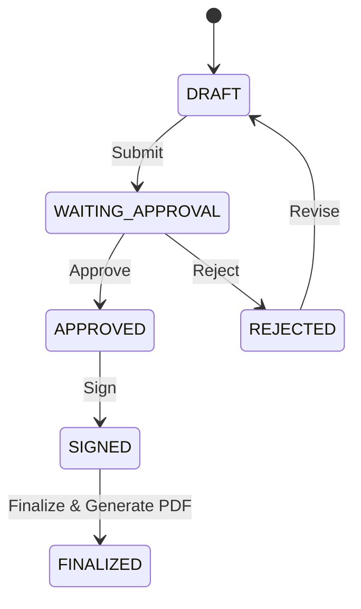

# Business Rules

## Medical Procurement Bid Optimizer

> Status: Acuan aturan bisnis MVP
> Terakhir diperbarui: 9 September 2026

---

## 1. Tujuan

Dokumen ini mendefinisikan aturan bisnis yang harus dijaga secara konsisten oleh validation layer, application service, database constraint, background worker, dan automated test.

Business rules dalam dokumen ini menjadi acuan untuk memastikan bahwa:

* kebutuhan tender dari instansi tetap menjadi source of truth;
* supplier offer digunakan secara valid dan dapat ditelusuri;
* procurement result selalu memenuhi kebutuhan tender;
* optimizer hanya memberikan rekomendasi sourcing;
* pricing dan profit dihitung secara konsisten;
* keputusan akhir tetap dikendalikan oleh pengguna;
* approval, signature, finalization, dan historical data dapat diaudit.

---

## 2. Access dan Master Data

| ID            | Rule                                                                                                                                                        |
| ------------- | ----------------------------------------------------------------------------------------------------------------------------------------------------------- |
| BR-ACCESS-001 | Setiap tindakan hanya dapat dilakukan oleh role yang berwenang dan authorization tetap divalidasi di server.                                                |
| BR-ACCESS-002 | Admin mengelola master `Product` dan `Supplier`.                                                                                                            |
| BR-ACCESS-003 | Procurement Staff mencatat `TenderRequest`, mencatat dan mengelola `SupplierOffer`, menjalankan optimizer, memilih procurement result, dan menyusun `BidProposal`. |
| BR-ACCESS-004 | Manager melakukan review, approval/rejection, dan electronic signature terhadap `BidProposal`.                                                              |
| BR-MASTER-001 | Product dan supplier yang inactive tidak boleh digunakan untuk transaksi baru.                                                                              |
| BR-MASTER-002 | Master data yang pernah digunakan oleh transaksi historis tidak boleh dihapus dengan cara yang merusak histori.                                             |
| BR-MASTER-003 | Perubahan product atau supplier tidak boleh mengubah procurement result atau bid proposal historis.                                                         |
| BR-MASTER-004 | Data historis yang membutuhkan informasi master harus menyimpan snapshot atau informasi lain yang cukup untuk mempertahankan kondisi saat transaksi dibuat. |

---

## 3. Tender Request

`TenderRequest` merupakan representasi di dalam sistem terhadap kebutuhan tender yang diterbitkan oleh instansi.

Procurement Staff mencatat kebutuhan tersebut ke dalam aplikasi, tetapi tidak dianggap sebagai pihak yang menciptakan kebutuhan bisnis instansi.

| ID         | Rule                                                                                                                                                                    |
| ---------- | ----------------------------------------------------------------------------------------------------------------------------------------------------------------------- |
| BR-REQ-001 | Tender request merupakan source of truth terhadap kebutuhan pengadaan yang diterbitkan oleh instansi.                                                                   |
| BR-REQ-002 | Tender request harus memiliki minimal satu `TenderRequestItem` sebelum dapat diproses.                                                                                  |
| BR-REQ-003 | Setiap request item harus memiliki product dan `quantity > 0`.                                                                                                          |
| BR-REQ-004 | Tender request item dapat menyimpan specification atau informasi persyaratan lain yang berasal dari dokumen tender.                                                     |
| BR-REQ-005 | Tender request dapat memiliki `total_hps` atau nilai batas anggaran lain apabila informasi tersebut tersedia.                                                           |
| BR-REQ-006 | `total_hps`, jika diisi, harus lebih besar dari `0`.                                                                                                                    |
| BR-REQ-007 | Optimizer, procurement result editor, dan bid proposal tidak boleh mengubah kebutuhan asli seperti product, requested quantity, atau specification pada tender request. |
| BR-REQ-008 | Perubahan resmi terhadap kebutuhan tender harus dilakukan sebagai perubahan/revisi tender request yang dapat ditelusuri.                                                |
| BR-REQ-009 | Data tender request yang telah digunakan dalam submission harus tetap dapat direkonstruksi melalui snapshot atau revision history.                                      |

Untuk MVP, `target_unit_price` per request item **tidak diwajibkan**. Harga penawaran Perusahaan B dihitung pada `BidProposal`, bukan diambil langsung dari harga target item tender.

---

## 4. Supplier Offer

`SupplierOffer` merupakan data komersial dari supplier kepada Perusahaan B dan bukan bagian dari master data permanen.

Satu supplier dapat memberikan beberapa offer untuk product yang berbeda atau memberikan offer baru untuk product yang sama pada waktu yang berbeda.

| ID           | Rule                                                                                                                                   |
| ------------ | -------------------------------------------------------------------------------------------------------------------------------------- |
| BR-OFFER-001 | Setiap supplier offer terkait dengan tepat satu supplier dan satu product.                                                             |
| BR-OFFER-002 | Supplier dan product yang digunakan oleh offer harus aktif pada saat offer dicatat atau digunakan untuk transaksi baru.                |
| BR-OFFER-003 | `base_unit_price` harus lebih besar dari `0`.                                                                                          |
| BR-OFFER-004 | `discount_percent` harus berada pada rentang `0 <= discount_percent <= 100`.                                                           |
| BR-OFFER-005 | `net_purchase_price` harus lebih besar dari `0` agar supplier offer eligible untuk digunakan.                                          |
| BR-OFFER-006 | Jika supplier offer memiliki `available_quantity`, nilainya harus lebih besar dari `0` agar offer eligible.                            |
| BR-OFFER-007 | Jika supplier offer memiliki masa berlaku, offer yang sudah expired tidak boleh digunakan untuk procurement result baru.               |
| BR-OFFER-008 | Perubahan supplier offer tidak boleh mengubah procurement result atau optimization run historis yang telah menggunakan offer tersebut. |
| BR-OFFER-009 | Supplier offer yang pernah digunakan secara historis tidak boleh dihapus dengan cara yang merusak traceability.                        |
| BR-OFFER-010 | Supplier offer yang belum pernah digunakan dapat dikoreksi oleh Procurement Staff dan perubahan tersebut harus dicatat pada audit trail. |
| BR-OFFER-011 | Perubahan informasi komersial pada supplier offer yang telah digunakan oleh optimization run atau procurement result harus dibuat sebagai supplier offer baru; offer lama dipertahankan dan dapat dinonaktifkan. |

Untuk domain yang mencakup obat dan alat kesehatan, istilah generik `base_unit_price` digunakan. Untuk supplier obat, nilai tersebut dapat merepresentasikan harga dasar seperti HNA apabila relevan.

---

## 5. Procurement Result

`ProcurementResult` merepresentasikan cara memenuhi seluruh kebutuhan pada satu tender request menggunakan satu atau lebih supplier offer.

### 5.1 Result dan Allocation

| ID            | Rule                                                                                                                                            |
| ------------- | ----------------------------------------------------------------------------------------------------------------------------------------------- |
| BR-RESULT-001 | Setiap procurement result terkait dengan tepat satu tender request.                                                                             |
| BR-RESULT-002 | Procurement result yang valid harus mencakup seluruh tender request item.                                                                       |
| BR-RESULT-003 | Satu tender request item dapat dipenuhi oleh satu atau lebih `SupplierAllocation`.                                                              |
| BR-RESULT-004 | Setiap supplier allocation harus menggunakan supplier offer untuk product yang sesuai dengan request item.                                      |
| BR-RESULT-005 | `allocated_quantity` harus lebih besar dari `0`.                                                                                                |
| BR-RESULT-006 | Jika supplier offer memiliki available quantity, allocated quantity tidak boleh melebihi ketersediaan yang digunakan pada snapshot perhitungan. |
| BR-RESULT-007 | Jumlah seluruh allocation untuk satu request item harus sama dengan requested quantity pada request item tersebut.                              |
| BR-RESULT-008 | Result yang tidak memenuhi seluruh requested quantity dianggap invalid dan tidak dapat dipilih sebagai selected result.                         |

Contoh:

```text
Tender Request:
Infusion Pump = 100 unit

Procurement Result:
Supplier A = 60 unit
Supplier B = 40 unit

60 + 40 = 100 → valid
```

### 5.2 Source Type

| ID            | Rule                                                                                       |
| ------------- | ------------------------------------------------------------------------------------------ |
| BR-RESULT-009 | Procurement result memiliki source type `MANUAL`, `OPTIMIZER`, atau `CUSTOMIZED`.          |
| BR-RESULT-010 | Result dengan source type berbeda menggunakan validation dan calculation policy yang sama. |
| BR-RESULT-011 | `MANUAL` dibuat langsung oleh Procurement Staff.                                           |
| BR-RESULT-012 | `OPTIMIZER` dihasilkan oleh optimization run.                                              |
| BR-RESULT-013 | `CUSTOMIZED` dibuat sebagai result baru berdasarkan result sebelumnya.                     |
| BR-RESULT-014 | Customization tidak boleh menimpa result sumber.                                           |
| BR-RESULT-015 | Customized result harus menyimpan referensi ke source result.                              |

### 5.3 Snapshot dan Selection

| ID            | Rule                                                                                                                                                        |
| ------------- | ----------------------------------------------------------------------------------------------------------------------------------------------------------- |
| BR-RESULT-016 | Procurement result menyimpan snapshot informasi yang diperlukan untuk merekonstruksi product, supplier, supplier offer, quantity, dan harga yang digunakan. |
| BR-RESULT-017 | Procurement result menyimpan calculated procurement cost berdasarkan snapshot tersebut.                                                                     |
| BR-RESULT-018 | Procurement Staff dapat memilih satu result valid sebagai `selected_result`.                                                                                |
| BR-RESULT-019 | Selected result harus berasal dari tender request yang sama dengan bid proposal yang menggunakannya.                                                        |
| BR-RESULT-020 | Setelah bid proposal disubmit untuk approval, selected result yang direferensikan oleh submission tersebut tidak boleh diganti secara diam-diam.            |

---

## 6. Procurement Cost Calculation

Seluruh jalur `MANUAL`, `OPTIMIZER`, dan `CUSTOMIZED` harus menggunakan calculation policy yang sama.

### 6.1 Net Purchase Price

| ID          | Rule                                                                                 |
| ----------- | ------------------------------------------------------------------------------------ |
| BR-CALC-001 | `net_purchase_price = base_unit_price - (base_unit_price × discount_percent / 100)`. |

### 6.2 Supplier Allocation Cost

| ID          | Rule                                                             |
| ----------- | ---------------------------------------------------------------- |
| BR-CALC-002 | `allocation_purchase = allocated_quantity × net_purchase_price`. |

### 6.3 Item Procurement Cost

| ID          | Rule                                                                                                         |
| ----------- | ------------------------------------------------------------------------------------------------------------ |
| BR-CALC-003 | `item_purchase_total = Σ allocation_purchase` untuk seluruh supplier allocation pada request item yang sama. |

### 6.4 Total Procurement Cost

| ID          | Rule                                                                                 |
| ----------- | ------------------------------------------------------------------------------------ |
| BR-CALC-004 | `total_purchase = Σ item_purchase_total` untuk seluruh item pada procurement result. |

Contoh:

```text
Supplier A:
60 × Rp6.300.000 = Rp378.000.000

Supplier B:
40 × Rp7.125.000 = Rp285.000.000

total_purchase
= Rp378.000.000 + Rp285.000.000
= Rp663.000.000
```

---

## 7. Optimization

Optimization merupakan proses pencarian alternatif procurement result yang memenuhi kebutuhan tender dengan menggunakan supplier offer yang eligible.

| ID         | Rule                                                                                                                             |
| ---------- | -------------------------------------------------------------------------------------------------------------------------------- |
| BR-OPT-001 | Optimization dijalankan sebagai background job.                                                                                  |
| BR-OPT-002 | Hanya satu optimization run berstatus `PENDING` atau `RUNNING` yang boleh aktif untuk tender request yang sama.                  |
| BR-OPT-003 | Optimization run harus membuat input snapshot sebelum melakukan perhitungan.                                                     |
| BR-OPT-004 | Snapshot harus mencakup tender requirement dan supplier offer eligible yang digunakan oleh run tersebut.                         |
| BR-OPT-005 | Perubahan supplier offer setelah snapshot dibuat tidak boleh mengubah hasil optimization run tersebut.                           |
| BR-OPT-006 | Optimizer tidak boleh mengubah tender request.                                                                                   |
| BR-OPT-007 | Optimizer hanya menghasilkan procurement result yang memenuhi validation policy yang sama dengan result manual.                  |
| BR-OPT-008 | Objective utama optimizer MVP adalah meminimalkan `total_purchase`.                                                              |
| BR-OPT-009 | Ranked result diurutkan berdasarkan `total_purchase` dari nilai terendah ke tertinggi.                                           |
| BR-OPT-010 | Jika dua result memiliki `total_purchase` yang sama, sistem menggunakan deterministic tie-break agar ranking dapat direproduksi. |
| BR-OPT-011 | Tie-break dapat memprioritaskan jumlah supplier yang lebih sedikit, kemudian menggunakan stable candidate identifier.            |
| BR-OPT-012 | Status optimization run adalah `PENDING`, `RUNNING`, `COMPLETED`, atau `FAILED`.                                                 |
| BR-OPT-013 | Optimization run menyimpan algorithm version, input snapshot, result yang dihasilkan, ranking, actor, dan timestamp.             |
| BR-OPT-014 | Kandidat yang ditolak dapat menyimpan rejection reason untuk kebutuhan traceability.                                             |
| BR-OPT-015 | Optimization failure harus mencatat error yang aman untuk ditampilkan dan debugging internal.                                    |
| BR-OPT-016 | Optimization failure tidak boleh menghapus atau mengubah run sebelumnya.                                                         |
| BR-OPT-017 | Retry dilakukan melalui optimization run baru.                                                                                   |
| BR-OPT-018 | Re-run tidak boleh menimpa optimization run atau procurement result sebelumnya.                                                  |

Optimizer bertanggung jawab mencari **cara pengadaan yang efisien**, bukan menentukan harga penawaran kepada instansi.

---

## 8. Bid Proposal dan Pricing

`BidProposal` merupakan penawaran komersial Perusahaan B kepada instansi berdasarkan tender request dan selected procurement result.

### 8.1 Bid Proposal

| ID         | Rule                                                                                                                                            |
| ---------- | ----------------------------------------------------------------------------------------------------------------------------------------------- |
| BR-BID-001 | Bid proposal harus terkait dengan tepat satu tender request.                                                                                    |
| BR-BID-002 | Bid proposal harus menggunakan satu selected procurement result yang valid dari tender request yang sama.                                       |
| BR-BID-003 | Bid proposal menyimpan snapshot selected result dan data perhitungan yang diperlukan agar perubahan data lain tidak mengubah proposal historis. |
| BR-BID-004 | Untuk MVP, pricing menggunakan satu `target_margin_percent` pada level proposal.                                                                |
| BR-BID-005 | Target margin digunakan untuk menghitung harga penawaran berdasarkan procurement cost dari selected result.                                     |

### 8.2 Target Margin

| ID          | Rule                                                                       |
| ----------- | -------------------------------------------------------------------------- |
| BR-CALC-005 | `target_margin_rate = target_margin_percent / 100`.                        |
| BR-CALC-006 | `target_margin_percent` harus memenuhi `0 <= target_margin_percent < 100`. |

### 8.3 Item Bid Price

Untuk MVP, target margin proposal diterapkan secara konsisten terhadap seluruh item.

| ID          | Rule                                                                   |
| ----------- | ---------------------------------------------------------------------- |
| BR-CALC-007 | `item_unit_purchase_cost = item_purchase_total / requested_quantity`.  |
| BR-CALC-008 | `bid_unit_price = item_unit_purchase_cost / (1 - target_margin_rate)`. |
| BR-CALC-009 | `item_bid_total = requested_quantity × bid_unit_price`.                |

### 8.4 Total Bid Value

| ID          | Rule                                                                  |
| ----------- | --------------------------------------------------------------------- |
| BR-CALC-010 | `total_bid_value = Σ item_bid_total` untuk seluruh bid proposal item. |

Secara matematis, sebelum memperhitungkan rounding:

```text
total_bid_value
= total_purchase / (1 - target_margin_rate)
```

### 8.5 Gross Profit

| ID          | Rule                                               |
| ----------- | -------------------------------------------------- |
| BR-CALC-011 | `gross_profit = total_bid_value - total_purchase`. |

### 8.6 Actual Margin

| ID          | Rule                                                                                                            |
| ----------- | --------------------------------------------------------------------------------------------------------------- |
| BR-CALC-012 | `margin_percent = (gross_profit / total_bid_value) × 100`.                                                      |
| BR-CALC-013 | Jika `total_bid_value <= 0`, bid proposal dianggap invalid dan margin tidak dihitung.                           |
| BR-CALC-014 | Setelah rounding, actual `margin_percent` dihitung ulang dari nilai final `gross_profit` dan `total_bid_value`. |

Contoh:

```text
total_purchase       = Rp800.000.000
target_margin        = 20%

total_bid_value
= 800.000.000 / (1 - 0,20)
= Rp1.000.000.000

gross_profit
= 1.000.000.000 - 800.000.000
= Rp200.000.000

margin
= 200.000.000 / 1.000.000.000 × 100
= 20%
```

---

## 9. HPS dan Feasibility

Untuk scope MVP, jika `total_hps` dicatat pada tender request, sistem memperlakukannya sebagai batas maksimum nilai penawaran yang dapat difinalisasi.

Aturan ini merupakan **business assumption MVP** dan tidak menyatakan bahwa seluruh jenis tender di dunia selalu memiliki mekanisme HPS yang sama.

| ID         | Rule                                                                                                                                   |
| ---------- | -------------------------------------------------------------------------------------------------------------------------------------- |
| BR-HPS-001 | `total_hps` bersifat optional.                                                                                                         |
| BR-HPS-002 | Jika `total_hps` tersedia, `total_bid_value <= total_hps` harus terpenuhi agar proposal dapat difinalisasi.                            |
| BR-HPS-003 | Jika `total_bid_value > total_hps`, target margin dianggap tidak feasible untuk selected procurement result tersebut.                  |
| BR-HPS-004 | Jika `total_hps > 0`, `max_margin_percent = ((total_hps - total_purchase) / total_hps) × 100`.                                         |
| BR-HPS-005 | Target margin yang menghasilkan total bid di atas HPS tidak boleh digunakan untuk finalisasi.                                          |
| BR-HPS-006 | Jika `total_purchase > total_hps`, tidak ada target margin non-negatif yang feasible menggunakan selected procurement result tersebut. |

Contoh:

```text
Total HPS        = Rp1.000.000.000
Total Purchase   = Rp850.000.000

Maximum Margin
= (1.000.000.000 - 850.000.000)
  / 1.000.000.000 × 100

= 15%
```

Jika Procurement Staff memilih:

```text
Target margin = 20%
```

sistem harus menandainya sebagai tidak feasible.

---

## 10. Monetary Precision dan Rounding

| ID           | Rule                                                                                                               |
| ------------ | ------------------------------------------------------------------------------------------------------------------ |
| BR-MONEY-001 | Semua nilai uang harus dihitung menggunakan `Decimal`, bukan floating-point binary.                                |
| BR-MONEY-002 | Semua jalur MANUAL, OPTIMIZER, dan CUSTOMIZED menggunakan rounding policy yang sama.                               |
| BR-MONEY-003 | Intermediate calculation harus mempertahankan precision yang cukup agar tidak terjadi akumulasi rounding error.    |
| BR-MONEY-004 | Nilai final yang disimpan atau ditampilkan dibulatkan menggunakan satu rounding policy yang konsisten.             |
| BR-MONEY-005 | Perbedaan kecil akibat rounding tidak boleh menyebabkan historical calculation berubah ketika data dibaca kembali. |

---

## 11. Notification

| ID           | Rule                                                                                                                         |
| ------------ | ---------------------------------------------------------------------------------------------------------------------------- |
| BR-NOTIF-001 | Procurement Staff yang menjalankan optimizer menerima in-app notification ketika optimization selesai.                       |
| BR-NOTIF-002 | Procurement Staff yang menjalankan optimizer menerima in-app notification ketika optimization gagal.                         |
| BR-NOTIF-003 | Submitter menerima in-app notification ketika bid proposal ditolak oleh Manager.                                             |
| BR-NOTIF-004 | Notification harus dapat ditelusuri ke entity atau event sumber seperti tender request, bid proposal, atau optimization run. |
| BR-NOTIF-005 | Event yang sama tidak boleh menghasilkan notification duplikat kepada user yang sama.                                        |

---

## 12. Approval dan Rejection

Approval dilakukan terhadap `BidProposal`, bukan terhadap `TenderRequest`.

Tender request adalah kebutuhan instansi, sedangkan bid proposal adalah keputusan komersial Perusahaan B yang perlu memperoleh persetujuan internal.

| ID         | Rule                                                                                                                                          |
| ---------- | --------------------------------------------------------------------------------------------------------------------------------------------- |
| BR-APP-001 | Bid proposal hanya dapat disubmit jika menggunakan selected procurement result yang valid.                                                    |
| BR-APP-002 | Bid proposal harus memiliki pricing yang valid sebelum submission.                                                                            |
| BR-APP-003 | Jika tender memiliki total HPS, proposal harus memenuhi HPS feasibility rule sebelum submission/finalization sesuai workflow yang ditetapkan. |
| BR-APP-004 | Procurement Staff dapat submit bid proposal berstatus `DRAFT` menjadi `WAITING_APPROVAL`.                                                     |
| BR-APP-005 | Submission harus menyimpan snapshot proposal dan mencatat audit event.                                                                        |
| BR-APP-006 | Hanya Manager yang dapat approve atau reject bid proposal berstatus `WAITING_APPROVAL`.                                                       |
| BR-APP-007 | Rejection wajib memiliki alasan.                                                                                                              |
| BR-APP-008 | Rejection mengubah bid proposal menjadi `REJECTED`.                                                                                           |
| BR-APP-009 | Approval mengubah bid proposal menjadi `APPROVED`.                                                                                            |
| BR-APP-010 | Submission, approval, dan rejection harus dicatat secara append-only.                                                                         |
| BR-APP-011 | Bid proposal yang ditolak dapat direvisi oleh Procurement Staff.                                                                              |
| BR-APP-012 | Resubmission setelah rejection harus mempertahankan snapshot submission sebelumnya dan meningkatkan revision/version yang dapat ditelusuri.   |

---

## 13. Signature dan Finalization

### 13.1 Electronic Signature

| ID          | Rule                                                                                             |
| ----------- | ------------------------------------------------------------------------------------------------ |
| BR-SIGN-001 | Electronic signature hanya dapat diberikan terhadap bid proposal yang berstatus `APPROVED`.      |
| BR-SIGN-002 | Untuk MVP, signature hanya dapat diberikan oleh Manager yang melakukan approval.                 |
| BR-SIGN-003 | Sistem menyimpan `signed_by`, `signed_at`, `signer_name`, dan signature image apabila digunakan. |
| BR-SIGN-004 | Signing mengubah status bid proposal menjadi `SIGNED`.                                           |
| BR-SIGN-005 | Data proposal yang telah ditandatangani tidak boleh berubah secara diam-diam.                    |

### 13.2 Bid Proposal Finalization

| ID           | Rule                                                                                                                                  |
| ------------ | ------------------------------------------------------------------------------------------------------------------------------------- |
| BR-FINAL-001 | Bid proposal hanya dapat difinalisasi setelah berstatus `SIGNED`.                                                                     |
| BR-FINAL-002 | Finalization menggunakan tender request snapshot, selected procurement result, pricing, approval, dan signature yang telah dibekukan. |
| BR-FINAL-003 | Finalization menghasilkan Bid Proposal PDF yang siap digunakan dalam proses pengajuan eksternal.                                      |
| BR-FINAL-004 | Sistem tidak melakukan pengiriman langsung Bid Proposal PDF ke sistem rumah sakit atau portal tender pada scope MVP.                  |
| BR-FINAL-005 | Bid Proposal PDF menyimpan version, private file reference, content snapshot, dan checksum SHA-256.                                   |
| BR-FINAL-006 | Regeneration tidak boleh menimpa PDF historis yang telah tersimpan.                                                                   |
| BR-FINAL-007 | Perubahan material setelah finalization memerlukan revision baru dan, jika diperlukan, approval serta signature ulang.                |
| BR-FINAL-008 | Finalization mengubah status bid proposal menjadi `FINALIZED`.                                                                        |

`ProcurementContract` setelah tender dimenangkan berada di luar scope MVP.

---

## 14. Lifecycle

Lifecycle dipisahkan berdasarkan entity agar status satu proses tidak ditempatkan pada entity yang tidak tepat.

### 14.1 Optimization Run



Retry tidak mengubah run `FAILED`.

Retry menghasilkan:

```text
FAILED Run #1
     ↓
Create new run
     ↓
PENDING Run #2
```

---

### 14.2 Bid Proposal



Business rules:

* `TenderRequest` tidak berubah menjadi `APPROVED` atau `REJECTED`;
* `ProcurementResult` tidak berubah menjadi `SIGNED`;
* `OptimizationRun` tidak menggunakan status proposal;
* lifecycle masing-masing entity harus dijaga secara terpisah.

---

## 15. Auditability

Sistem minimal mencatat actor, timestamp, entity, dan action untuk aktivitas berikut:

* pembuatan dan revisi tender request;
* pembuatan atau perubahan supplier offer;
* pembuatan procurement result manual;
* optimization run;
* customized result;
* pemilihan selected result;
* pembuatan bid proposal;
* perubahan target margin;
* submission;
* approval;
* rejection;
* signing;
* finalization;
* Bid Proposal PDF generation.

Status transition event bersifat append-only dan minimal menyimpan:

```text
entity_type
entity_id
actor
action
from_status
to_status
timestamp
note
```

jika field tersebut relevan dengan event yang dicatat.

Historical snapshot tidak boleh bergantung pada current value dari master atau transactional data yang dapat berubah.

---

## 16. Invariants Utama

Business invariants berikut harus dijaga oleh application service dan automated test.

### Preserve Tender Requirement

```text
Optimizer / Result / Bid Proposal
        ✗
tidak boleh mengubah TenderRequest
```

### Complete Fulfillment

```text
Σ supplier allocation quantity
=
requested quantity
```

untuk setiap tender request item.

### Procurement Cost Consistency

```text
total_purchase
=
Σ allocation_purchase
```

### Human-Controlled Selection

```text
Optimizer
→ memberikan ranked recommendation

Procurement Staff
→ menentukan selected result
```

### Pricing Separation

```text
SupplierOffer
→ menentukan procurement cost

Target Margin
→ menentukan bid price

Tender HPS
→ digunakan sebagai feasibility constraint jika tersedia
```

### Historical Immutability

```text
Perubahan SupplierOffer hari ini
        ✗
tidak mengubah OptimizationRun kemarin
        ✗
tidak mengubah ProcurementResult historis
        ✗
tidak mengubah BidProposal yang telah disubmit/finalized
```

### Controlled Finalization

```text
DRAFT
→ WAITING_APPROVAL
→ APPROVED
→ SIGNED
→ FINALIZED
```

Tidak boleh melompati transition yang diwajibkan.

---

## 17. Traceability ke Product Requirements

| Product Requirement                                                               | Business Rules                                                                                                      |
| --------------------------------------------------------------------------------- | ------------------------------------------------------------------------------------------------------------------- |
| PRD-001 — Authentication dan role-based access                                    | BR-ACCESS-001–004                                                                                                   |
| PRD-002 — Admin mengelola Product/Supplier dan Procurement Staff mengelola Supplier Offer tanpa merusak histori | BR-ACCESS-002–003, BR-MASTER-001–004, BR-OFFER-001–011 |
| PRD-003 — Pencatatan tender request dan preservation of source of truth           | BR-REQ-001–009                                                                                                      |
| PRD-004 — Manual procurement result                                               | BR-RESULT-001–020, BR-CALC-001–004                                                                                  |
| PRD-005 — Background optimizer dan ranked result                                  | BR-OPT-001–018                                                                                                      |
| PRD-006 — Review, customization, dan selected result                              | BR-RESULT-009–020                                                                                                   |
| PRD-007 — In-app notification                                                     | BR-NOTIF-001–005                                                                                                    |
| PRD-008 — Bid proposal dan internal submission                                    | BR-BID-001–005, BR-CALC-005–014, BR-HPS-001–006, BR-APP-001–005                                                     |
| PRD-009 — Manager approve/reject                                                  | BR-APP-006–012                                                                                                      |
| PRD-010 — Electronic signature                                                    | BR-SIGN-001–005                                                                                                     |
| PRD-011 — Finalization dan Bid Proposal PDF                                       | BR-FINAL-001–008                                                                                                    |
| PRD-012 — Audit trail dan historical snapshot                                     | BR-MASTER-003–004, BR-OFFER-008–009, BR-RESULT-016–020, BR-OPT-003–005, BR-APP-010–012, BR-FINAL-005–007, Bagian 15 |

---

## 18. Batas Domain MVP

Business rules dalam dokumen ini hanya mengatur proses internal Perusahaan B sampai Bid Proposal difinalisasi.

Alur utama:

```text
Tender Request
      ↓
Supplier Offers
      ↓
Manual Result / Optimizer
      ↓
Procurement Results
      ↓
Selected Result
      ↓
Target Margin
      ↓
Bid Proposal
      ↓
Internal Approval
      ↓
Electronic Signature
      ↓
Finalization
      ↓
Bid Proposal PDF
```

Proses berikut berada di luar scope MVP:

```text
Pengajuan ke portal / instansi
      ↓
Evaluasi tender
      ↓
Penetapan pemenang
      ↓
Procurement Contract
      ↓
Fulfillment / Delivery
      ↓
Payment
```

Dengan demikian, `BidProposal` tidak boleh diperlakukan sebagai `ProcurementContract`.
