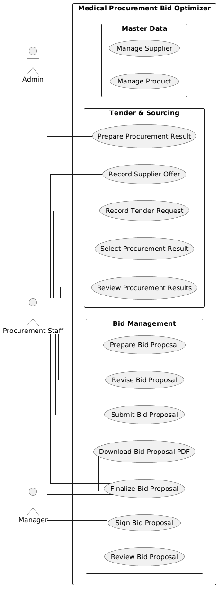

# Use Cases

## Medical Procurement Bid Optimizer

> Status: Acuan use case MVP
> Terakhir diperbarui: 8 September 2026

---

## 1. Tujuan

Dokumen ini mendefinisikan use case utama **Medical Procurement Bid Optimizer** berdasarkan Product Overview dan Business Rules.

Dokumen ini menjelaskan:

* actor yang melakukan suatu tindakan;
* tujuan dari tindakan tersebut;
* kondisi yang harus terpenuhi sebelum use case dijalankan;
* alur utama;
* alternative atau exception flow;
* kondisi sistem setelah use case selesai;
* traceability terhadap Product Requirements dan Business Rules.

Dokumen ini tidak mendefinisikan ulang formula, calculation policy, invariant, atau detail teknis implementasi yang telah ditetapkan pada Business Rules.

---

## 2. Aktor

| Actor             | Tanggung Jawab                                                                                                                                                                                        |
| ----------------- | ----------------------------------------------------------------------------------------------------------------------------------------------------------------------------------------------------- |
| Admin             | Mengelola master Product dan Supplier.                                                                                                                                                                |
| Procurement Staff | Mencatat Tender Request dan Supplier Offer, menyusun dan memilih Procurement Result, menjalankan optimizer, menyusun Bid Proposal, menentukan target margin, dan melakukan submission untuk approval. |
| Manager           | Melakukan review, approve/reject, dan electronic signature terhadap Bid Proposal.                                                                                                                     |
| System / Worker   | Menjalankan proses otomatis seperti optimization, calculation, notification, audit logging, dan PDF generation.                                                                                       |

---

## 3. Daftar Use Case

| ID     | Use Case                         | Primary Actor               |
| ------ | -------------------------------- | --------------------------- |
| UC-001 | Authenticate User                | Semua user                  |
| UC-002 | Manage Product                   | Admin                       |
| UC-003 | Manage Supplier                  | Admin                       |
| UC-004 | Record Supplier Offer            | Procurement Staff           |
| UC-005 | Record Tender Request            | Procurement Staff           |
| UC-006 | Create Manual Procurement Result | Procurement Staff           |
| UC-007 | Run Optimization                 | Procurement Staff           |
| UC-008 | Review Procurement Results       | Procurement Staff           |
| UC-009 | Customize Procurement Result     | Procurement Staff           |
| UC-010 | Select Procurement Result        | Procurement Staff           |
| UC-011 | Create Bid Proposal              | Procurement Staff           |
| UC-012 | Set Target Margin                | Procurement Staff           |
| UC-013 | Submit Bid Proposal              | Procurement Staff           |
| UC-014 | Approve Bid Proposal             | Manager                     |
| UC-015 | Reject Bid Proposal              | Manager                     |
| UC-016 | Revise Rejected Bid Proposal     | Procurement Staff           |
| UC-017 | Sign Bid Proposal                | Manager                     |
| UC-018 | Finalize Bid Proposal            | Procurement Staff / Manager |
| UC-019 | Download Bid Proposal PDF        | User berizin                |

---

## 4. Use Case Diagram

Diagram berikut merangkum hubungan antara aktor dan use case utama dalam **Medical Procurement Bid Optimizer**.



---

## 5. Use Case Details

### 5.1 UC-001 — Authenticate User

**Primary Actor:** Semua user

#### Goal

Memungkinkan user masuk ke sistem dan memperoleh akses sesuai role yang dimiliki.

#### Preconditions

* User memiliki account aktif.
* User memiliki role yang valid.

#### Trigger

User membuka halaman login dan memasukkan credential.

#### Main Flow

1. User memasukkan credential.
2. Sistem memvalidasi credential.
3. Sistem membuat authenticated session.
4. Sistem mengidentifikasi role user.
5. Sistem memberikan akses sesuai permission role.

#### Alternative / Exception Flow

**A1 — Credential salah**

1. Sistem menolak authentication.
2. Sistem menampilkan pesan login gagal tanpa membocorkan informasi akun.

**A2 — Account inactive**

1. Sistem menolak authentication.
2. User tidak memperoleh session.

**A3 — User mengakses fitur tanpa permission**

1. Server melakukan authorization check.
2. Sistem menolak tindakan dengan response yang sesuai, seperti `403 Forbidden`.

#### Postconditions

* User memiliki authenticated session jika authentication berhasil.
* Semua tindakan berikutnya tetap tunduk pada server-side authorization.

#### Related Requirements

* PRD-001

#### Related Business Rules

* BR-ACCESS-001

---

### 5.2 UC-002 — Manage Product

**Primary Actor:** Admin

#### Goal

Mengelola Product yang dapat digunakan dalam Tender Request dan Supplier Offer.

#### Preconditions

* Admin sudah authenticated.

#### Trigger

Admin membuka halaman Product Management.

#### Main Flow

1. Admin memilih membuat Product baru atau membuka Product yang sudah ada.
2. Admin mengisi atau memperbarui data Product.
3. Sistem memvalidasi data.
4. Sistem menyimpan perubahan.
5. Admin dapat mengaktifkan atau menonaktifkan Product.

#### Alternative / Exception Flow

**A1 — Data Product tidak valid**

1. Sistem menolak perubahan.
2. Sistem menunjukkan field yang harus diperbaiki.

**A2 — Product pernah digunakan secara historis**

1. Sistem tidak mengizinkan penghapusan yang merusak histori.
2. Admin dapat menonaktifkan Product.

#### Postconditions

* Product baru tersedia untuk transaksi jika aktif.
* Histori transaksi lama tetap dapat direkonstruksi.

#### Related Requirements

* PRD-002

#### Related Business Rules

* BR-MASTER-001–004

---

### 5.3 UC-003 — Manage Supplier

**Primary Actor:** Admin

#### Goal

Mengelola Supplier yang dapat memberikan Supplier Offer kepada Perusahaan B.

#### Preconditions

* Admin sudah authenticated.

#### Trigger

Admin membuka halaman Supplier Management.

#### Main Flow

1. Admin membuat Supplier baru atau membuka Supplier yang sudah ada.
2. Admin mengisi atau memperbarui data Supplier.
3. Sistem memvalidasi data.
4. Sistem menyimpan perubahan.
5. Admin dapat mengaktifkan atau menonaktifkan Supplier.

#### Alternative / Exception Flow

**A1 — Data Supplier tidak valid**

1. Sistem menolak perubahan.
2. Sistem menunjukkan data yang harus diperbaiki.

**A2 — Supplier sudah digunakan oleh transaksi historis**

1. Supplier tidak boleh dihapus dengan cara yang merusak histori.
2. Admin dapat menonaktifkan Supplier.

#### Postconditions

* Supplier aktif dapat digunakan untuk Supplier Offer baru.
* Histori Supplier Offer dan Procurement Result lama tetap dapat ditelusuri.

#### Related Requirements

* PRD-002

#### Related Business Rules

* BR-MASTER-001–004

---

### 5.4 UC-004 — Record Supplier Offer

**Primary Actor:** Procurement Staff

#### Goal

Mencatat harga dan informasi penawaran dari Supplier yang dapat digunakan dalam proses sourcing.

#### Preconditions

* Procurement Staff sudah authenticated.
* Supplier aktif tersedia.
* Product aktif tersedia.

#### Trigger

Procurement Staff menerima penawaran harga dari Supplier.

#### Main Flow

1. Staff memilih Supplier.
2. Staff memilih Product.
3. Staff memasukkan base unit price.
4. Staff memasukkan discount jika tersedia.
5. Staff memasukkan available quantity jika tersedia.
6. Staff memasukkan masa berlaku offer jika tersedia.
7. Sistem memvalidasi data.
8. Sistem menghitung net purchase price sesuai calculation policy.
9. Sistem menyimpan Supplier Offer.

#### Alternative / Exception Flow

**A1 — Offer tidak valid**

1. Sistem menolak Supplier Offer.
2. Sistem menunjukkan data yang tidak memenuhi Business Rules.

**A2 — Supplier atau Product inactive**

1. Sistem menolak penggunaan Supplier atau Product tersebut.
2. Staff harus memilih data aktif.

#### Postconditions

* Supplier Offer tersedia untuk manual sourcing dan optimizer jika eligible.

#### Related Requirements

* PRD-002

#### Related Business Rules

* BR-OFFER-001–009
* BR-CALC-001
* BR-MONEY-001–005

---

### 5.5 UC-005 — Record Tender Request

**Primary Actor:** Procurement Staff

#### Goal

Mencatat kebutuhan tender yang diterbitkan oleh instansi ke dalam aplikasi.

#### Preconditions

* Procurement Staff sudah authenticated.
* Product yang diperlukan tersedia di sistem.

#### Trigger

Perusahaan B menerima atau menemukan informasi tender dari instansi.

#### Main Flow

1. Staff membuat Tender Request.
2. Staff memasukkan identitas instansi dan metadata tender.
3. Staff memasukkan total HPS jika informasi tersebut tersedia.
4. Staff menambahkan minimal satu Tender Request Item.
5. Untuk setiap item, Staff menentukan Product dan quantity.
6. Staff memasukkan specification atau informasi kebutuhan lain jika diperlukan.
7. Sistem memvalidasi data.
8. Sistem menyimpan Tender Request.

#### Alternative / Exception Flow

**A1 — Tidak ada Tender Request Item**

1. Sistem menolak proses penyimpanan sebagai request valid.

**A2 — Quantity tidak valid**

1. Sistem menolak item yang tidak memenuhi Business Rules.

**A3 — Total HPS tidak tersedia**

1. Staff dapat melanjutkan tanpa mengisi total HPS.

#### Postconditions

* Tender Request tersimpan sebagai source of truth kebutuhan instansi.
* Tender Request dapat digunakan dalam proses sourcing.

#### Related Requirements

* PRD-003

#### Related Business Rules

* BR-REQ-001–009

---

### 5.6 UC-006 — Create Manual Procurement Result

**Primary Actor:** Procurement Staff

#### Goal

Menyusun secara manual cara memenuhi seluruh kebutuhan Tender Request menggunakan Supplier Offer.

#### Preconditions

* Tender Request valid.
* Supplier Offer eligible tersedia.

#### Trigger

Staff memilih metode manual untuk menyusun Procurement Result.

#### Main Flow

1. Staff membuka Tender Request.
2. Staff memilih satu atau lebih Supplier Offer untuk setiap Tender Request Item.
3. Staff menentukan allocated quantity untuk masing-masing Supplier Offer.
4. Sistem memvalidasi Supplier Allocation.
5. Sistem menghitung procurement cost.
6. Staff menyimpan Procurement Result.
7. Sistem menetapkan source type sebagai `MANUAL`.

#### Alternative / Exception Flow

**A1 — Allocation belum memenuhi seluruh quantity**

1. Sistem menandai Procurement Result sebagai belum valid.
2. Result belum dapat dipilih sebagai selected result.

**A2 — Allocation melebihi availability**

1. Sistem menolak allocation tersebut.

**A3 — Supplier Offer tidak sesuai dengan Product**

1. Sistem menolak allocation.

#### Postconditions

* Procurement Result manual tersedia.
* Result dapat direview dan dipilih jika valid.

#### Related Requirements

* PRD-004

#### Related Business Rules

* BR-RESULT-001–020
* BR-CALC-001–004
* BR-MONEY-001–005

---

### 5.7 UC-007 — Run Optimization

**Primary Actor:** Procurement Staff
**Supporting Actor:** System / Worker

#### Goal

Menghasilkan alternatif Procurement Result yang valid dan diranking berdasarkan procurement cost.

#### Preconditions

* Tender Request valid.
* Tersedia Supplier Offer eligible.
* Tidak terdapat Optimization Run aktif untuk Tender Request yang sama.

#### Trigger

Procurement Staff memilih `Run Optimizer`.

#### Main Flow

1. Sistem membuat Optimization Run berstatus `PENDING`.
2. Sistem membuat input snapshot.
3. Background worker mengambil job.
4. Run berubah menjadi `RUNNING`.
5. Optimizer membentuk candidate Supplier Allocation.
6. Sistem memvalidasi candidate.
7. Sistem menghitung procurement cost untuk candidate valid.
8. Candidate valid diranking sesuai optimization policy.
9. Sistem membuat Procurement Result dengan source type `OPTIMIZER`.
10. Sistem menyimpan ranking dan informasi run.
11. Run berubah menjadi `COMPLETED`.
12. Staff menerima notification.

#### Alternative / Exception Flow

**A1 — Tidak ditemukan candidate valid**

1. Run diselesaikan sesuai policy yang ditetapkan.
2. Staff memperoleh informasi bahwa tidak terdapat Procurement Result yang memenuhi kebutuhan.

**A2 — Optimization gagal**

1. Run berubah menjadi `FAILED`.
2. Sistem mencatat safe error.
3. Staff menerima notification.

**A3 — Staff melakukan retry**

1. Sistem membuat Optimization Run baru.
2. Run lama tidak diubah.

#### Postconditions

* Ranked Procurement Result tersedia jika optimization berhasil.
* Optimization Run dan hasilnya dapat direkonstruksi secara historis.

#### Related Requirements

* PRD-005
* PRD-007
* PRD-012

#### Related Business Rules

* BR-OPT-001–018
* BR-RESULT-001–020
* BR-NOTIF-001–005

---

### 5.8 UC-008 — Review Procurement Results

**Primary Actor:** Procurement Staff

#### Goal

Membandingkan alternatif sourcing sebelum menentukan result yang akan digunakan.

#### Preconditions

* Terdapat minimal satu Procurement Result untuk Tender Request.

#### Trigger

Staff membuka daftar Procurement Result.

#### Main Flow

1. Sistem menampilkan Procurement Result yang tersedia.
2. Staff melihat source type setiap result.
3. Staff melihat supplier allocation.
4. Staff melihat procurement cost.
5. Staff melihat ranking jika result berasal dari optimizer.
6. Staff membandingkan result.

#### Alternative / Exception Flow

**A1 — Tidak ada result valid**

1. Sistem menunjukkan bahwa belum ada result yang dapat dipilih.
2. Staff dapat membuat manual result atau menjalankan optimizer kembali.

#### Postconditions

* Tidak ada perubahan data wajib.
* Staff memperoleh informasi untuk memilih atau melakukan customization.

#### Related Requirements

* PRD-005
* PRD-006

#### Related Business Rules

* BR-RESULT-001–020
* BR-OPT-008–011

---

### 5.9 UC-009 — Customize Procurement Result

**Primary Actor:** Procurement Staff

#### Goal

Membuat alternatif Procurement Result baru berdasarkan result yang sudah ada tanpa mengubah source result.

#### Preconditions

* Procurement Result sumber tersedia.
* Staff memiliki permission untuk melakukan customization.

#### Trigger

Staff memilih `Customize` pada Procurement Result.

#### Main Flow

1. Sistem membuat basis customization dari source result.
2. Staff mengubah Supplier Allocation.
3. Sistem memvalidasi allocation baru.
4. Sistem menghitung ulang procurement cost.
5. Staff menyimpan hasil customization.
6. Sistem membuat Procurement Result baru.
7. Sistem menetapkan source type sebagai `CUSTOMIZED`.
8. Sistem menyimpan referensi ke source result.

#### Alternative / Exception Flow

**A1 — Hasil customization invalid**

1. Sistem menolak result sebagai valid.
2. Staff harus memperbaiki Supplier Allocation.

#### Postconditions

* Customized Procurement Result baru tersedia.
* Source result tetap tidak berubah.

#### Related Requirements

* PRD-006

#### Related Business Rules

* BR-RESULT-009–017

---

### 5.10 UC-010 — Select Procurement Result

**Primary Actor:** Procurement Staff

#### Goal

Menentukan Procurement Result yang akan menjadi dasar Bid Proposal.

#### Preconditions

* Minimal satu Procurement Result valid tersedia.

#### Trigger

Staff memilih `Select Result`.

#### Main Flow

1. Staff memilih Procurement Result.
2. Sistem memvalidasi result.
3. Sistem memastikan result berasal dari Tender Request yang sesuai.
4. Sistem menetapkan result sebagai `selected_result`.
5. Sistem mencatat selection event.

#### Alternative / Exception Flow

**A1 — Result invalid**

1. Sistem menolak selection.

**A2 — Result berasal dari Tender Request berbeda**

1. Sistem menolak selection.

#### Postconditions

* Tender Request memiliki selected Procurement Result yang dapat digunakan oleh Bid Proposal.

#### Related Requirements

* PRD-006

#### Related Business Rules

* BR-RESULT-018–020

---

### 5.11 UC-011 — Create Bid Proposal

**Primary Actor:** Procurement Staff

#### Goal

Membuat draft penawaran tender berdasarkan Tender Request dan selected Procurement Result.

#### Preconditions

* Tender Request memiliki selected Procurement Result yang valid.

#### Trigger

Staff memilih `Create Bid Proposal`.

#### Main Flow

1. Sistem membuat Bid Proposal.
2. Sistem menghubungkan proposal dengan Tender Request.
3. Sistem menghubungkan proposal dengan selected Procurement Result.
4. Sistem mengambil procurement cost dari selected result.
5. Sistem membuat proposal dengan status `DRAFT`.
6. Sistem menyimpan snapshot yang diperlukan.

#### Alternative / Exception Flow

**A1 — Selected Result tidak valid**

1. Sistem menolak pembuatan Bid Proposal.

#### Postconditions

* Draft Bid Proposal tersedia untuk proses pricing.

#### Related Requirements

* PRD-008

#### Related Business Rules

* BR-BID-001–005
* BR-RESULT-018–020

---

### 5.12 UC-012 — Set Target Margin

**Primary Actor:** Procurement Staff

#### Goal

Menentukan target margin dan memperoleh calculated bid value serta estimasi profit.

#### Preconditions

* Bid Proposal berstatus `DRAFT`.
* Proposal memiliki procurement cost yang valid.

#### Trigger

Staff memasukkan atau mengubah target margin.

#### Main Flow

1. Staff memasukkan target margin.
2. Sistem memvalidasi nilai target margin.
3. Sistem menghitung pricing berdasarkan calculation policy.
4. Sistem menghitung total bid value.
5. Sistem menghitung gross profit.
6. Sistem menghitung actual margin.
7. Jika HPS tersedia, sistem mengevaluasi pricing feasibility.
8. Sistem menampilkan hasil kalkulasi.
9. Staff menyimpan pricing.

#### Alternative / Exception Flow

**A1 — Target margin invalid**

1. Sistem menolak nilai tersebut.

**A2 — Pricing tidak feasible terhadap HPS**

1. Sistem menandai pricing sebagai tidak feasible.
2. Staff dapat memasukkan target margin baru atau memilih Procurement Result lain.

#### Postconditions

* Bid Proposal memiliki pricing valid atau memiliki informasi bahwa pricing belum feasible.

#### Related Requirements

* PRD-008

#### Related Business Rules

* BR-BID-001–005
* BR-CALC-005–014
* BR-HPS-001–006
* BR-MONEY-001–005

---

### 5.13 UC-013 — Submit Bid Proposal

**Primary Actor:** Procurement Staff

#### Goal

Mengirim Bid Proposal untuk memperoleh internal approval dari Manager.

#### Preconditions

* Bid Proposal berstatus `DRAFT`.
* Selected Procurement Result valid.
* Pricing valid.
* Proposal memenuhi feasibility rule yang diperlukan.

#### Trigger

Staff memilih `Submit for Approval`.

#### Main Flow

1. Sistem melakukan validation terakhir.
2. Staff mengonfirmasi submission.
3. Sistem membuat submission snapshot.
4. Sistem mengubah status menjadi `WAITING_APPROVAL`.
5. Sistem mencatat audit event.

#### Alternative / Exception Flow

**A1 — Selected Result invalid**

1. Sistem menolak submission.

**A2 — Pricing tidak valid atau tidak feasible**

1. Sistem menolak submission.
2. Staff harus memperbaiki proposal.

**A3 — Proposal tidak lagi berstatus DRAFT**

1. Sistem menolak duplicate atau invalid submission.

#### Postconditions

* Bid Proposal berstatus `WAITING_APPROVAL`.
* Submitted snapshot tersedia.

#### Related Requirements

* PRD-008
* PRD-012

#### Related Business Rules

* BR-APP-001–005

---

### 5.14 UC-014 — Approve Bid Proposal

**Primary Actor:** Manager

#### Goal

Memberikan persetujuan internal terhadap Bid Proposal.

#### Preconditions

* Manager sudah authenticated.
* Bid Proposal berstatus `WAITING_APPROVAL`.

#### Trigger

Manager membuka proposal yang menunggu approval.

#### Main Flow

1. Sistem menampilkan data Tender Request.
2. Sistem menampilkan selected Procurement Result.
3. Sistem menampilkan procurement cost.
4. Sistem menampilkan target margin.
5. Sistem menampilkan bid value dan gross profit.
6. Sistem menampilkan informasi HPS jika tersedia.
7. Manager meninjau proposal.
8. Manager memilih `Approve`.
9. Sistem menyimpan approval.
10. Sistem mengubah status proposal menjadi `APPROVED`.
11. Sistem mencatat audit event.

#### Alternative / Exception Flow

**A1 — Proposal sudah berubah atau tidak lagi WAITING_APPROVAL**

1. Sistem menolak approval.

#### Postconditions

* Bid Proposal berstatus `APPROVED`.
* Proposal dapat masuk ke proses electronic signature.

#### Related Requirements

* PRD-009
* PRD-012

#### Related Business Rules

* BR-APP-006–010

---

### 5.15 UC-015 — Reject Bid Proposal

**Primary Actor:** Manager

#### Goal

Menolak Bid Proposal yang belum dapat disetujui dan memberikan alasan agar dapat direvisi.

#### Preconditions

* Bid Proposal berstatus `WAITING_APPROVAL`.

#### Trigger

Manager memilih `Reject`.

#### Main Flow

1. Manager memasukkan rejection reason.
2. Sistem memvalidasi bahwa reason tersedia.
3. Sistem menyimpan rejection.
4. Sistem mengubah status menjadi `REJECTED`.
5. Sistem mencatat audit event.
6. Submitter menerima in-app notification.

#### Alternative / Exception Flow

**A1 — Rejection reason kosong**

1. Sistem menolak rejection.

#### Postconditions

* Bid Proposal berstatus `REJECTED`.
* Rejection reason tersimpan.
* Procurement Staff dapat melakukan revision.

#### Related Requirements

* PRD-007
* PRD-009
* PRD-012

#### Related Business Rules

* BR-APP-006–012
* BR-NOTIF-003–005

---

### 5.16 UC-016 — Revise Rejected Bid Proposal

**Primary Actor:** Procurement Staff

#### Goal

Memperbaiki Bid Proposal berdasarkan rejection reason Manager.

#### Preconditions

* Bid Proposal berstatus `REJECTED`.

#### Trigger

Procurement Staff membuka proposal yang ditolak.

#### Main Flow

1. Sistem menampilkan rejection reason.
2. Staff membuat revision proposal.
3. Staff dapat mengganti selected Procurement Result apabila diperlukan.
4. Staff dapat mengubah target margin.
5. Sistem menghitung ulang pricing apabila terdapat perubahan material.
6. Proposal kembali ke kondisi yang dapat diedit.
7. Sistem mempertahankan revision dan submission history sebelumnya.

#### Alternative / Exception Flow

**A1 — Selected Result baru tidak valid**

1. Sistem menolak penggunaan result tersebut.

**A2 — Pricing revision tidak feasible**

1. Proposal tetap belum dapat disubmit ulang.

#### Postconditions

* Bid Proposal revision berstatus `DRAFT`.
* Proposal dapat disubmit kembali setelah valid.

#### Related Requirements

* PRD-008
* PRD-009
* PRD-012

#### Related Business Rules

* BR-APP-011–012
* BR-BID-001–005

---

### 5.17 UC-017 — Sign Bid Proposal

**Primary Actor:** Manager

#### Goal

Memberikan electronic signature sederhana terhadap Bid Proposal yang telah disetujui.

#### Preconditions

* Bid Proposal berstatus `APPROVED`.
* User adalah Manager yang melakukan approval.

#### Trigger

Manager memilih `Sign`.

#### Main Flow

1. Sistem menampilkan approved Bid Proposal.
2. Manager mengonfirmasi electronic signature.
3. Sistem menyimpan signer information.
4. Sistem menyimpan server timestamp.
5. Sistem menyimpan signature image apabila digunakan.
6. Sistem mengubah status menjadi `SIGNED`.
7. Sistem mencatat audit event.

#### Alternative / Exception Flow

**A1 — User bukan approving Manager**

1. Sistem menolak signature.

**A2 — Proposal tidak lagi sesuai approved snapshot**

1. Sistem menolak signing.
2. Proposal harus melalui proses revision sesuai Business Rules.

#### Postconditions

* Bid Proposal berstatus `SIGNED`.
* Proposal siap difinalisasi.

#### Related Requirements

* PRD-010
* PRD-012

#### Related Business Rules

* BR-SIGN-001–005

---

### 5.18 UC-018 — Finalize Bid Proposal

**Primary Actor:** Procurement Staff / Manager sesuai permission
**Supporting Actor:** System / Worker

#### Goal

Membekukan Bid Proposal yang telah disetujui dan ditandatangani serta menghasilkan dokumen final.

#### Preconditions

* Bid Proposal berstatus `SIGNED`.
* Semua final validation terpenuhi.

#### Trigger

User berizin memilih `Finalize`.

#### Main Flow

1. Sistem melakukan final validation.
2. Sistem membuat final snapshot.
3. Sistem menghasilkan Bid Proposal PDF.
4. Sistem menyimpan document version.
5. Sistem menyimpan private file reference.
6. Sistem menghitung dan menyimpan checksum.
7. Sistem mengubah Bid Proposal menjadi `FINALIZED`.
8. Sistem mencatat finalization event.

#### Alternative / Exception Flow

**A1 — Final validation gagal**

1. Sistem membatalkan finalization.
2. Status proposal tidak berubah menjadi `FINALIZED`.

**A2 — PDF generation gagal**

1. Sistem mencatat failure.
2. Proposal tidak dianggap berhasil difinalisasi sampai output final tersedia sesuai implementation policy.

**A3 — Data material berubah**

1. Sistem tidak mengizinkan finalization menggunakan snapshot yang tidak sesuai.
2. Revision dan approval ulang dapat diperlukan.

#### Postconditions

* Bid Proposal final tersedia.
* Bid Proposal PDF tersedia.
* Final snapshot dan document metadata dapat ditelusuri.

#### Related Requirements

* PRD-011
* PRD-012

#### Related Business Rules

* BR-FINAL-001–008
* BR-MONEY-001–005

---

### 5.19 UC-019 — Download Bid Proposal PDF

**Primary Actor:** User berizin

#### Goal

Mengakses dokumen Bid Proposal final.

#### Preconditions

* Bid Proposal berstatus `FINALIZED`.
* Bid Proposal PDF tersedia.
* User memiliki permission.

#### Trigger

User memilih `Download PDF`.

#### Main Flow

1. Sistem melakukan permission check.
2. Sistem mencari final document yang sesuai.
3. Sistem memberikan file kepada user.

#### Alternative / Exception Flow

**A1 — User tidak memiliki permission**

1. Sistem menolak akses.

**A2 — Dokumen tidak tersedia**

1. Sistem tidak memberikan file.
2. Sistem memberikan error yang aman kepada user.

#### Postconditions

* User memperoleh Bid Proposal PDF.
* Data proposal tidak berubah akibat proses download.

#### Related Requirements

* PRD-011

#### Related Business Rules

* BR-FINAL-001–008

---

## 6. Traceability ke Product Requirements

| Product Requirement | Use Cases                          |
| ------------------- | ---------------------------------- |
| PRD-001             | UC-001                             |
| PRD-002             | UC-002, UC-003, UC-004             |
| PRD-003             | UC-005                             |
| PRD-004             | UC-006                             |
| PRD-005             | UC-007, UC-008                     |
| PRD-006             | UC-008, UC-009, UC-010             |
| PRD-007             | UC-007, UC-015                     |
| PRD-008             | UC-011, UC-012, UC-013, UC-016     |
| PRD-009             | UC-014, UC-015, UC-016             |
| PRD-010             | UC-017                             |
| PRD-011             | UC-018, UC-019                     |
| PRD-012             | UC-007, UC-009, UC-010, UC-013–018 |

---

## 7. Traceability ke Business Rules

| Business Rule Area | Use Cases                              |
| ------------------ | -------------------------------------- |
| BR-ACCESS-*        | UC-001                                 |
| BR-MASTER-*        | UC-002, UC-003                         |
| BR-OFFER-*         | UC-004                                 |
| BR-REQ-*           | UC-005                                 |
| BR-RESULT-*        | UC-006, UC-008, UC-009, UC-010         |
| BR-CALC-*          | UC-004, UC-006, UC-007, UC-012         |
| BR-OPT-*           | UC-007, UC-008                         |
| BR-BID-*           | UC-011, UC-012, UC-016                 |
| BR-HPS-*           | UC-012, UC-013                         |
| BR-MONEY-*         | UC-004, UC-006, UC-007, UC-012, UC-018 |
| BR-NOTIF-*         | UC-007, UC-015                         |
| BR-APP-*           | UC-013–016                             |
| BR-SIGN-*          | UC-017                                 |
| BR-FINAL-*         | UC-018, UC-019                         |

---

## 8. Scope Boundary

Use case aplikasi berakhir pada finalisasi Bid Proposal.

```text id="zvjc97"
Tender Request
       ↓
Supplier Offer
       ↓
Procurement Result
       ↓
Selected Result
       ↓
Bid Proposal
       ↓
Internal Approval
       ↓
Electronic Signature
       ↓
Finalization
       ↓
Bid Proposal PDF
```

Proses berikut tidak termasuk use case MVP:

* mengirim proposal secara langsung ke portal tender;
* proses evaluasi tender oleh instansi;
* negosiasi setelah submission;
* penetapan pemenang;
* pembentukan Procurement Contract;
* purchasing setelah tender dimenangkan;
* inventory;
* shipping;
* invoicing;
* payment.

---

## 9. End-to-End Primary Scenario

Primary success scenario MVP adalah:

1. Admin membuat Product.
2. Admin membuat Supplier.
3. Procurement Staff mencatat Supplier Offer.
4. Procurement Staff mencatat Tender Request.
5. Procurement Staff membuat Procurement Result secara manual atau menjalankan optimizer.
6. Procurement Staff melakukan review terhadap Procurement Result.
7. Procurement Staff melakukan customization jika diperlukan.
8. Procurement Staff memilih satu valid Procurement Result.
9. Procurement Staff membuat Bid Proposal.
10. Procurement Staff menentukan target margin.
11. Sistem menghitung pricing dan feasibility.
12. Procurement Staff submit Bid Proposal.
13. Manager melakukan review.
14. Manager melakukan approval.
15. Manager memberikan electronic signature.
16. Bid Proposal difinalisasi.
17. Sistem menghasilkan Bid Proposal PDF.
18. User berizin mengunduh Bid Proposal PDF.
19. Seluruh aktivitas penting dapat ditelusuri melalui audit trail.
