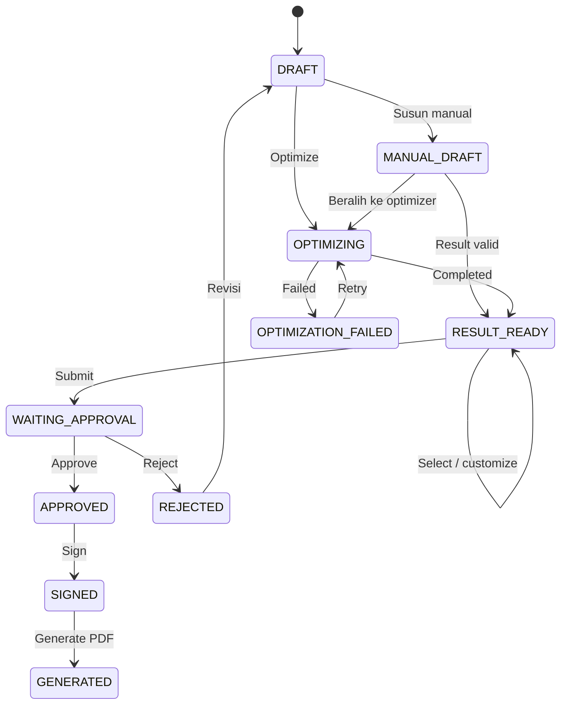

# Alur Pengguna (User Flows)

## Mini Procurement Contract Optimizer

> Status: Acuan alur pengguna MVP 
> Terakhir diperbarui: 28 Agustus 2026

## 1. Tujuan

Dokumen ini menjelaskan alur utama pengguna beserta prasyarat, hasil, dan kondisi gagal. ID `UF-*` digunakan oleh arsitektur dan test.

## 2. Aktor

| Actor | Tanggung jawab |
|---|---|
| Admin | Mengelola product, vendor, dan vendor offer |
| Procurement Staff | Membuat request, menyusun atau memilih result, menjalankan optimizer, customize, dan submit |
| Manager | Review, approve/reject, dan sign |
| System/Worker | Menjalankan optimization, notification, dan contract generation |

Optimizer memberi rekomendasi berdasarkan data dan aturan yang tersedia. Procurement Staff tetap memilih result final dan Manager tetap mengambil keputusan approval.

## 3. Lifecycle

## 4. Daftar Alur dan Traceability

| ID | Flow | Actor | Requirement | Business rules |
|---|---|---|---|---|
| UF-001 | Login dan akses berbasis role | Semua user | PRD-001 | BR-ACCESS-001 |
| UF-002 | Kelola master data | Admin | PRD-002 | BR-MASTER-001–004, BR-OFFER-001–004 |
| UF-003 | Buat procurement request | Procurement Staff | PRD-003 | BR-REQ-001–005 |
| UF-004 | Susun result manual | Procurement Staff | PRD-004 | BR-RESULT-001–004, BR-CALC-001–005 |
| UF-005 | Jalankan optimizer | Procurement Staff / Worker | PRD-005, PRD-007 | BR-OPT-001–009, BR-NOTIF-001, BR-NOTIF-003 |
| UF-006 | Review, customize, dan pilih result | Procurement Staff | PRD-006 | BR-RESULT-005–007 |
| UF-007 | Submit untuk approval | Procurement Staff | PRD-008 | BR-APP-001–002 |
| UF-008 | Approve atau reject | Manager | PRD-007, PRD-008 | BR-APP-003–006, BR-NOTIF-002–003 |
| UF-009 | Electronic signature | Manager | PRD-009 | BR-SIGN-001–003 |
| UF-010 | Generate dan unduh kontrak | Worker / user berizin | PRD-010 | BR-CONTRACT-001–004 |

## 5. Rincian Alur

### UF-001 — Login dan Akses Berbasis Role

**Prasyarat:** user aktif dan memiliki role.

1. User memasukkan kredensial.
2. Sistem memvalidasi kredensial dan membuat session.
3. Sistem menampilkan menu dan data sesuai role.

Kredensial salah ditolak tanpa membocorkan detail akun. Akses tanpa permission menghasilkan `403 Forbidden`.

### UF-002 — Kelola Master Data

**Prasyarat:** Admin sudah login.

1. Admin membuat atau memperbarui product, vendor, dan vendor offer.
2. Sistem memvalidasi relasi, HNA, discount, dan net purchase price.
3. Admin mengaktifkan atau menonaktifkan data.

Data historis tidak ikut berubah. Record yang sudah digunakan dinonaktifkan, bukan dihapus secara merusak.

### UF-003 — Buat Procurement Request

**Prasyarat:** Procurement Staff sudah login.

1. Staff mengisi identitas instansi dan metadata request.
2. Staff menambahkan minimal satu item, quantity, dan target unit price.
3. Sistem memvalidasi input dan menyimpan request sebagai `DRAFT`.
4. Staff memilih **Buat Result Manual** atau **Optimize Otomatis**.

Request item menjadi source of truth dan tidak diedit melalui editor result.

### UF-004 — Susun Result Manual

**Prasyarat:** request berstatus `DRAFT` atau `MANUAL_DRAFT` dan memiliki item valid.

1. Staff memilih vendor offer eligible untuk setiap request item.
2. Sistem menghitung total purchase, total selling, gross profit, dan margin.
3. Staff dapat menyimpan pekerjaan belum lengkap sebagai `MANUAL_DRAFT`.
4. Setelah seluruh item valid, sistem menyimpan snapshot result `MANUAL` dan mengubah status menjadi `RESULT_READY`.

Input tidak valid ditolak dengan pesan per item. Staff dapat beralih ke optimizer sebelum submission.

### UF-005 — Jalankan Optimizer

**Prasyarat:** request berstatus `DRAFT`, `MANUAL_DRAFT`, atau `OPTIMIZATION_FAILED`; item valid; tidak ada run aktif untuk request yang sama.

1. Staff memilih **Optimize Otomatis**.
2. Sistem membuat `OptimizationRun` berstatus `PENDING` dan mengantrekan job.
3. Worker mengubah run menjadi `RUNNING`, mengambil input snapshot, membentuk alternatif, menghitung, dan memberi ranking.
4. Worker menyimpan result `OPTIMIZER` dan ranking secara atomik.
5. Run menjadi `COMPLETED`, request menjadi `RESULT_READY`, dan Staff menerima notification.

Jika gagal, run menjadi `FAILED`, request menjadi `OPTIMIZATION_FAILED`, dan Staff menerima notification. Retry selalu membuat run baru.

### UF-006 — Review, Customize, dan Pilih Result

**Prasyarat:** request berstatus `RESULT_READY`.

1. Staff membandingkan result dan rincian kalkulasi.
2. Staff dapat memilih result langsung atau melakukan customization.
3. Customization divalidasi dan disimpan sebagai result `CUSTOMIZED` baru dengan referensi result sumber dan alasan perubahan.
4. Staff menetapkan satu result valid sebagai `selected_result`.

Result sumber tetap read-only. Staff tidak wajib memilih ranking pertama.

### UF-007 — Submit untuk Approval

**Prasyarat:** request berstatus `RESULT_READY` dan memiliki `selected_result` valid.

1. Sistem memvalidasi kembali coverage, quantity, offer, dan kalkulasi.
2. Staff mengonfirmasi result final.
3. Sistem mengunci result, mengubah status menjadi `WAITING_APPROVAL`, dan mencatat audit event.

Submission ditolak jika result tidak lagi eligible atau tidak berasal dari request yang sama.

### UF-008 — Approve atau Reject

**Prasyarat:** Manager membuka request `WAITING_APPROVAL`.

* **Approve:** Manager meninjau request dan selected result, lalu sistem mengubah status menjadi `APPROVED` dan mencatat event.
* **Reject:** Manager wajib mengisi alasan; sistem mengubah status menjadi `REJECTED`, mencatat event, dan memberi notification kepada submitter.

Request yang ditolak dapat dibuka kembali sebagai `DRAFT`; histori sebelumnya tetap tersedia.

### UF-009 — Electronic Signature

**Prasyarat:** request berstatus `APPROVED` dan user adalah Manager yang melakukan approval.

1. Manager mengonfirmasi persetujuan.
2. Sistem menyimpan signer, server timestamp, dan image opsional.
3. Sistem mengubah status menjadi `SIGNED`.

### UF-010 — Generate dan Unduh Kontrak

**Prasyarat:** request berstatus `SIGNED`.

1. Sistem mengantrekan contract generation.
2. Worker mengambil snapshot request, approved selected result, approval, dan signature.
3. Worker menghasilkan PDF, menyimpannya secara private, dan mencatat version serta checksum SHA-256.
4. Sistem mengubah status menjadi `GENERATED`.
5. User berizin dapat mengunduh kontrak.

Regeneration tidak menimpa file lama.

## 6. Aturan Pengalaman Pengguna

* UI menampilkan status, timestamp terakhir, source type result, serta pesan berhasil atau gagal.
* Tindakan yang tidak valid disembunyikan di UI dan tetap ditolak oleh server.
* Proses background dapat dipantau tanpa membuat job duplikat.
* Nilai uang memakai currency dan pembulatan yang konsisten.
* Error untuk user tidak memuat secret atau stack trace.
* UI membedakan request asli, rekomendasi optimizer, dan selected result final.
