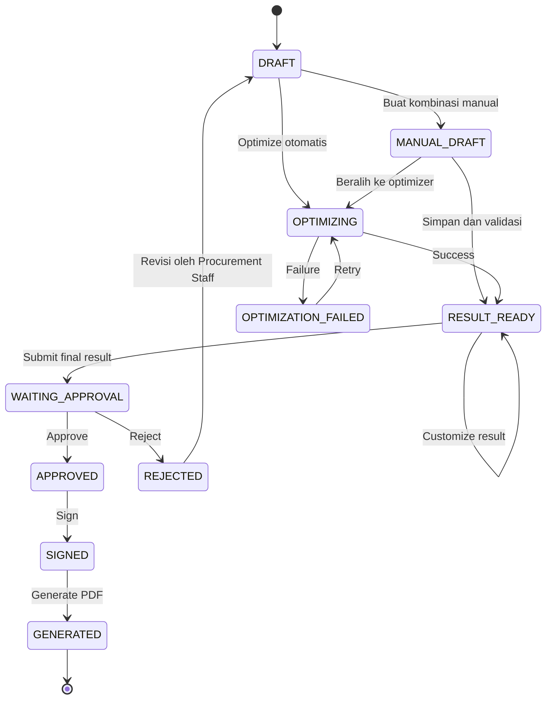

# Alur Pengguna (User Flows)

## Mini Procurement Contract Optimizer

> Jenis: Dokumen desain MVP portofolio  
> Status: Siap digunakan sebagai acuan implementasi  
> Pemilik: Tim Pengembang  
> Terakhir diperbarui: 27 Agustus 2026

## 1. Tujuan

Dokumen ini menjelaskan alur utama pengguna, aktor, prasyarat, alur normal, alur alternatif, dan kondisi akhir setiap proses. ID alur digunakan sebagai referensi pada kriteria penerimaan dan kasus uji.

Istilah domain dan identifier yang muncul di kode—seperti `OptimizationRun`, `WAITING_APPROVAL`, dan `selected_result`—tetap ditulis dalam bahasa Inggris agar dokumentasi mudah dipetakan ke implementasi.

## 2. Actors

| Actor | Tujuan utama | Batasan utama |
|---|---|---|
| Admin | Mengelola product, vendor, dan vendor offer | Tidak mengubah kebutuhan asli instansi demi hasil optimizer |
| Procurement Staff | Membuat request, menyusun kombinasi secara manual atau melalui optimizer, menyesuaikan hasil, dan mengajukan approval | Tidak dapat mengubah kebutuhan asli saat menyusun hasil, approve, atau menandatangani kontrak |
| Manager | Review, approve/reject, dan menandatangani kontrak | Hanya dapat memproses request berstatus sesuai |

### 2.1 Peran Optimizer

Optimizer adalah alat bantu keputusan, bukan pengambil keputusan final. Fungsinya adalah:

* mengambil kebutuhan pada procurement request tanpa mengubahnya;
* mencari vendor offer yang eligible untuk setiap item;
* membentuk dan mengevaluasi berbagai kombinasi vendor offer;
* menghitung total purchase, total selling, gross profit, dan margin setiap kombinasi;
* menolak kombinasi yang tidak memenuhi aturan bisnis;
* memberi ranking serta merekomendasikan kombinasi terbaik berdasarkan objective optimizer.

Procurement Staff tetap menentukan result final. Staff dapat memilih rekomendasi optimizer apa adanya, mengustomisasinya, atau menggunakan jalur manual sejak awal. Manager tetap menjadi pihak yang menyetujui atau menolak result final.

## 3. Siklus Status

`RESULT_READY` berarti Staff sudah memiliki hasil yang valid, baik hasil kombinasi manual maupun rekomendasi optimizer. Setelah ditolak, request kembali ke `DRAFT` agar Procurement Staff dapat memilih kembali jalur manual atau optimizer tanpa mengubah kebutuhan asli instansi.

## 4. Daftar Alur

| ID | Flow | Primary actor | Start state | End state |
|---|---|---|---|---|
| UF-001 | Login dan akses berbasis role | Semua pengguna | Belum login | Sudah login |
| UF-002 | Kelola master data | Admin | N/A | Master data tersimpan |
| UF-003 | Buat procurement request dan pilih metode | Procurement Staff | N/A | `DRAFT` |
| UF-004 | Susun kombinasi manual | Procurement Staff | `DRAFT` / `MANUAL_DRAFT` | `RESULT_READY` |
| UF-005 | Jalankan optimizer otomatis | Procurement Staff | `DRAFT` / `MANUAL_DRAFT` / `OPTIMIZATION_FAILED` | `RESULT_READY` / `OPTIMIZATION_FAILED` |
| UF-006 | Review dan kustomisasi result | Procurement Staff | `RESULT_READY` | `RESULT_READY` |
| UF-007 | Validasi dan submit untuk approval | Sistem / Procurement Staff | `RESULT_READY` | `WAITING_APPROVAL` |
| UF-008 | Approve atau reject | Manager | `WAITING_APPROVAL` | `APPROVED` / `REJECTED` |
| UF-009 | Electronic signature | Manager | `APPROVED` | `SIGNED` |
| UF-010 | Generate dan unduh kontrak | Sistem / Procurement Staff | `SIGNED` | `GENERATED` |

## 5. Rincian Alur

### UF-001 — Login dan Akses Berbasis Role

**Prasyarat**

* User aktif dan sudah memiliki role yang sesuai.

**Alur normal**

1. User membuka halaman login.
2. User memasukkan kredensial.
3. Sistem memvalidasi kredensial dan status pengguna.
4. Sistem membuat session dan mengarahkan pengguna ke dashboard.
5. Sistem menampilkan menu sesuai role.

**Alur alternatif dan kegagalan**

* Kredensial salah: sistem menolak login tanpa membocorkan detail akun.
* Pengguna tidak memiliki role: sistem hanya menyediakan akses profil dan logout.
* Pengguna mengakses URL tanpa izin: sistem mengembalikan respons `403 Forbidden`.

**Kondisi akhir**

* Session login aktif dan akses dibatasi berdasarkan role.

### UF-002 — Kelola Master Data

**Prasyarat**

* Admin sudah login.

**Alur normal**

1. Admin membuat atau memperbarui product dan vendor.
2. Admin membuat vendor offer untuk satu vendor dan satu product.
3. Sistem memvalidasi HNA, discount, dan net purchase price.
4. Admin mengaktifkan data yang siap digunakan.
5. Sistem menyimpan audit metadata.

**Alur alternatif dan kegagalan**

* Input tidak valid: sistem menampilkan pesan kesalahan pada field terkait.
* Data sudah dipakai secara historis: sistem menonaktifkan data, bukan menghapus relasi historis.

### UF-003 — Buat Procurement Request dan Pilih Metode

**Prasyarat**

* Procurement Staff sudah login.

**Alur normal**

1. Staff membuat request dan mengisi identitas instansi serta metadata request.
2. Staff menambahkan minimal satu item, quantity, dan target unit price.
3. Sistem memvalidasi product aktif, quantity `> 0`, dan nilai uang.
4. Sistem menyimpan request dengan status `DRAFT`.
5. Sistem menampilkan dua tindakan pada halaman detail request yang valid:
   * **Buat Kombinasi Manual** untuk menyusun sendiri pilihan vendor offer per item.
   * **Optimize Otomatis** untuk meminta sistem membuat dan memberi ranking kombinasi terbaik.

**Kondisi akhir**

* Request beserta item menjadi source of truth kebutuhan instansi dan siap diproses melalui jalur manual atau optimizer tanpa langkah persiapan oleh Admin.

### UF-004 — Susun Kombinasi Manual

**Prasyarat**

* Request berstatus `DRAFT`.
* Request memiliki minimal satu item yang valid.
* Vendor, product, dan vendor offer aktif yang relevan tersedia.

**Alur normal**

1. Staff memilih **Buat Kombinasi Manual**.
2. Sistem membuat draft kombinasi dan menampilkan seluruh item pada request.
3. Staff memilih vendor offer yang eligible untuk setiap item serta mengisi parameter penawaran yang diizinkan.
4. Sistem menghitung total purchase, total selling, gross profit, dan margin secara langsung setiap kali pilihan berubah.
5. Staff menyimpan kombinasi manual.
6. Sistem memvalidasi coverage seluruh item, quantity, vendor offer, harga, dan konsistensi perhitungan.
7. Jika valid, sistem menyimpan result manual beserta actor dan timestamp, lalu mengubah request menjadi `RESULT_READY`.

**Alur alternatif dan kegagalan**

* Staff dapat menyimpan pekerjaan sebagai `MANUAL_DRAFT` dan melanjutkannya nanti.
* Jika kombinasi belum valid, sistem mempertahankan `MANUAL_DRAFT` dan menunjukkan item atau nilai yang perlu diperbaiki.
* Staff dapat kembali ke halaman request dan memilih **Optimize Otomatis** selama result belum dikirim untuk approval.

### UF-005 — Jalankan Optimizer Otomatis

**Prasyarat**

* Request berstatus `DRAFT`, `MANUAL_DRAFT`, atau `OPTIMIZATION_FAILED`.
* Request memiliki minimal satu item yang valid.
* Vendor, product, dan vendor offer aktif yang relevan tersedia.
* Tidak ada optimization run aktif untuk request yang sama.

**Alur normal**

1. Staff memilih **Optimize Otomatis** pada halaman detail request.
2. Sistem memvalidasi kelengkapan request dan ketersediaan vendor offer yang eligible.
3. Sistem membuat `OptimizationRun` berstatus `PENDING` dan mengubah request menjadi `OPTIMIZING` saat worker mulai bekerja.
4. Sistem membentuk serta mengevaluasi alternatif kombinasi berdasarkan request dan master data aktif.
5. Sistem mengeluarkan kombinasi yang tidak memenuhi coverage item, quantity, kecocokan product, status vendor offer, atau aturan bisnis lainnya.
6. Sistem menghitung total purchase, total selling, gross profit, dan margin untuk setiap kombinasi yang valid.
7. Sistem memberi ranking berdasarkan objective optimizer dan menandai kombinasi dengan nilai terbaik sebagai rekomendasi utama.
8. Worker menyimpan input snapshot, seluruh hasil yang valid, perhitungan, dan ranking secara atomik.
9. Run menjadi `COMPLETED` dan request menjadi `RESULT_READY`.
10. Sistem membuat in-app notification untuk Staff pemicu dan menyediakan tindakan **Review result**.

**Alur kegagalan**

1. Jika request atau master data belum memenuhi syarat, sistem tidak memulai run dan menampilkan field/data yang perlu diperbaiki.
2. Jika proses worker gagal, run menjadi `FAILED` dan request menjadi `OPTIMIZATION_FAILED`.
3. Sistem mengirim notification kegagalan.
4. Staff dapat menjalankan ulang optimasi; percobaan tersebut membuat run baru.

### UF-006 — Review dan Kustomisasi Result

1. Staff membuka result manual atau optimization run yang selesai.
2. Jika berasal dari optimizer, sistem menampilkan rekomendasi utama, alternatif berdasarkan ranking, alasan ranking, dan rincian per item agar Staff dapat memilih salah satu result sebagai dasar.
3. Staff dapat langsung memilih result tersebut atau memilih **Customize result**.
4. Dalam mode kustomisasi, Staff dapat mengganti vendor offer atau parameter penawaran yang diizinkan untuk setiap item.
5. Sistem tidak mengubah identitas instansi, product, quantity, atau kebutuhan asli pada procurement request.
6. Sistem menghitung ulang seluruh nilai turunan, termasuk total purchase, total selling, gross profit, dan margin.
7. Sistem menyimpan hasil kustom sebagai result baru beserta referensi result sumber, actor, timestamp, dan alasan perubahan.
8. Staff memilih result final sebagai `selected_result`.

**Alur alternatif**

* Result manual dapat dikustomisasi kembali sebelum submission.
* Staff tidak wajib memilih result dengan ranking pertama; keputusan akhir dapat mempertimbangkan faktor bisnis di luar perhitungan optimizer.
* Result optimizer asli tetap utuh ketika Staff membuat result kustom.
* Staff dapat membatalkan perubahan sebelum disimpan.
* Jika perubahan tidak eligible, sistem menolak penyimpanan dan menunjukkan item atau nilai yang perlu diperbaiki.

### UF-007 — Validasi dan Submit untuk Approval

1. Staff membuka `selected_result` yang akan dikirim untuk approval.
2. Sistem memvalidasi bahwa seluruh request item tercakup, vendor offer masih eligible, quantity sesuai request, dan seluruh perhitungan konsisten.
3. Sistem menunjukkan label sumber result: **Manual**, **Optimizer**, atau **Customized**.
4. Untuk result hasil optimizer yang dikustomisasi, sistem menampilkan perbandingan dengan rekomendasi asalnya.
5. Staff mengonfirmasi result final dan memilih **Submit for approval**.
6. Sistem mengunci result final agar tidak dapat diubah selama proses approval.
7. Sistem mengubah status menjadi `WAITING_APPROVAL`.
8. Sistem mencatat audit event submission beserta metode penyusunan dan referensi result sumber jika ada.

### UF-008 — Approve atau Reject

**Approve**

1. Manager membuka request `WAITING_APPROVAL`.
2. Manager meninjau kebutuhan asli, result final, perhitungan, dan ringkasan kustomisasi oleh Procurement Staff jika ada.
3. Manager memilih **Approve**.
4. Sistem mengubah status menjadi `APPROVED` dan mencatat audit event.

**Reject**

1. Manager memilih **Reject** dan wajib mengisi alasan.
2. Sistem mengubah status menjadi `REJECTED`.
3. Sistem menyimpan alasan dan memberi notifikasi kepada submitter.

### UF-009 — Electronic Signature

1. Manager yang melakukan approval membuka request `APPROVED`.
2. Manager mengonfirmasi identitas dan persetujuan `[mekanisme TBD]`.
3. Sistem menyimpan `signed_by`, `signed_at`, `signer_name`, dan signature image opsional.
4. Sistem mengubah status menjadi `SIGNED`.

### UF-010 — Generate dan Unduh Kontrak

1. Sistem atau pengguna memicu pembuatan PDF setelah signing.
2. Sistem mengambil snapshot request, approved result, approval, dan signature.
3. Sistem menghasilkan file PDF berversi beserta checksum SHA-256.
4. Sistem menyimpan metadata file dan mengubah status menjadi `GENERATED`.
5. User berizin mengunduh kontrak final.

## 6. Prinsip Pengalaman Pengguna

* Tampilkan status proses dan timestamp terakhir pada halaman detail.
* Semua tindakan yang mengubah data harus memberikan umpan balik berhasil atau gagal.
* Tindakan yang tidak valid untuk status atau role disembunyikan pada antarmuka dan tetap ditolak oleh server.
* Proses asinkron harus dapat dipantau tanpa membuat job duplikat.
* Nilai uang menampilkan currency dan pembulatan yang konsisten.
* Pesan kegagalan untuk pengguna tidak boleh memuat secret atau stack trace.
* Result optimizer asli harus tetap tersedia sebagai snapshot read-only setelah Staff membuat result kustom.
* Antarmuka harus memperjelas perbedaan antara kebutuhan asli instansi, rekomendasi optimizer, dan result final yang akan diajukan.
* Jalur manual dan optimizer harus terlihat sebagai dua pilihan yang setara; keduanya menjalani validasi yang sama sebelum submission.
* UI harus menjelaskan bahwa ranking optimizer adalah rekomendasi berbasis data dan aturan yang tersedia, bukan keputusan final.

## 7. Checklist Kesiapan Alur

- [ ] Setiap alur memiliki prasyarat dan kondisi akhir yang teruji.
- [ ] Semua transisi status telah disepakati.
- [ ] Hak akses setiap tindakan telah dipetakan.
- [ ] Kondisi kosong, memuat, berhasil, gagal, dan percobaan ulang telah didesain.
- [ ] Audit event utama telah didefinisikan.
- [ ] Seluruh keputusan MVP pada dokumen ini konsisten dengan business rules.
