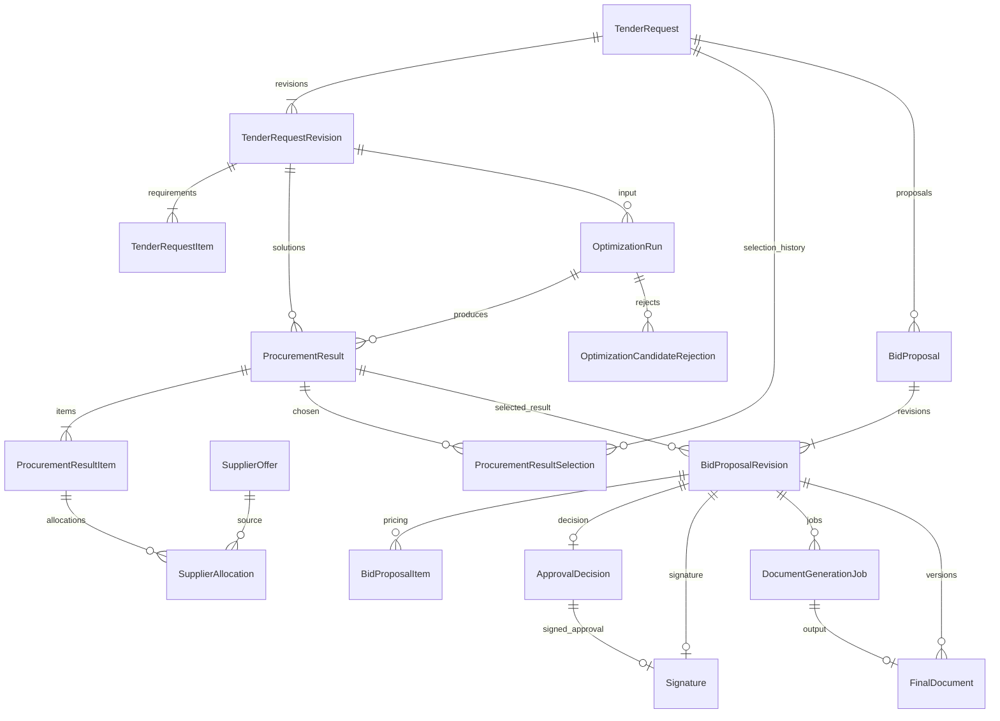

# Domain Model

## Medical Procurement Bid Optimizer

> Status: Dokumentasi implementasi saat ini<br>
> Terakhir diperbarui: 15 September 2026

## 1. Domain dan ownership

| Modul | Model aktual | Tanggung jawab |
|---|---|---|
| accounts | User | Identity Django, UUID, full name, role, dan active state |
| catalog | Product, Supplier | Master versioned dan lifecycle active/inactive |
| tender | TenderRequest, TenderRequestRevision, TenderRequestItem | Root, immutable kebutuhan instansi, dan Product snapshot |
| sourcing | SupplierOffer | Harga komersial, discount, validity, kapasitas, dan supersede lineage |
| sourcing | ProcurementResult, ProcurementResultItem, SupplierAllocation, ProcurementResultSelection | Solusi sourcing, snapshot allocation, validation, dan selection history |
| optimization | OptimizationRun, OptimizationCandidateRejection | Frozen input, status proses, dan rejected candidate |
| bids | BidProposal, BidProposalRevision, BidProposalItem | Identitas proposal, revision komersial, pricing, dan submission |
| approval | ApprovalDecision | Satu keputusan immutable per Bid revision |
| signatures | Signature | Satu tanda tangan untuk revision/approval, gambar opsional |
| documents | DocumentNumberSequence, DocumentGenerationJob, FinalDocument | Nomor tahunan, job render, dan immutable PDF metadata |
| notifications | Notification | Pesan in-app per recipient/source event/type |
| audit | AuditEvent | Fakta mutation dengan actor name frozen dan correlation ID |

`apps/core` berisi utility dan pure policy support, tanpa model/tabel sendiri. Money, quantity, dan percentage diimplementasikan sebagai Decimal dan field model, bukan entity Money terpisah. Institution merupakan field pada Tender revision.

## 2. Relasi inti

Diagram sumber yang dapat diedit tersedia pada [domain-model.mmd](images/domain-model.mmd).



Diagram menunjukkan struktur bisnis setelah aggregate dibuat; DRAFT result dapat belum mempunyai allocation dan Bid DRAFT belum diberi pricing. FK, nullable column, dan relasi master/user lengkap dicatat dalam [Data Model](06-data-model.md) dan [DBML](schema.dbml).

`source_result` merupakan self-reference untuk CUSTOMIZED. Offer `supersedes_offer` merupakan OneToOne self-reference. Selection menyimpan Tender root, revision, result, nomor, actor, dan waktu; selection terbesar per Tender menjadi current selection. Tender root tidak menyimpan selected-result FK.

## 3. Aggregate dan mutability

- **Tender root** dapat berubah current revision/version. Revision dan item tidak diedit; revisi resmi membuat row baru.
- **Result** dapat diedit sebagai DRAFT; setelah VALID, snapshot dan children immutable. Customization membuat aggregate baru.
- **Bid root** menyimpan nomor dan current revision/version. DRAFT revision dapat dipricing; setelah submission material data immutable, sedangkan workflow status dapat maju. Setelah REJECTED, revision baru memakai selection terbaru.
- **OptimizationRun** dan **DocumentGenerationJob** mempunyai status mutable yang dikendalikan service/worker; input snapshot frozen.
- **ApprovalDecision**, **Signature**, **FinalDocument**, **ProcurementResultSelection**, dan **AuditEvent** mempunyai guard update/delete pada model/queryset terkait.
- **Notification** mempunyai read timestamp mutable; uniqueness mencegah pesan source event yang sama menjadi ganda.

Guard model/service tidak berarti ada SQL trigger untuk semua tabel. Database menyediakan FK/check/unique constraints; command reset demo sengaja menggunakan jalur penghapusan langsung pada dataset canonical.

## 4. Lifecycle

```text
Tender:      root revision 1 -> revision 2 -> ... (revision lama tetap)
Result:      DRAFT -> VALID
Optimization:PENDING -> RUNNING -> COMPLETED | FAILED
Bid revision:DRAFT -> WAITING_APPROVAL -> APPROVED -> SIGNED -> FINALIZED
                                      -> REJECTED
Rejected Bid:revision REJECTED lama + revision DRAFT baru
Document job:PENDING -> RUNNING -> COMPLETED | FAILED
Retry PDF:   RUNNING -> PENDING -> RUNNING pada job yang sama
```

Tidak ada status LOCKED, CANCELLED, atau NO_SOLUTION. Optimization COMPLETED dapat menyimpan result count 0. Business retry optimization membuat run baru, sedangkan technical retry PDF melepas claim menjadi PENDING pada job yang sama. Regeneration PDF tidak mengubah Bid revision dan membuat version baru; FINALIZED tetap FINALIZED.

## 5. Snapshot dan historical context

| Titik capture | Informasi yang dipertahankan |
|---|---|
| Tender revision | Product snapshot, kebutuhan, instansi, HPS, dan content hash |
| Draft allocation | Supplier/Offer snapshot dan harga komersial saat allocation ditulis |
| Result VALID | Tender context, item, allocations, total purchase, lineage, dan result hash |
| Optimization request | Eligible Offer, master flags, kebutuhan, tanggal evaluasi, dan input hash |
| Bid create/revise | Selected-result snapshot dari current selection |
| Bid submit | Result context, pricing, submitter, waktu, dan submission hash |
| Signing | Signer name, signed submission hash, dan metadata gambar privat |
| Finalization request | Frozen submission pricing, Tender, approval, signature metadata, nomor, version, dan validity |

Manual/customized validation memakai eligibility Offer live pada tanggal validasi. Optimizer memakai eligibility input frozen. Sesudah submission, approval/signing/finalization memakai hash dan konteks frozen, tanpa rebase otomatis ke Tender/master terbaru.

## 6. Service domain aktual

Pure policies tersedia sebagai fungsi/dataclass, bukan class service bernama konseptual:

- `calculate_net_purchase_price()` dan `evaluate_offer_eligibility()` dalam `apps/sourcing/policies.py`;
- `validate_result_candidate()` dalam `apps/sourcing/validators.py`;
- procurement calculators dalam `apps/sourcing/calculations.py`;
- `optimize()` dalam `apps/optimization/engine.py`;
- `calculate_bid_pricing()` dalam `apps/bids/calculations.py`;
- `canonical_dumps()` dan `canonical_hash()` dalam `apps/core/domain/canonical_json.py`.

Application services mengatur role, transaction, version, snapshot, audit, serta notification. Tidak ada generic event bus, event-sourcing projection, reservation ledger, atau idempotency aggregate. AuditEvent adalah catatan transaksi tambahan, bukan sumber replay seluruh state aplikasi.
