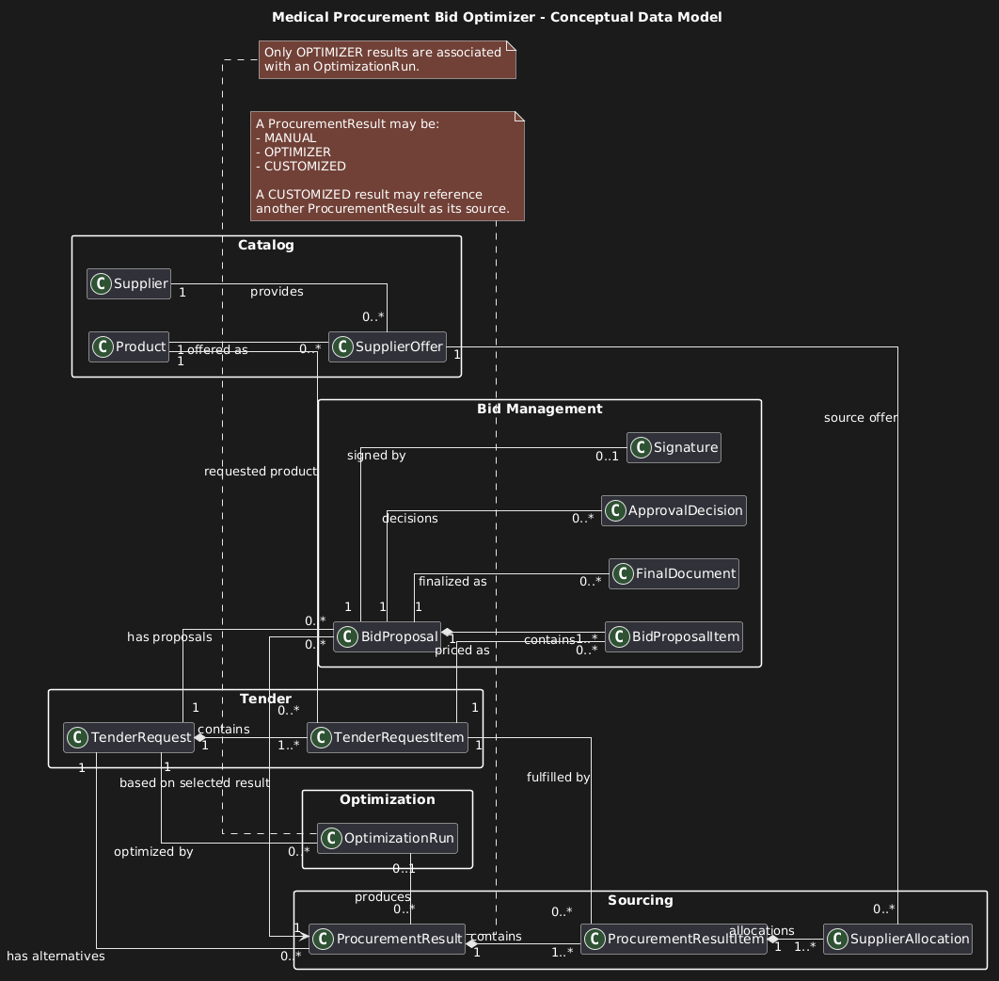

# Domain Model

## Medical Procurement Bid Optimizer

> Status: Acuan domain model MVP  
> Terakhir diperbarui: 8 September 2026

---

## 1. Tujuan

Dokumen ini mendefinisikan model domain **Medical Procurement Bid Optimizer** berdasarkan:

- Product Overview;
- Business Rules;
- Use Cases.

Domain Model menjelaskan:

- konsep bisnis utama;
- domain entity dan tanggung jawabnya;
- hubungan antar-konsep;
- aggregate dan ownership;
- behavior utama;
- business invariant;
- lifecycle entity yang relevan.

Dokumen ini tidak mendefinisikan:

- nama tabel database;
- nama kolom final;
- tipe data PostgreSQL;
- index;
- foreign key policy;

- serializer;
- API endpoint;
- background worker implementation.

Detail tersebut ditentukan pada Data Model dan Technical Design.

---

# 2. Domain Context

Medical Procurement Bid Optimizer digunakan oleh Perusahaan B untuk membantu menyusun penawaran tender pengadaan alat kesehatan atau obat-obatan.

Alur domain utama adalah:

```text
Tender Request
      ↓
Supplier Offers
      ↓
Procurement Result
      ↓
Selected Procurement Result
      ↓
Bid Proposal
      ↓
Internal Approval
      ↓
Electronic Signature
      ↓
Finalization
      ↓
Bid Proposal PDF
```

Aplikasi berhenti pada finalisasi Bid Proposal.

Pengajuan proposal kepada instansi, evaluasi tender, penetapan pemenang, dan Procurement Contract berada di luar scope MVP.

---

# 3. Domain Areas

Domain dibagi menjadi beberapa area konseptual.

## 3.1 Catalog

Menyediakan referensi Product dan Supplier yang digunakan oleh proses tender dan sourcing.

Konsep utama:

- Product
- Supplier

## 3.2 Tender

Merepresentasikan kebutuhan pengadaan yang diterbitkan oleh instansi.

Konsep utama:

- TenderRequest
- TenderRequestItem

## 3.3 Supplier Sourcing

Merepresentasikan penawaran Supplier dan alternatif pemenuhan kebutuhan tender.

Konsep utama:

- SupplierOffer
- ProcurementResult
- ProcurementResultItem
- SupplierAllocation

## 3.4 Optimization

Merepresentasikan satu proses pencarian alternatif Procurement Result secara otomatis.

Konsep utama:

- OptimizationRun

## 3.5 Bid Management

Merepresentasikan penawaran komersial Perusahaan B kepada instansi dan proses internal sampai finalisasi.

Konsep utama:

- BidProposal
- BidProposalItem
- ApprovalDecision
- Signature
- FinalDocument

---

# 4. Domain Entity List

| Entity | Deskripsi |
|---|---|
| Product | Barang yang dapat diminta oleh instansi dan ditawarkan oleh Supplier. |
| Supplier | Perusahaan yang menyediakan Product kepada Perusahaan B. |
| SupplierOffer | Penawaran komersial Supplier untuk Product tertentu. |
| TenderRequest | Representasi kebutuhan tender yang diterbitkan oleh instansi. |
| TenderRequestItem | Satu kebutuhan Product di dalam TenderRequest. |
| ProcurementResult | Satu alternatif cara memenuhi seluruh kebutuhan TenderRequest. |
| ProcurementResultItem | Pemenuhan satu TenderRequestItem di dalam ProcurementResult. |
| SupplierAllocation | Alokasi quantity dari SupplierOffer untuk memenuhi ProcurementResultItem. |
| OptimizationRun | Satu eksekusi optimizer terhadap TenderRequest tertentu. |
| BidProposal | Penawaran komersial Perusahaan B kepada instansi. |
| BidProposalItem | Rincian harga penawaran untuk satu TenderRequestItem. |
| ApprovalDecision | Keputusan Manager terhadap BidProposal yang disubmit. |
| Signature | Electronic signature terhadap BidProposal yang telah disetujui. |
| FinalDocument | Dokumen Bid Proposal final yang dihasilkan setelah proses finalisasi. |

---

# 5. Domain Entity Details

## 5.1 Product

### Purpose

Merepresentasikan barang yang dapat muncul sebagai kebutuhan tender maupun sebagai barang yang ditawarkan Supplier.

### Identity

Product memiliki identity yang stabil sepanjang lifecycle-nya.

### Responsibilities

- menjadi referensi Product pada TenderRequestItem;
- menjadi referensi Product pada SupplierOffer;
- mempertahankan identity historis meskipun informasi Product berubah.

### Main Business Information

Contoh informasi bisnis yang dimiliki:

- product code / SKU;
- product name;
- description;
- active status.

### Important Behavior

- activate;
- deactivate.

### Important Invariants

- Product inactive tidak dapat digunakan untuk transaksi baru;
- Product yang telah digunakan secara historis tidak boleh dihapus dengan cara yang merusak histori.

---

## 5.2 Supplier

### Purpose

Merepresentasikan perusahaan yang menyediakan Product kepada Perusahaan B.

### Responsibilities

- menjadi pihak pemberi SupplierOffer;
- menyediakan identity Supplier yang konsisten untuk sourcing dan histori.

### Main Business Information

Contoh:

- supplier code;
- supplier name;
- contact information;
- address;
- active status.

### Important Behavior

- activate;
- deactivate.

### Important Invariants

- Supplier inactive tidak dapat digunakan untuk SupplierOffer baru;
- histori transaksi yang menggunakan Supplier harus tetap dapat ditelusuri.

---

## 5.3 SupplierOffer

### Purpose

Merepresentasikan penawaran harga dan ketersediaan satu Product dari Supplier kepada Perusahaan B.

SupplierOffer merupakan data komersial, bukan master data permanen.

### Responsibilities

- menyimpan informasi harga beli Supplier;
- menyimpan discount;
- menyimpan availability jika tersedia;
- menyimpan periode berlaku jika tersedia;
- menentukan apakah offer eligible untuk proses sourcing.

### Main Business Information

Contoh:

- Supplier;
- Product;
- base unit price;
- discount;
- net purchase price;
- currency;
- available quantity;
- validity period;
- active status.

### Main Behavior

- calculate net purchase price;
- determine eligibility.

### Important Invariants

- SupplierOffer hanya terkait dengan satu Supplier;
- SupplierOffer hanya terkait dengan satu Product;
- base price harus valid;
- discount berada pada rentang yang diperbolehkan;
- net purchase price harus positif agar offer eligible;
- expired atau inactive offer tidak boleh digunakan untuk ProcurementResult baru.

---

# 6. Tender Domain

## 6.1 TenderRequest

### Purpose

Merepresentasikan kebutuhan pengadaan yang diterbitkan oleh instansi.

TenderRequest merupakan **source of truth** terhadap kebutuhan tender.

### Responsibilities

- menyimpan identitas dan metadata tender;
- menjaga daftar TenderRequestItem;
- menjaga informasi HPS apabila tersedia;
- menjaga revision kebutuhan tender;
- mencegah proses sourcing mengubah kebutuhan asli.

### Main Business Information

Contoh:

- tender/reference number;
- institution information;
- tender title;
- currency;
- total HPS jika tersedia;
- revision number.

### Main Behavior

- add item;
- remove item pada kondisi yang diperbolehkan;
- revise tender requirement;
- validate minimum requirement.

### Important Invariants

- TenderRequest harus memiliki minimal satu TenderRequestItem sebelum diproses;
- optimizer tidak boleh mengubah TenderRequest;
- ProcurementResult tidak boleh mengubah TenderRequest;
- BidProposal tidak boleh mengubah TenderRequest;
- perubahan resmi terhadap kebutuhan harus menghasilkan revision yang dapat ditelusuri.

---

## 6.2 TenderRequestItem

### Purpose

Merepresentasikan satu kebutuhan Product di dalam TenderRequest.

### Responsibilities

- menentukan Product yang dibutuhkan;
- menentukan requested quantity;
- menyimpan specification atau requirement tambahan.

### Main Business Information

Contoh:

- Product;
- quantity;
- unit;
- specification;
- description kebutuhan.

### Important Invariants

- quantity harus lebih besar dari `0`;
- item selalu dimiliki oleh satu TenderRequest;
- Product dan requested quantity tidak boleh dimodifikasi melalui ProcurementResult.

---

# 7. Sourcing Domain

## 7.1 ProcurementResult

### Purpose

Merepresentasikan **satu alternatif sourcing** untuk memenuhi seluruh kebutuhan dalam TenderRequest.

ProcurementResult tidak merepresentasikan harga penawaran kepada instansi.

### Source Type

ProcurementResult memiliki salah satu source type:

- `MANUAL`;
- `OPTIMIZER`;
- `CUSTOMIZED`.

### Responsibilities

- menjaga daftar ProcurementResultItem;
- memastikan seluruh TenderRequestItem terpenuhi;
- menghitung total procurement cost;
- menjaga lineage jika merupakan customized result;
- menyediakan alternatif yang dapat dipilih Procurement Staff.

### Main Behavior

- add or update allocation selama result masih editable;
- validate fulfillment;
- calculate total procurement cost;
- create customized result from another result;
- validate result;
- lock result ketika digunakan pada submission.

### Important Invariants

- ProcurementResult terkait dengan tepat satu TenderRequest;
- ProcurementResult valid harus memenuhi seluruh TenderRequestItem;
- source result tidak boleh ditimpa oleh customization;
- result `CUSTOMIZED` harus memiliki source ProcurementResult;
- result `OPTIMIZER` harus dapat ditelusuri ke OptimizationRun yang menghasilkannya.

---

## 7.2 ProcurementResultItem

### Purpose

Merepresentasikan bagaimana satu TenderRequestItem dipenuhi dalam ProcurementResult.

### Responsibilities

- menghubungkan ProcurementResult dengan TenderRequestItem;
- memiliki satu atau lebih SupplierAllocation;
- menghitung procurement cost untuk satu tender item.

### Main Behavior

- add SupplierAllocation;
- remove SupplierAllocation sebelum result dikunci;
- calculate item procurement cost;
- validate fulfillment.

### Important Invariant

Untuk satu TenderRequestItem:

```text
SUM(SupplierAllocation.allocated_quantity)
=
TenderRequestItem.requested_quantity
```

---

## 7.3 SupplierAllocation

### Purpose

Merepresentasikan bagian quantity yang diambil dari satu SupplierOffer untuk memenuhi TenderRequestItem.

Contoh:

```text
Tender membutuhkan:
100 unit Infusion Pump

Procurement Result:
Supplier A → 60 unit
Supplier B → 40 unit
```

Dalam contoh tersebut terdapat dua SupplierAllocation.

### Responsibilities

- menentukan SupplierOffer yang digunakan;
- menentukan allocated quantity;
- menyediakan procurement cost untuk allocation tersebut.

### Main Behavior

- calculate allocation purchase cost.

### Important Invariants

- allocated quantity harus lebih besar dari `0`;
- Product pada SupplierOffer harus sesuai dengan Product pada TenderRequestItem;
- allocation tidak boleh melebihi available quantity apabila availability dibatasi;
- SupplierOffer harus eligible ketika allocation dibuat.

---

# 8. Optimization Domain

## 8.1 OptimizationRun

### Purpose

Merepresentasikan satu eksekusi optimizer untuk TenderRequest tertentu.

OptimizationRun bukan ProcurementResult.

Satu OptimizationRun dapat menghasilkan beberapa ProcurementResult.

### Responsibilities

- mencatat satu execution optimizer;
- menggunakan kondisi input yang konsisten selama satu run;
- menghasilkan candidate ProcurementResult;
- menentukan ranking result;
- mencatat execution outcome.

### Status

```text
PENDING
RUNNING
COMPLETED
FAILED
```

### Main Behavior

- start;
- complete;
- fail.

### Optimization Objective

Untuk MVP:

```text
MINIMIZE total procurement cost
```

subject to seluruh business constraints.

### Important Invariants

- hanya satu OptimizationRun aktif untuk TenderRequest yang sama;
- optimizer tidak boleh mengubah TenderRequest;
- retry menghasilkan OptimizationRun baru;
- run lama tidak ditimpa;
- ProcurementResult yang dihasilkan harus menggunakan validation policy yang sama dengan result manual.

---

# 9. Bid Management Domain

## 9.1 BidProposal

### Purpose

Merepresentasikan penawaran komersial Perusahaan B kepada instansi.

BidProposal dibuat berdasarkan:

- TenderRequest;
- satu selected ProcurementResult.

### Responsibilities

- menentukan target margin;
- menghitung nilai penawaran;
- menghitung gross profit;
- mengevaluasi feasibility terhadap HPS jika tersedia;
- menjalani workflow internal approval;
- menjadi dasar signature dan finalization.

### Main Business Information

Contoh:

- selected ProcurementResult;
- target margin;
- procurement cost;
- total bid value;
- gross profit;
- actual margin;
- revision;
- status.

### Main Behavior

- set target margin;
- calculate pricing;
- validate feasibility;
- submit for approval;
- revise after rejection;
- transition through allowed lifecycle.

### Status

```text
DRAFT
WAITING_APPROVAL
APPROVED
REJECTED
SIGNED
FINALIZED
```

### Important Invariants

- selected ProcurementResult harus berasal dari TenderRequest yang sama;
- selected ProcurementResult harus valid;
- proposal tidak boleh disubmit jika pricing invalid;
- proposal yang melewati HPS constraint tidak dapat difinalisasi jika HPS tersedia;
- proposal tidak dapat ditandatangani sebelum approved;
- proposal tidak dapat difinalisasi sebelum signed.

---

## 9.2 BidProposalItem

### Purpose

Merepresentasikan rincian komersial untuk satu TenderRequestItem di dalam BidProposal.

### Responsibilities

- membawa quantity item;
- membawa procurement cost item;
- menentukan bid unit price;
- menentukan total bid value untuk item.

### Main Behavior

- calculate item bid price;
- calculate item bid total.

### Important Invariant

BidProposalItem harus mengacu pada TenderRequestItem yang berasal dari TenderRequest yang sama dengan BidProposal.

---

## 9.3 ApprovalDecision

### Purpose

Merepresentasikan keputusan Manager terhadap BidProposal yang disubmit.

### Decision

```text
APPROVED
REJECTED
```

### Responsibilities

- menyimpan keputusan Manager;
- menyimpan alasan rejection;
- mempertahankan histori keputusan terhadap revision tertentu.

### Main Behavior

- approve;
- reject.

### Important Invariants

- keputusan hanya dapat dibuat terhadap proposal `WAITING_APPROVAL`;
- hanya Manager yang berwenang dapat membuat keputusan;
- rejection wajib memiliki reason;
- keputusan historis tidak boleh ditimpa.

---

## 9.4 Signature

### Purpose

Merepresentasikan electronic signature sederhana terhadap BidProposal yang telah disetujui.

### Responsibilities

- mengidentifikasi signer;
- mengidentifikasi waktu signing;
- merepresentasikan persetujuan signer terhadap approved proposal.

### Main Behavior

- sign approved proposal.

### Important Invariants

- BidProposal harus `APPROVED`;
- untuk MVP, signer harus Manager yang melakukan approval;
- signature terkait dengan proposal/revision yang telah disetujui;
- proposal material tidak boleh berubah setelah signing.

---

## 9.5 FinalDocument

### Purpose

Merepresentasikan Bid Proposal PDF yang dihasilkan setelah BidProposal difinalisasi.

FinalDocument bukan Procurement Contract.

### Responsibilities

- merepresentasikan dokumen final;
- menyediakan version history;
- menyediakan integrity information;
- mempertahankan hubungan dengan proposal yang menjadi sumbernya.

### Main Behavior

- generate;
- create new version jika regeneration diperlukan.

### Important Invariants

- FinalDocument hanya dapat dibuat dari BidProposal yang memenuhi syarat finalization;
- file historis tidak boleh ditimpa secara diam-diam;
- perubahan material membutuhkan revision baru sesuai Business Rules.

---

# 10. Supporting Concepts

Konsep berikut mendukung domain tetapi tidak menjadi fokus core business model.

## 10.1 Notification

Digunakan untuk memberi informasi kepada user mengenai event seperti:

- optimization completed;
- optimization failed;
- BidProposal rejected.

Notification tidak menjadi source of truth terhadap business event.

## 10.2 Audit Event

Digunakan untuk mencatat aktivitas penting seperti:

- result selected;
- proposal submitted;
- approval;
- rejection;
- signing;
- finalization.

Audit event bersifat append-only.

Detail persistensi Audit Event ditentukan pada Data Model dan Technical Design.

---

# 11. Value Concepts

Tidak semua konsep domain harus menjadi Entity atau tabel database.

Beberapa konsep lebih tepat diperlakukan sebagai value atau calculated concept.

## 11.1 Money

Merepresentasikan nilai uang dengan currency tertentu.

Contoh:

```text
Rp 800.000.000
```

Money tidak memiliki identity bisnis sendiri.

## 11.2 Percentage / Margin

Merepresentasikan persentase seperti:

- discount percent;
- target margin;
- actual margin.

## 11.3 Procurement Cost

Merupakan nilai hasil kalkulasi dari seluruh SupplierAllocation.

```text
total_purchase
=
SUM(allocation_purchase)
```

ProcurementCost bukan standalone entity.

## 11.4 Bid Value

Merupakan nilai penawaran komersial Perusahaan B kepada instansi.

Untuk pricing berbasis target margin:

```text
total_bid_value
=
total_purchase / (1 - target_margin_rate)
```

---

# 12. Domain Services

Beberapa business behavior melibatkan lebih dari satu entity dan tidak harus dimiliki langsung oleh satu entity.

## 12.1 ProcurementResultValidator

### Responsibility

Memastikan ProcurementResult:

- memenuhi seluruh TenderRequestItem;
- menggunakan SupplierOffer yang sesuai;
- memiliki allocation yang valid.

## 12.2 ProcurementCostCalculator

### Responsibility

Menghitung:

- net purchase price;
- allocation purchase;
- item purchase total;
- total procurement cost.

## 12.3 Optimizer

### Responsibility

Mencari ProcurementResult valid dengan objective:

```text
MINIMIZE total procurement cost
```

Optimizer hanya memberi recommendation.

Optimizer tidak menentukan selected result.

## 12.4 BidPricingCalculator

### Responsibility

Menghitung:

- bid value;
- gross profit;
- actual margin;
- maximum feasible margin jika HPS tersedia.

## 12.5 BidFinalizationPolicy

### Responsibility

Memastikan BidProposal memenuhi seluruh syarat sebelum finalization.

Contoh:

- approved;
- signed;
- pricing valid;
- HPS feasibility valid jika diperlukan.

---

# 13. Aggregate Boundaries

Aggregate adalah consistency boundary, bukan sekadar pengelompokan tabel.

## 13.1 TenderRequest Aggregate

```text
TenderRequest
└── TenderRequestItem
```

### Aggregate Root

`TenderRequest`

### Responsibility

Menjaga konsistensi kebutuhan tender.

Perubahan TenderRequestItem dilakukan melalui TenderRequest.

## 13.2 ProcurementResult Aggregate

```text
ProcurementResult
└── ProcurementResultItem
    └── SupplierAllocation
```

### Aggregate Root

`ProcurementResult`

### Responsibility

Menjaga konsistensi satu alternatif sourcing.

Validation utama:

```text
SUM(allocation)
=
requested quantity
```

## 13.3 BidProposal Aggregate

```text
BidProposal
└── BidProposalItem
```

### Aggregate Root

`BidProposal`

### Responsibility

Menjaga pricing dan lifecycle proposal.

`ApprovalDecision`, `Signature`, dan `FinalDocument` berhubungan dengan BidProposal tetapi dapat memiliki identity dan lifecycle sendiri.

## 13.4 OptimizationRun

`OptimizationRun` merupakan aggregate root sendiri.

Satu run dapat menghasilkan beberapa ProcurementResult.

---

# 14. Relationships

High-level relationship domain:

```text
Supplier
    |
    | provides
    v
SupplierOffer
    |
    | offers
    v
Product


TenderRequest
    |
    | contains
    v
TenderRequestItem
    |
    | fulfilled by
    v
ProcurementResultItem
    |
    | contains
    v
SupplierAllocation
    |
    | uses
    v
SupplierOffer


TenderRequest
    |
    | has alternatives
    v
ProcurementResult


OptimizationRun
    |
    | produces
    v
ProcurementResult


TenderRequest
    |
    | is offered through
    v
BidProposal
    |
    | uses
    v
Selected ProcurementResult


BidProposal
    |
    +--> ApprovalDecision
    |
    +--> Signature
    |
    +--> FinalDocument
```

---

# 15. Conceptual Domain Diagram

Source diagram dapat disimpan sebagai:

```text
docs/images/domain-model.png
```

PlantUML:


Diagram ini bersifat konseptual.

Diagram ini bukan ERD fisik database.

---

# 16. Core Domain Invariants

## INV-001 — Preserve Tender Requirement

TenderRequest merupakan source of truth.

```text
Optimizer
ProcurementResult
BidProposal
```

tidak boleh mengubah kebutuhan TenderRequest.

## INV-002 — Complete Fulfillment

Untuk setiap TenderRequestItem:

```text
SUM(allocated_quantity)
=
requested_quantity
```

## INV-003 — Matching Product

SupplierOffer yang digunakan SupplierAllocation harus menawarkan Product yang sesuai dengan TenderRequestItem.

## INV-004 — Valid Procurement Result

ProcurementResult hanya dianggap valid jika seluruh TenderRequestItem terpenuhi.

## INV-005 — Human-Controlled Selection

Optimizer hanya menghasilkan recommendation.

Procurement Staff menentukan selected ProcurementResult.

## INV-006 — Result Lineage

Customization menghasilkan ProcurementResult baru.

Source ProcurementResult tidak ditimpa.

## INV-007 — Selected Result Consistency

Selected ProcurementResult harus berasal dari TenderRequest yang sama dengan BidProposal.

## INV-008 — Pricing Separation

ProcurementResult menentukan procurement cost.

BidProposal menentukan commercial bid pricing.

Gross profit tidak menjadi objective utama optimizer.

## INV-009 — HPS Feasibility

Jika TenderRequest memiliki HPS, BidProposal harus memenuhi feasibility rule yang berlaku sebelum finalization.

## INV-010 — Controlled Approval

BidProposal hanya dapat di-approve atau reject ketika berada pada kondisi `WAITING_APPROVAL`.

## INV-011 — Controlled Signature

BidProposal hanya dapat ditandatangani setelah approved.

## INV-012 — Controlled Finalization

BidProposal hanya dapat difinalisasi setelah signed.

## INV-013 — Historical Integrity

Perubahan Product, Supplier, atau SupplierOffer saat ini tidak boleh mengubah makna transaksi historis seperti:

- ProcurementResult;
- OptimizationRun;
- submitted BidProposal;
- FinalDocument.

Cara persistence historical data ditentukan pada Data Model.

---

# 17. Lifecycles

## 17.1 OptimizationRun

```text
PENDING
    ↓
RUNNING
    ├──→ COMPLETED
    └──→ FAILED
```

Retry membuat OptimizationRun baru.

## 17.2 ProcurementResult

Untuk kebutuhan MVP:

```text
DRAFT
    ↓
VALID
    ↓
LOCKED
```

`DRAFT` terutama digunakan oleh manual result yang belum selesai.

Result optimizer dibuat `VALID` setelah seluruh validation berhasil.

Result yang menjadi dasar submitted BidProposal dapat dikunci sesuai Business Rules.

## 17.3 BidProposal

```text
DRAFT
    ↓
WAITING_APPROVAL
    ├──→ REJECTED
    │       ↓
    │     DRAFT
    │
    └──→ APPROVED
            ↓
          SIGNED
            ↓
         FINALIZED
```

---

# 18. Domain Events

Domain event merupakan fakta bisnis yang penting untuk diketahui bagian sistem lain.

Contoh event:

```text
TenderRequestRecorded
TenderRequestRevised

ProcurementResultCreated
ProcurementResultSelected

OptimizationStarted
OptimizationCompleted
OptimizationFailed

BidProposalCreated
BidProposalSubmitted
BidProposalApproved
BidProposalRejected
BidProposalSigned
BidProposalFinalized
```

Domain event tidak otomatis berarti setiap event harus memiliki tabel tersendiri.

Cara implementasinya ditentukan pada Technical Design.

---

# 19. Domain Concepts yang Tidak Dimodelkan sebagai Entity pada MVP

## Institution

Instansi adalah pihak eksternal yang menerbitkan tender.

Untuk MVP, Institution dapat direpresentasikan sebagai informasi pada TenderRequest dan belum harus menjadi aggregate/master entity sendiri.

Jika nantinya satu instansi memiliki banyak tender dan membutuhkan pengelolaan data tersendiri, `Institution` dapat dipromosikan menjadi entity.

## Procurement Contract

Procurement Contract baru muncul setelah Perusahaan B memenangkan tender.

Procurement Contract berada di luar scope MVP.

---

# 20. Out of Scope Domain

Domain berikut belum dimodelkan:

- supplier onboarding;
- supplier qualification;
- supplier negotiation;
- procurement contract;
- purchase order;
- inventory;
- warehouse;
- shipping;
- invoice;
- payment;
- accounting;
- ERP integration;
- tender portal integration.

---

# 21. Traceability

| Domain Area | Product Requirements | Business Rules | Use Cases |
|---|---|---|---|
| Catalog | PRD-002 | BR-MASTER-* | UC-002, UC-003 |
| Supplier Offer | PRD-002 | BR-OFFER-* | UC-004 |
| Tender | PRD-003 | BR-REQ-* | UC-005 |
| Manual Sourcing | PRD-004 | BR-RESULT-*, BR-CALC-* | UC-006 |
| Optimization | PRD-005 | BR-OPT-* | UC-007 |
| Result Review & Selection | PRD-006 | BR-RESULT-* | UC-008–010 |
| Bid Proposal | PRD-008 | BR-BID-*, BR-CALC-*, BR-HPS-* | UC-011–013 |
| Approval | PRD-009 | BR-APP-* | UC-014–016 |
| Signature | PRD-010 | BR-SIGN-* | UC-017 |
| Finalization | PRD-011 | BR-FINAL-* | UC-018, UC-019 |
| Auditability | PRD-012 | Cross-cutting | Cross-cutting |

---

# 22. Open Questions

Hal berikut belum menjadi keputusan final dan harus diselesaikan sebelum Data Model/PDM difinalisasi:

1. Apakah Institution perlu menjadi master entity atau cukup disimpan pada TenderRequest untuk MVP? Jawab: Tidak perlu jadi master
2. Apakah ProcurementResult `LOCKED` diperlukan sebagai persistent state atau cukup dikontrol melalui submission snapshot? --> 
3. Apakah BidProposal dapat memiliki lebih dari satu approval decision history dalam revision yang sama?
4. Apakah FinalDocument generation dilakukan synchronous atau background job? --> background job
5. Informasi Product apa saja yang wajib dipertahankan untuk kebutuhan historical representation? -->semua yang ada di atribut data product
6. Informasi SupplierOffer apa saja yang harus dipertahankan untuk historical representation? --> semua yang ada di atribut data supplierOffer
7. Apakah currency MVP hanya IDR atau tetap mendukung ISO currency lainnya? --> IDR saja