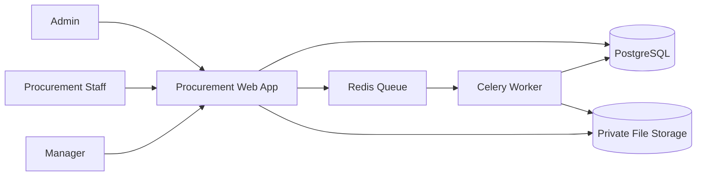
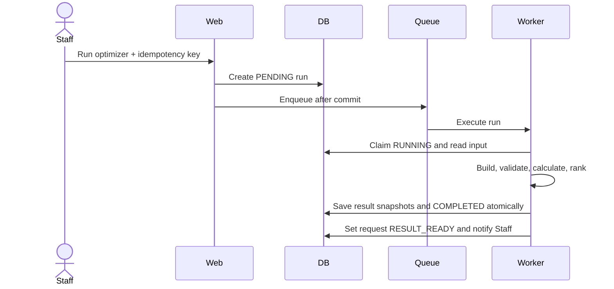
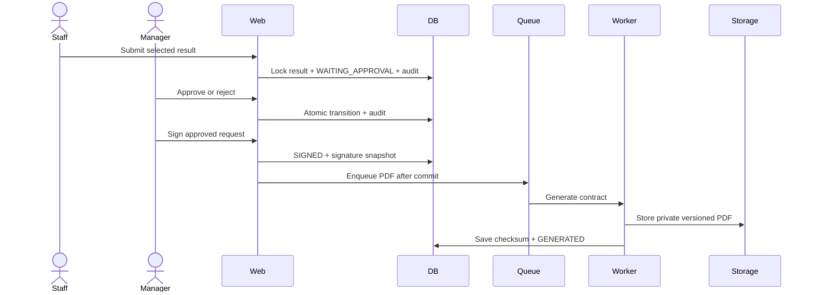
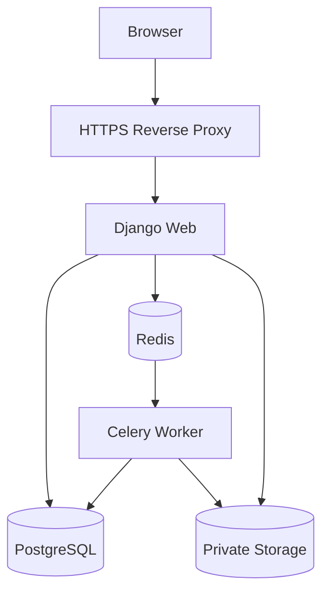

# Arsitektur Sistem (System Architecture)

## Mini Procurement Contract Optimizer

> Status: Arsitektur target MVP; implementasi masih bertahap<br>
> Terakhir diperbarui: 28 Agustus 2026

## 1. Tujuan

Dokumen ini menjelaskan pembagian komponen sistem, hubungan antarkomponen, aliran data teknis, dan keputusan arsitektur untuk MVP. Dokumen ini tidak mendefinisikan detail aturan bisnis, struktur tabel, algoritma optimizer, skenario pengujian, atau prosedur deployment.

Detail tersebut berada pada dokumen khusus yang tercantum pada bagian Referensi Dokumen.

## 2. Prinsip Arsitektur

* Procurement request dan procurement result disimpan terpisah.
* Manual, optimizer, dan customized result memakai model serta validation policy yang sama.
* Optimization dan contract generation berjalan sebagai background job.
* Permission, status guard, dan invariant divalidasi di application service, bukan hanya di UI.
* Result, approval, signature, dan contract disimpan sebagai histori yang dapat diaudit.
* MVP menggunakan modular monolith agar deployment tetap sederhana tanpa mencampur ownership domain.

## 3. Konteks Sistem



Sistem tidak menangani vendor onboarding, negotiation, payment, accounting, inventory, shipping, atau ERP integration.

## 4. Komponen dan Struktur Aplikasi

Sistem dibangun sebagai Django modular monolith. Setiap modul memiliki tanggung jawab bisnis yang jelas, tetapi dijalankan dalam satu aplikasi dan menggunakan database yang sama.

| Komponen | Tanggung jawab | Data utama |
|---|---|---|
| `accounts` | Authentication, role, dan permission | User dan Group |
| `catalog` | Product, vendor, dan vendor offer | Master data |
| `procurement` | Request, request item, result, selected result, dan lifecycle | Procurement domain |
| `optimizer` | Run, pembentukan alternatif, kalkulasi, ranking, dan snapshot | Optimization run dan ranked result |
| `approval` | Submission, approval/rejection, signature, dan audit event | Approval dan signature |
| `contracts` | Rendering, versioning, checksum, dan file | Contract metadata |
| `notifications` | In-app notification dan read state | Notification |
| `dashboard` | Ringkasan sesuai role | Read model; bukan source of truth |

Setiap modul dapat memiliki `models.py`, `services.py`, `policies.py`, `forms.py`, `views.py`, dan `urls.py` sesuai kebutuhannya. Urutan nama file tersebut bukan urutan eksekusi aplikasi.

## 5. Alur Request dan Dependency

```text
HTTP Request
      ↓
URL Router
      ↓
Views / Forms
      ↓
Application Services
      ↓
Domain Policies and Calculations
      ↓
Django Models / ORM / Queue / Storage Adapters
```

Tanggung jawab setiap lapisan:

* URL router memetakan endpoint ke view.
* View dan form menangani HTTP, parsing input, serta presentasi response.
* Application service menangani use case, permission, status transition, transaction, dan side effect.
* Domain policy menangani validation dan kalkulasi yang dapat digunakan kembali oleh jalur manual, optimizer, dan customized.
* Model dan adapter menangani persistence serta integrasi infrastruktur.

Dependency mengarah ke bawah. View tidak boleh menjadi tempat utama aturan bisnis, dan domain policy tidak bergantung pada detail HTTP.

## 6. Aliran Data Utama

### Manual dan Customization

```mermaid
sequenceDiagram
    actor Staff
    participant Web
    participant Service
    participant DB
    Staff->>Web: Save manual/customized result
    Web->>Service: Validate result input
    Service->>Service: Apply shared calculation policy
    Service->>DB: Store immutable result snapshot
    Service->>DB: Set RESULT_READY; selection dilakukan saat review
```

### Optimization



### Approval dan Contract



Semua jenis result menggunakan entitas `ProcurementResult` dan validation policy yang sama. Detail entitas, field, relasi, constraint, dan snapshot dijelaskan dalam `05-data-model.md`.

## 7. Background Job

Optimization dan contract generation dijalankan melalui Celery dengan Redis sebagai broker agar request web tidak menunggu pekerjaan berat selesai.

Pola umum background job:

```text
Web request
    ↓
Commit database transaction
    ↓
Publish job melalui transaction.on_commit
    ↓
Worker claim dan menjalankan job
    ↓
Worker menyimpan outcome dan notification
```

Job harus idempotent. Redelivery untuk job yang sudah selesai menjadi no-op. Kegagalan menyimpan safe error dan status gagal tanpa menghapus histori percobaan sebelumnya. Kebijakan algoritma, retry, serta siklus optimization job dijelaskan dalam `06-optimizer-design.md`.

## 8. Transaction dan Concurrency

Operasi lintas-record berikut harus atomik:

* membuat dan claim optimization run;
* menyimpan result batch beserta outcome run;
* memilih result dan melakukan submission;
* approve atau reject beserta audit event;
* signing; dan
* finalisasi metadata contract setelah file berhasil dibuat.

Application service menetapkan batas transaction dan menggunakan row locking pada transition yang berisiko diproses bersamaan. Queue hanya dipublikasikan setelah transaction database berhasil commit.

Detail database constraint dan index berada di `05-data-model.md`. Strategi pengujian race condition dan idempotency berada di `07-testing-strategy.md`.

## 9. Security Architecture

* Gunakan Django authentication dan group `Admin`, `Procurement Staff`, dan `Manager`.
* Terapkan permission serta object-level access pada setiap endpoint mutatif dan download.
* Aktifkan CSRF protection serta secure, HTTP-only, SameSite cookie di production.
* Simpan secret di environment atau secret manager.
* Signature dan contract berada di private storage tanpa public URL permanen.
* Batasi tipe dan ukuran signature image.
* Escape input pada template PDF dan blokir external resource fetch yang tidak diizinkan.
* Jangan menulis secret, signature, atau isi kontrak ke application log.

## 10. Observability

Web dan worker menghasilkan structured log dengan correlation ID agar satu proses dapat ditelusuri dari HTTP request sampai background job. Log memuat identifier yang relevan, event, status transition, duration, dan outcome tanpa mengekspos data sensitif.

Area yang harus dapat diamati:

* web latency dan error rate;
* queue depth dan oldest job age;
* optimization duration serta success/failure rate;
* contract generation failure; dan
* database serta storage availability.

Ambang performa dan skenario validasinya didefinisikan dalam `07-testing-strategy.md`. Prosedur respons operasional berada di `08-deployment-runbook.md`.

## 11. Deployment Architecture



Web dan worker menggunakan artifact aplikasi yang sama, tetapi dijalankan dengan command dan resource allocation berbeda. PostgreSQL menjadi source of truth, Redis digunakan sebagai broker, dan contract disimpan di private storage. Prosedur migration, backup, health check, deployment, dan rollback dijelaskan dalam `08-deployment-runbook.md`.

## 12. Keputusan Arsitektur

| Keputusan | Status |
|---|---|
| Django modular monolith | Accepted |
| Satu model `ProcurementResult` dengan `source_type` | Accepted |
| `RESULT_READY` untuk result valid manual maupun optimizer | Accepted |
| PostgreSQL untuk production | Accepted |
| Celery + Redis untuk background job | Accepted |
| WeasyPrint + private versioned storage | Accepted |

## 13. Referensi Dokumen

| Dokumen | Pemilik detail |
|---|---|
| `01-product-overview.md` | Tujuan produk, scope, dan product requirements |
| `02-business-rules.md` | Aturan bisnis, lifecycle, dan invariant |
| `03-user-flows.md` | Alur pengguna dan interaksi UI |
| `05-data-model.md` | ERD, entity, field, constraint, index, dan snapshot |
| `06-optimizer-design.md` | Input, kalkulasi, ranking, algoritma, dan siklus optimization job |
| `07-testing-strategy.md` | Skenario, quality gate, performance, security, dan concurrency testing |
| `08-deployment-runbook.md` | Konfigurasi, deployment, backup, recovery, dan rollback |
