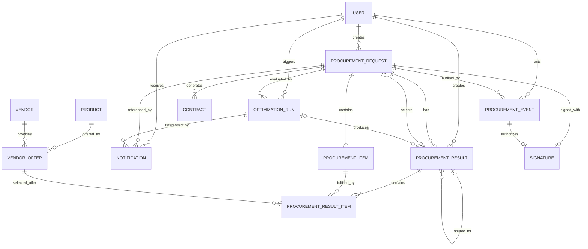

# Model Data (Data Model)

## Mini Procurement Contract Optimizer

> Status: Model konseptual target MVP; implementasi masih bertahap<br>
> Terakhir diperbarui: 28 Agustus 2026

## 1. Tujuan

Dokumen ini menerjemahkan konsep produk, aturan bisnis, user flows, dan keputusan arsitektur pada dokumen 01–04 menjadi entity, relasi, constraint, snapshot, serta kebutuhan index.

`ProcurementRequest` tetap menjadi source of truth kebutuhan instansi. `ProcurementResult` menyimpan alternatif pemenuhan kebutuhan dan digunakan bersama oleh jalur `MANUAL`, `OPTIMIZER`, serta `CUSTOMIZED`.

Nama field dapat disesuaikan saat implementasi Django, tetapi relasi dan invariant dalam dokumen ini harus tetap dijaga.

## 2. Konvensi Pemodelan

* Model domain menggunakan UUID; Django User tetap menggunakan primary key bawaannya.
* Timestamp disimpan timezone-aware dalam UTC dan dikonversi untuk tampilan pengguna.
* Nilai uang menggunakan `Decimal`, bukan floating point.
* Currency disimpan pada request dan snapshot result; seluruh item dalam satu request menggunakan currency yang sama.
* Entity mutatif memiliki `created_at`, `updated_at`, dan actor jika diperlukan untuk audit.
* Snapshot historis tidak berubah ketika master data berubah.
* Master data yang telah direferensikan dinonaktifkan, bukan dihapus secara merusak.
* Cross-table invariant diterapkan di application service dalam transaction; database constraint digunakan jika memungkinkan.

## 3. Entity Relationship Diagram (ERD)



`ProcurementResult.source_result_id` adalah self-reference opsional untuk result `CUSTOMIZED`. `ProcurementResult.optimization_run_id` hanya diisi untuk result `OPTIMIZER`. Relasi master data pada result item digunakan untuk traceability; field snapshot tetap menjadi sumber tampilan historis.

## 4. Daftar Entity

### 4.1 Product

| Field | Tipe | Wajib | Catatan |
|---|---|---|---|
| `id` | PK | Yes | Stable identifier |
| `sku` | varchar | Yes | Unique dan dinormalisasi menjadi huruf kapital |
| `name` | varchar | Yes | Display name |
| `description` | text | No | Product detail |
| `is_active` | boolean | Yes | Default `true` |
| timestamps | datetime | Yes | Created/updated |

### 4.2 Vendor

| Field | Tipe | Wajib | Catatan |
|---|---|---|---|
| `id` | PK | Yes | Stable identifier |
| `code` | varchar | Yes | Unique vendor code |
| `name` | varchar | Yes | Legal/display name |
| `address` | text | No | Digunakan pada contract jika tersedia |
| `contact` | JSON/fields | No | Simpan hanya data yang diperlukan |
| `is_active` | boolean | Yes | Default `true` |
| timestamps | datetime | Yes | Created/updated |

### 4.3 VendorOffer

| Field | Tipe | Wajib | Catatan |
|---|---|---|---|
| `id` | PK | Yes | Stable identifier |
| `vendor_id` | FK Vendor | Yes | Vendor pemberi offer |
| `product_id` | FK Product | Yes | Product yang ditawarkan |
| `hna` | decimal | Yes | `>= 0` |
| `discount_percent` | decimal | Yes | `0..100` |
| `net_purchase_price` | decimal | Yes | Hasil formula yang dihitung atau divalidasi |
| `currency` | char(3) | Yes | ISO 4217 |
| `valid_from`, `valid_until` | date | No | Periode eligibility; tanggal akhir inklusif |
| `is_active` | boolean | Yes | Eligibility flag |
| timestamps | datetime | Yes | Created/updated |

Formula:

```text
net_purchase_price = hna - (hna × discount_percent / 100)
```

Offer eligible harus terkait product dan vendor aktif, berada dalam periode berlaku jika periodenya diisi, serta memiliki `net_purchase_price > 0`.

### 4.4 ProcurementRequest

| Field | Tipe | Wajib | Catatan |
|---|---|---|---|
| `id` | PK | Yes | Stable identifier |
| `request_number` | varchar | Yes | Unique human-readable ID |
| `institution_name` | varchar | Yes | Instansi peminta |
| `title` | varchar | Yes | Ringkasan request |
| `status` | enum/varchar | Yes | Lifecycle procurement |
| `currency` | char(3) | Yes | Currency untuk request dan seluruh result-nya |
| `revision_number` | positive integer | Yes | Dimulai dari `1`; naik pada perubahan material kebutuhan |
| `created_by_id` | FK User | Yes | Procurement Staff pembuat request |
| `selected_result_id` | FK ProcurementResult | No | Result valid milik request yang sama |
| `selected_by_id` | FK User | No | Actor yang terakhir memilih result |
| `selected_at` | datetime | No | Waktu pemilihan result terakhir |
| `submitted_at` | datetime | No | Diisi ketika submission berhasil |
| timestamps | datetime | Yes | Created/updated |

Nilai `status`:

```text
DRAFT
MANUAL_DRAFT
OPTIMIZING
OPTIMIZATION_FAILED
RESULT_READY
WAITING_APPROVAL
APPROVED
REJECTED
SIGNED
GENERATED
```

`selected_result_id`, `selected_by_id`, dan `selected_at` harus seluruhnya null atau seluruhnya terisi. Riwayat perubahan selection dicatat dalam `ProcurementEvent`.

### 4.5 ProcurementItem

| Field | Tipe | Wajib | Catatan |
|---|---|---|---|
| `id` | PK | Yes | Stable identifier |
| `request_id` | FK ProcurementRequest | Yes | Parent request |
| `product_id` | FK Product | Yes | Product yang dibutuhkan |
| `description_snapshot` | varchar/text | Yes | Deskripsi kebutuhan saat request dibuat |
| `quantity` | positive integer | Yes | `> 0`; split quantity di luar scope MVP |
| `unit` | varchar | Yes | Nilai dari daftar unit yang dikendalikan aplikasi |
| `target_unit_price` | decimal | Yes | `>= 0` |
| `valid_from_revision` | positive integer | Yes | Revision pertama yang menggunakan item ini |
| `valid_until_revision` | positive integer | No | Revision terakhir; null berarti masih aktif |
| timestamps | datetime | Yes | Created/updated |

Request harus memiliki minimal satu item aktif pada revision berjalan sebelum result dibuat atau optimizer dijalankan. Perubahan resmi item hanya diperbolehkan pada status request yang mengizinkan dan tidak dilakukan melalui editor result. Item yang sudah dipakai result tidak ditimpa; revision lama ditutup dan record item revision baru dibuat.

### 4.6 ProcurementResult

Header satu alternatif pemenuhan seluruh item dalam sebuah procurement request.

| Field | Tipe | Wajib | Catatan |
|---|---|---|---|
| `id` | PK | Yes | Stable result ID |
| `request_id` | FK ProcurementRequest | Yes | Request yang dipenuhi |
| `request_revision` | positive integer | Yes | Revision request yang dipenuhi oleh snapshot ini |
| `source_type` | enum/varchar | Yes | `MANUAL`, `OPTIMIZER`, atau `CUSTOMIZED` |
| `status` | enum/varchar | Yes | `DRAFT`, `VALID`, atau `LOCKED` |
| `source_result_id` | self FK | Conditional | Wajib hanya untuk `CUSTOMIZED` |
| `optimization_run_id` | FK OptimizationRun | Conditional | Wajib hanya untuk `OPTIMIZER` |
| `rank` | positive integer | Conditional | Wajib dan unique dalam run untuk `OPTIMIZER` |
| `customization_reason` | text | Conditional | Wajib untuk `CUSTOMIZED` |
| `currency` | char(3) | Yes | Harus sama dengan request |
| `total_purchase` | decimal | Yes | Snapshot total purchase |
| `total_selling_price` | decimal | Yes | Snapshot total selling |
| `gross_profit` | decimal | Yes | Snapshot gross profit |
| `margin_percent` | decimal | No | Null jika total selling price `0` |
| `calculation_snapshot` | JSON | Yes | Formula, pembulatan, tie-break jika relevan, dan versi policy |
| `snapshot_schema_version` | positive integer | Yes | Versi struktur snapshot |
| `created_by_id` | FK User | Yes | Staff pembuat manual/customized result atau pemicu optimization run |
| `locked_by_id` | FK User | No | Actor yang melakukan submission |
| `locked_at` | datetime | No | Diisi saat selected result dikunci |
| timestamps | datetime | Yes | Created/updated |

Result manual yang belum lengkap dapat disimpan sebagai `DRAFT` selama request berstatus `MANUAL_DRAFT`. Setelah seluruh request item terpenuhi dan kalkulasi valid, result menjadi `VALID` dan snapshot tidak lagi diedit. Customization selalu membuat result baru. Selected result menjadi `LOCKED` saat submission.

### 4.7 ProcurementResultItem

Snapshot pemenuhan satu `ProcurementItem` dalam sebuah result.

| Field | Tipe | Wajib | Catatan |
|---|---|---|---|
| `id` | PK | Yes | Stable identifier |
| `result_id` | FK ProcurementResult | Yes | Parent result |
| `procurement_item_id` | FK ProcurementItem | Yes | Request item yang dipenuhi |
| `vendor_offer_id` | FK VendorOffer | Yes | Offer yang dipilih; snapshot tetap authoritative untuk histori |
| `product_id` | FK Product | No | Traceability ke master data asal |
| `vendor_id` | FK Vendor | No | Traceability ke master data asal |
| `product_sku_snapshot` | varchar | Yes | SKU ketika result dibuat |
| `product_name_snapshot` | varchar | Yes | Nama product ketika result dibuat |
| `vendor_code_snapshot` | varchar | Yes | Kode vendor ketika result dibuat |
| `vendor_name_snapshot` | varchar | Yes | Nama vendor ketika result dibuat |
| `quantity` | positive integer | Yes | Harus sama dengan request item |
| `unit_snapshot` | varchar | Yes | Unit ketika result dibuat |
| `target_unit_price` | decimal | Yes | Snapshot target/selling unit price dari request |
| `hna` | decimal | Yes | Snapshot HNA offer |
| `discount_percent` | decimal | Yes | Snapshot discount offer |
| `net_purchase_price` | decimal | Yes | Snapshot net purchase price |
| `total_purchase` | decimal | Yes | Quantity × net purchase price |
| `total_selling_price` | decimal | Yes | Quantity × target unit price |
| `gross_profit` | decimal | Yes | Selling − purchase |
| `margin_percent` | decimal | No | Null jika total selling price `0` |
| `snapshot_schema_version` | positive integer | Yes | Versi struktur snapshot |

Satu result hanya boleh memiliki satu item untuk setiap procurement item. Result `VALID` atau `LOCKED` harus mencakup seluruh item request tanpa item tambahan.

### 4.8 OptimizationRun

| Field | Tipe | Wajib | Catatan |
|---|---|---|---|
| `id` | PK | Yes | Stable run ID |
| `request_id` | FK ProcurementRequest | Yes | Request yang dioptimasi |
| `request_revision` | positive integer | Yes | Revision request pada saat input dibekukan |
| `status` | enum/varchar | Yes | `PENDING`, `RUNNING`, `COMPLETED`, atau `FAILED` |
| `triggered_by_id` | FK User | Yes | Procurement Staff pemicu |
| `idempotency_key` | varchar | Yes | Unique untuk permintaan run dari client/service |
| `input_snapshot` | JSON | Yes | Canonical input, eligible offers, dan versi schema |
| `algorithm_version` | varchar | Yes | Reproducibility |
| `rejected_candidates_snapshot` | JSON | Yes | Alasan alternatif ditolak; dapat berupa list kosong |
| `started_at`, `finished_at` | datetime | No | Runtime tracking |
| `error_code`, `error_message` | varchar/text | No | Safe failure information |
| timestamps | datetime | Yes | Created/updated |

Hanya satu run `PENDING` atau `RUNNING` yang boleh ada per request. Retry selalu membuat run baru dan tidak menimpa run atau result sebelumnya.

### 4.9 ProcurementEvent

Event append-only untuk selection dan lifecycle procurement.

| Field | Tipe | Wajib | Catatan |
|---|---|---|---|
| `id` | PK | Yes | Stable event ID |
| `request_id` | FK ProcurementRequest | Yes | Parent request |
| `result_id` | FK ProcurementResult | No | Result terkait, wajib untuk selection/submission |
| `action` | enum/varchar | Yes | Jenis tindakan |
| `actor_type` | enum/varchar | Yes | `USER` atau `SYSTEM` |
| `actor_id` | FK User | Conditional | Wajib untuk actor `USER` |
| `from_status`, `to_status` | varchar | No | Wajib untuk status transition |
| `note` | text | Conditional | Wajib untuk rejection; opsional lainnya |
| `metadata` | JSON | Yes | Metadata aman dan berversi; default object kosong |
| `created_at` | datetime | Yes | Server timestamp; record tidak diperbarui |

Nilai action minimum:

```text
RESULT_SELECTED
REQUEST_REVISED
SUBMITTED
APPROVED
REJECTED
REOPENED
SIGNED
CONTRACT_GENERATED
```

Event `SUBMITTED`, `APPROVED`, dan `REJECTED` menyimpan `from_status` serta `to_status`. Event lain juga menyimpannya ketika tindakan tersebut mengubah lifecycle request.

### 4.10 Signature

| Field | Tipe | Wajib | Catatan |
|---|---|---|---|
| `id` | PK | Yes | Stable identifier |
| `request_id` | OneToOne ProcurementRequest | Yes | Satu signature final per request pada MVP |
| `approval_event_id` | FK ProcurementEvent | Yes | Harus menunjuk event `APPROVED` request yang sama |
| `signed_by_id` | FK User | Yes | Manager yang sama dengan approver |
| `signer_name` | varchar | Yes | Snapshot nama signer |
| `signed_at` | datetime | Yes | Server timestamp |
| `image_path` | private file reference | No | Signature image opsional |
| `image_checksum` | varchar | No | SHA-256 image jika tersedia |
| `consent_metadata` | JSON | Yes | Versi pernyataan persetujuan; default object kosong |
| `created_at` | datetime | Yes | Creation timestamp |

### 4.11 Contract

| Field | Tipe | Wajib | Catatan |
|---|---|---|---|
| `id` | PK | Yes | Stable identifier |
| `request_id` | FK ProcurementRequest | Yes | Request berstatus `SIGNED` saat job dibuat |
| `selected_result_id` | FK ProcurementResult | Yes | Result final yang telah dikunci |
| `signature_id` | FK Signature | Yes | Signature yang digunakan |
| `version` | positive integer | Yes | Unique dalam request |
| `status` | enum/varchar | Yes | `PENDING`, `RUNNING`, `GENERATED`, atau `FAILED` |
| `idempotency_key` | varchar | Yes | Unique untuk mencegah duplicate generation |
| `file_path` | private file reference | Conditional | Wajib saat `GENERATED` |
| `checksum` | varchar | Conditional | SHA-256 hexadecimal; wajib saat `GENERATED` |
| `content_snapshot` | JSON | Yes | Frozen request, result, approval, dan signature input |
| `snapshot_schema_version` | positive integer | Yes | Versi struktur content snapshot |
| `error_code`, `error_message` | varchar/text | No | Safe failure information |
| `generated_by_id` | FK User | No | Null untuk worker/system actor |
| `generated_at` | datetime | No | Wajib saat `GENERATED` |
| timestamps | datetime | Yes | Created/updated |

Regeneration membuat version baru dan tidak menimpa file lama. Request berubah menjadi `GENERATED` hanya setelah file serta metadata contract berhasil disimpan.

### 4.12 Notification

| Field | Tipe | Wajib | Catatan |
|---|---|---|---|
| `id` | PK | Yes | Stable identifier |
| `recipient_id` | FK User | Yes | Pemilik notification |
| `type` | enum/varchar | Yes | Optimization completed/failed atau request rejected |
| `request_id` | FK ProcurementRequest | Yes | Trace target utama |
| `optimization_run_id` | FK OptimizationRun | No | Wajib untuk notification optimization |
| `deduplication_key` | varchar | Yes | Unique per recipient dan business event |
| `message` | varchar | Yes | Safe display message |
| `read_at` | datetime | No | Null berarti unread |
| `created_at` | datetime | Yes | Creation timestamp |

## 5. Constraint dan Invariant Wajib

### Database constraint

* `Product.sku`, `Vendor.code`, dan `ProcurementRequest.request_number` unique.
* `quantity > 0`, `target_unit_price >= 0`, dan seluruh nilai total yang disyaratkan tidak null.
* `hna >= 0`, `0 <= discount_percent <= 100`, serta offer aktif yang eligible memiliki `net_purchase_price > 0`.
* Conditional unique constraint memastikan hanya satu `OptimizationRun` berstatus `PENDING` atau `RUNNING` per request.
* `(optimization_run_id, rank)` unique untuk result `OPTIMIZER`.
* `(result_id, procurement_item_id)` unique pada `ProcurementResultItem`.
* `(request_id, version)` unique pada `Contract`.
* `OptimizationRun.idempotency_key`, `Contract.idempotency_key`, dan `Notification.deduplication_key` unique sesuai scope-nya.
* Rejection event memiliki note non-empty.
* `locked_by_id` dan `locked_at` harus keduanya null atau keduanya terisi.
* Contract `GENERATED` memiliki `file_path`, `checksum`, dan `generated_at`; field tersebut belum wajib untuk status lainnya.

### Cross-table invariant

Invariant berikut divalidasi oleh application service di dalam transaction dan diuji secara eksplisit:

* Request memiliki minimal satu item aktif pada revision berjalan sebelum result dibuat atau optimization dimulai.
* Result item, procurement item, dan result merujuk request yang sama.
* Product pada vendor offer sesuai dengan product request item.
* `valid_until_revision` procurement item harus null atau lebih besar/sama dengan `valid_from_revision`.
* Result `VALID` atau `LOCKED` mencakup seluruh request item yang aktif pada `request_revision` tepat satu kali dengan quantity yang sama.
* Totals header result sama dengan penjumlahan result item menggunakan calculation policy yang sama.
* `MANUAL` tidak memiliki source result, optimization run, atau rank.
* `OPTIMIZER` memiliki run `COMPLETED` milik request dan revision yang sama serta memiliki rank; source result kosong.
* Status result `DRAFT` hanya digunakan oleh jalur `MANUAL` dan tidak dapat dipilih.
* Result `OPTIMIZER` dan `CUSTOMIZED` dibuat langsung sebagai `VALID` setelah seluruh validation berhasil.
* `CUSTOMIZED` memiliki source result `VALID` atau `LOCKED` dari request dan revision yang sama, alasan perubahan, serta tidak membentuk siklus self-reference.
* Selected result berstatus `VALID` atau `LOCKED`, berasal dari request serta revision yang sama, dan source type apa pun diperbolehkan.
* Submission memvalidasi ulang coverage, quantity, offer eligibility, dan kalkulasi; lalu mengunci selected result serta menyimpan event secara atomik.
* Approve/reject hanya berlaku dari `WAITING_APPROVAL`; signature hanya berlaku setelah `APPROVED`.
* Signature actor sama dengan actor pada event approval.
* Contract hanya dibuat dari request `SIGNED`, selected result yang dikunci, approval, dan signature milik request yang sama.
* Perubahan master data tidak mengubah field snapshot historis.
* Perubahan material request menaikkan `revision_number`, mencatat event `REQUEST_REVISED`, dan tidak mengubah result atau run revision sebelumnya.
* Ketika request yang ditolak dibuka kembali untuk revisi, selection aktif dibersihkan tanpa menghapus result dan event historis.

## 6. Rencana Index

| Entity | Index | Alasan |
|---|---|---|
| ProcurementRequest | `(status, updated_at)` | Work queue dan dashboard |
| ProcurementRequest | `(created_by_id, updated_at)` | Daftar request milik Staff |
| VendorOffer | `(product_id, is_active)` | Eligible-offer lookup |
| ProcurementResult | `(request_id, created_at)` | Review seluruh alternatif result |
| ProcurementResult | `(optimization_run_id, rank)` unique/partial | Ranked result retrieval |
| ProcurementResultItem | `(result_id, procurement_item_id)` unique | Coverage dan detail result |
| OptimizationRun | `(request_id, created_at)` | Run history |
| OptimizationRun | `(status, created_at)` | Worker dan operational lookup |
| ProcurementEvent | `(request_id, created_at)` | Audit timeline |
| Notification | `(recipient_id, read_at, created_at)` | User inbox |
| Contract | `(request_id, version)` unique | Version history |

Index final harus divalidasi terhadap query dan execution plan PostgreSQL; jangan menambah index redundan tanpa bukti penggunaan.

## 7. Kebijakan Kalkulasi, Uang, dan Pembulatan

Formula yang disimpan dalam calculation snapshot:

```text
net_purchase_price = hna - (hna × discount_percent / 100)
total_selling_price = quantity × target_unit_price
total_purchase = quantity × net_purchase_price
gross_profit = total_selling_price - total_purchase
margin_percent = (gross_profit / total_selling_price) × 100
```

Kebijakan penyimpanan:

* Presisi uang: `Decimal(19, 2)`.
* Presisi persentase: `Decimal(7, 4)`.
* Metode pembulatan: `ROUND_HALF_UP`.
* Total dihitung dan dibulatkan per item, lalu header result menjumlahkan total item.
* `margin_percent` bernilai null ketika total selling price `0`.
* Currency result dan result item harus sama dengan currency request.

Calculation policy yang sama digunakan oleh result manual, optimizer, dan customized.

## 8. Snapshot dan Immutability

| Artifact | Snapshot minimum |
|---|---|
| ProcurementResult | Source type, totals, calculation policy/version, actor, dan timestamp |
| ProcurementResultItem | Product, vendor, offer price, target price, quantity, unit, serta kalkulasi item |
| OptimizationRun | Request input, eligible offers, algorithm version, dan rejected reason |
| ProcurementEvent | Action, actor, timestamp, status transition, result terkait, dan note |
| Signature | Approval event, signer identity, consent, signed time, dan image checksum jika ada |
| Contract | Frozen request, selected result, approval, signature, version, storage key, dan checksum |

Setelah result menjadi `VALID`, perubahan dilakukan dengan membuat result baru, bukan mengedit snapshot lama. Submission mengubah selected result menjadi `LOCKED`. Approval event dan contract version bersifat append-only. Perubahan master data tidak dipropagasikan ke snapshot historis.

## 9. Penghapusan dan Retensi

* Product, vendor, dan vendor offer yang pernah direferensikan dinonaktifkan; hard delete ditolak.
* Procurement request, result, event, signature, dan contract tidak menyediakan hard delete melalui UI.
* Notification dapat dibersihkan tanpa menghapus procurement event yang menjadi audit trail.
* File signature dan contract berada di private storage dan mengikuti kebijakan retensi organisasi.
* Durasi retensi ditetapkan melalui kebijakan operasional terpisah; dokumen 01–04 belum menetapkan angka retensi.

## 10. Checklist Migration

- [ ] Enum dan state transition konsisten dengan lifecycle pada dokumen 02–03.
- [ ] `ProcurementResult` mendukung `MANUAL`, `OPTIMIZER`, dan `CUSTOMIZED` tanpa tabel result terpisah.
- [ ] Foreign key memakai delete policy yang tidak merusak histori.
- [ ] Check, unique, dan conditional unique constraint direpresentasikan dalam migration PostgreSQL.
- [ ] Cross-table invariant diterapkan di application service dan memiliki test.
- [ ] Snapshot JSON memiliki `snapshot_schema_version` dan format canonical.
- [ ] Money field memakai `Decimal` dengan presisi serta rounding yang konsisten.
- [ ] Data migration memiliki strategi forward dan rollback yang terdokumentasi.
- [ ] Migration besar menghindari table lock berkepanjangan.
- [ ] Backup tersedia sebelum migration destruktif.
