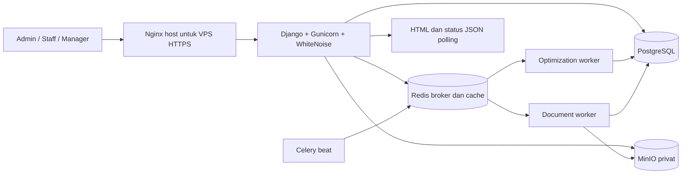

# System Architecture

## Medical Procurement Bid Optimizer

> Status: Dokumentasi implementasi saat ini 
> Terakhir diperbarui: 15 September 2026

## 1. Arsitektur yang tersedia

Repository menggunakan Django modular monolith dengan server-rendered templates dan session authentication. Business rules dipisahkan ke application services dan pure calculators/policies. Background processing memakai Celery/Redis; PostgreSQL menyimpan status canonical; MinIO menyimpan binary privat.

Untuk development, browser mengakses Django runserver langsung; Nginx merupakan konfigurasi host contoh, bukan service dalam Compose. [System context PlantUML](images/system-context.puml) menggambarkan pihak eksternal yang bertukar informasi dengan Staff di luar aplikasi.

## 2. Pembagian runtime

| Komponen | Implementasi |
|---|---|
| HTTP | Django 6.0, template/form, WSGI Gunicorn pada demo |
| Static assets | CSS/JavaScript lokal; WhiteNoise compressed manifest pada demo |
| Data | PostgreSQL; konfigurasi local/test/demo tidak menggunakan SQLite |
| Broker | Redis database 0 menurut environment example |
| Cache | Django RedisCache database 1 pada local/demo, termasuk login rate limit |
| Optimization | Celery queue `optimization`, worker Compose concurrency 2 |
| Documents | Celery queue `documents`, worker Compose concurrency 1, WeasyPrint/Pillow |
| Scheduler | Celery beat, dua reconciliation schedule setiap 60 detik |
| Binary storage | Bucket MinIO `procurement-private` secara default |
| Observability | JSON console logs, correlation ID, health endpoints, metrics text endpoint |

Versi dependency yang dapat diulang berasal dari `uv.lock`; `pyproject.toml` membatasi Python `>=3.12,<3.13` dan Django `>=6.0,<6.1`.

## 3. Transaction dan background flow

1. View memvalidasi form serta role dan memanggil service dengan actor/correlation ID.
2. Service menggunakan `transaction.atomic()`, row lock atau expected version, model validation, dan constraint.
3. Mutation bisnis dan AuditEvent disimpan bersama. Notification dibuat langsung melalui service terkait, bukan event-bus consumer terpisah.
4. Request background membuat PENDING row dan frozen snapshot/hash; task dipublikasikan melalui `transaction.on_commit()`.
5. Jika publish gagal, row tetap PENDING dan operational log dicatat. Beat menjadwalkan reconciliation untuk republish.
6. Worker mengambil claim PENDING secara transactional; duplicate delivery yang tidak dapat claim tidak memproses ulang.
7. UI membaca status dari PostgreSQL melalui endpoint JSON polling, tanpa Celery result backend sebagai sumber status.

Tidak ada transactional outbox atau generic HTTP idempotency store. Unique constraints dan state/claim guard mengatasi duplikasi pada operasi yang memang diimplementasikan.

## 4. Docker Compose aktual

`compose.yaml` mendefinisikan:

- `postgres` dan `redis` dengan health check;
- `minio` dengan persistent data serta console pada loopback host;
- `minio-init` untuk membuat bucket jika belum ada;
- `web`, menjalankan migration dan collectstatic sebelum Gunicorn;
- `worker-optimization`, `worker-documents`, dan `scheduler` setelah web ready;
- `minio-client` pada profile `tools` untuk backup.

Persistent volumes hanya `postgres-data` dan `minio-data`. Redis tidak memakai append-only persistence. Semua service berada dalam jaringan default Compose; port PostgreSQL/Redis tidak dipublikasikan. Web default bind loopback `127.0.0.1:8000`; contoh VPS memakai port 8002. MinIO API/console Compose terikat `127.0.0.1:9000/9001`.

Dockerfile menjalankan aplikasi sebagai user `appuser` dan menginstal Noto font serta library renderer. Compose belum mendefinisikan resource limits, monitoring containers, bucket versioning activation, atau reverse proxy container.

## 5. Operasi lokal dan demo

- `config.settings.local`: DEBUG default true, PostgreSQL socket default, Redis lokal, MinIO lokal, dan fallback development secret.
- `config.settings.test`: PostgreSQL test database, eager Celery dengan memory broker/backend, test password hasher, serta cache bawaan Django bila tidak dioverride test.
- `config.settings.demo`: DEBUG false, required environment values, WhiteNoise, proxy SSL header, secure cookie/redirect, dan HSTS configurable.
- `.env.example`: development host; `.env.demo.example`: Compose HTTP lokal; `.env.vps.example`: Compose di belakang HTTPS proxy.
- `make start/stop/status/logs`: process lokal via `scripts/dev-services.sh`, dengan PostgreSQL/Redis host dan container MinIO terpisah.
- `make docker-*`: Compose demo dengan `ENV_FILE` default `.env.vps`.

Preflight VPS dan template Nginx tersedia. Repository tidak membuktikan provider, lokasi VPS, kapasitas mesin, TLS aktif, atau kondisi deployment nyata. Tidak ada SLA/high availability maupun multi-host topology.

## 6. Observability dan recovery saat ini

- `/health/live/`: process liveness minimal.
- `/health/ready/`: DB connectivity dan pending migrations; tidak memeriksa Redis, MinIO, worker heartbeat, atau renderer.
- `/metrics/`: HTTP counts/duration totals per route, jumlah row optimization/document per status, dan umur PENDING tertua. HTTP counters in-process sehingga terpisah per Gunicorn worker dan hilang saat restart.
- Tidak ada OpenTelemetry SDK/Collector, Prometheus/Grafana service, dashboard monitoring, atau Telegram alert integration dalam repository.
- Optimization reconciliation hanya republish PENDING; tidak memulihkan optimization RUNNING stale otomatis.
- Document reconciliation republish PENDING dan memeriksa object deterministik pada RUNNING stale; object valid dapat dilengkapi ke DB, atau job dilepas dan dipublish ulang.
- Tidak ada scanner umum/penghapusan orphan semua object, restore automation, enkripsi backup otomatis, atau off-host backup otomatis. Script backup membuat dump DB, mirror object current bucket, commit, dan migration state lokal.

Rincian retry pada dokumen 07 dan prosedur operator pada dokumen 11–12.
