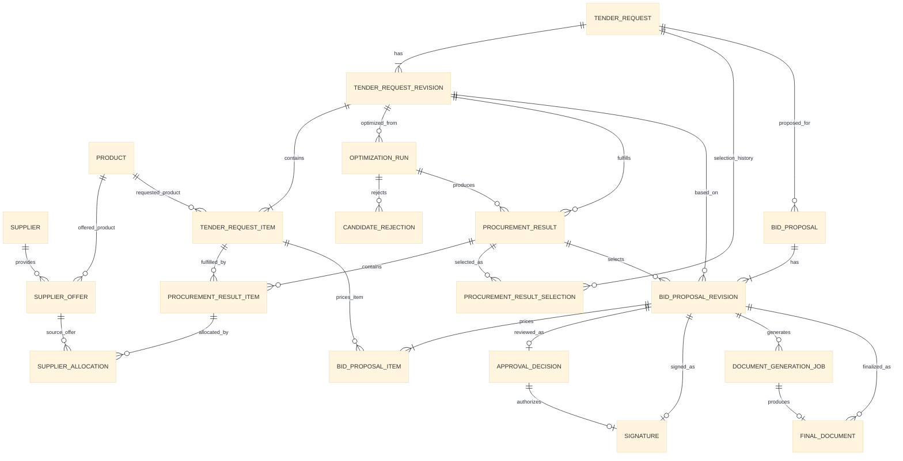
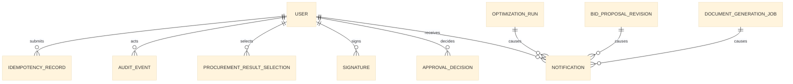
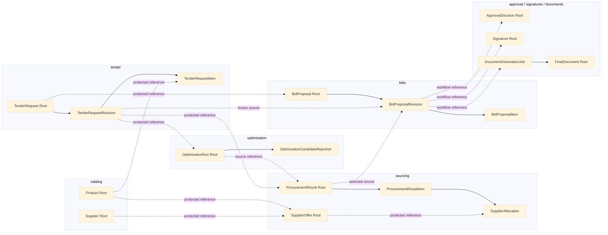

# Data Model

## Medical Procurement Bid Optimizer

> Status: Baseline lengkap data model demo MVP  
> Database target: PostgreSQL  
> ORM target: Django ORM  
> Terakhir diperbarui: 9 September 2026

---

## 1. Tujuan

Dokumen ini menerjemahkan Domain Model dan System Architecture menjadi logical dan physical relational data model untuk demo MVP **Medical Procurement Bid Optimizer**.

Dokumen ini menjadi acuan untuk:

- nama dan ownership tabel;
- aggregate root dan consistency boundary;
- primary key, foreign key, dan relationship;
- tipe data PostgreSQL;
- constraint, unique constraint, dan index;
- revision, snapshot, audit, dan idempotency;
- data background job;
- metadata file yang disimpan di MinIO;
- implementasi Django model dan migration.

Dokumen sumber:

1. `02-business-rules.md` untuk formula, invariant, lifecycle, dan authorization;
2. `03-use-cases.md` untuk command, actor, precondition, dan outcome;
3. `05-system-architecture.md` untuk accepted architecture decision, ownership, transaction, concurrency, snapshot, job, dan storage;
4. `04-domain-model.md` untuk entity, value object, aggregate, dan domain behavior;
5. `01-product-overview.md` untuk tujuan produk dan batas scope.

Data model ini tidak mendefinisikan:

- tampilan halaman atau komponen UI;
- URL, request, atau response HTTP;
- detail algoritma optimizer;
- template visual PDF;
- konfigurasi Docker Compose dan provider.

Jika konsep lama pada Domain Model berbeda dari accepted decision pada System Architecture, decision register yang lebih baru digunakan. Khususnya, ProcurementResult hanya memakai DRAFT dan VALID; persistent state LOCKED tidak digunakan.

---

## 2. Prinsip Data

### 2.1 PostgreSQL sebagai Source of Truth

PostgreSQL menyimpan seluruh fakta bisnis canonical, termasuk identity, status, revision, relationship, snapshot metadata, audit, idempotency, dan status background job.

Redis hanya menjadi Celery broker dan tidak menjadi sumber fakta bisnis. MinIO menyimpan binary file signature dan Final Document; PostgreSQL menyimpan object key, version, MIME type, size, checksum, serta relationship file tersebut ke entity bisnis.

### 2.2 Modular Monolith dan Ownership

Semua modul memakai satu PostgreSQL, tetapi setiap tabel memiliki tepat satu owning module.

| Modul | Data yang dimiliki |
|---|---|
| accounts | User, role/group, dan account status |
| catalog | Product dan Supplier |
| tender | TenderRequest, TenderRequestRevision, dan TenderRequestItem |
| sourcing | SupplierOffer, ProcurementResult, ProcurementResultItem, SupplierAllocation, dan ProcurementResultSelection |
| optimization | OptimizationRun, input snapshot, dan OptimizationCandidateRejection |
| bids | BidProposal, BidProposalRevision, dan BidProposalItem |
| approval | ApprovalDecision |
| signatures | Signature |
| documents | DocumentGenerationJob dan FinalDocument |
| notifications | Notification |
| audit | AuditEvent |
| core/application | IdempotencyRecord bila tidak ditempatkan pada modul pemilik operation |

Ownership berarti:

- write hanya dilakukan melalui application service milik modul;
- modul lain tidak mengubah tabel tersebut secara langsung;
- read lintas modul dilakukan melalui public query/service contract;
- dashboard dan reporting tidak menjadi pemilik data bisnis.

### 2.3 Aggregate Root

Django tidak memiliki tipe `AggregateRoot` bawaan. Aggregate root diterapkan melalui model root, application service, `transaction.atomic()`, row locking/version checking, dan database constraint.

| Aggregate root | Child yang berubah dalam consistency boundary yang sama |
|---|---|
| Product | Tidak ada |
| Supplier | Tidak ada |
| SupplierOffer | Tidak ada |
| TenderRequest | TenderRequestRevision dan TenderRequestItem yang sedang dibuat sebagai satu revision |
| ProcurementResult | ProcurementResultItem dan SupplierAllocation |
| OptimizationRun | Input snapshot, candidate rejection, outcome, dan reference result yang dihasilkan |
| BidProposal | BidProposalRevision dan BidProposalItem |
| ApprovalDecision | Submitted snapshot/reference dan terminal decision |
| Signature | Signed snapshot hash dan private signature object reference |
| FinalDocument | Immutable document metadata; generation job tetap record teknis terpisah |
| Notification | Read state |
| AuditEvent | Tidak ada; append-only |

Aggregate root adalah satu-satunya pintu perubahan child. Query tidak wajib memuat seluruh aggregate, tetapi command yang mengubah state harus menjaga invariant dalam transaction boundary yang sesuai.

### 2.4 Foreign Key dan Module Boundary

Module boundary tidak melarang foreign key. Data model menggunakan aturan berikut:

- FK di dalam aggregate boleh menggunakan `CASCADE` jika child tidak dapat hidup tanpa root;
- FK lintas aggregate atau modul menggunakan `RESTRICT`/`PROTECT`, bukan `CASCADE`;
- FK lintas modul hanya menjaga identity, lineage, dan referential integrity;
- keberadaan FK tidak mengizinkan direct mutation terhadap aggregate modul lain;
- application service memvalidasi relationship dan business rule sebelum write;
- reference polymorphic seperti target AuditEvent boleh memakai logical `entity_type` + `entity_id` tanpa FK fisik.

Contoh: `BidProposalRevision` boleh memiliki FK ke `ProcurementResult`, tetapi modul `bids` tidak boleh mengubah ProcurementResult. Pemilihan result dilakukan melalui application service yang memvalidasi Tender relationship dan status result.

### 2.5 Reference dan Historical Snapshot

Reference dan snapshot disimpan bersama karena memiliki tujuan berbeda:

- FK/reference menunjukkan record sumber dan mendukung navigasi/lineage;
- snapshot menyimpan nilai historis ketika optimization, submission, signing, atau finalization terjadi;
- perubahan Product, Supplier, SupplierOffer, atau Tender revision tidak mengubah snapshot lama;
- setiap snapshot memiliki `schema_version`;
- snapshot yang di-hash memakai canonical serialization.

Snapshot disimpan dalam `jsonb` ketika strukturnya merupakan frozen historical representation. Atribut yang diperlukan untuk filtering, constraint, relationship, atau lifecycle tetap disimpan sebagai kolom relational dan tidak hanya berada dalam JSON.

### 2.6 Identity, Waktu, dan Penamaan

- Primary key bisnis menggunakan UUID agar identity stabil dan aman dipakai lintas modul.
- Timestamp menggunakan PostgreSQL `timestamptz`, disimpan UTC, dan ditampilkan sesuai timezone pengguna.
- Setiap tabel memiliki `created_at`; mutable table juga memiliki `updated_at`.
- Nama tabel mengikuti prefix Django app, misalnya `tender_tender_request` dan `sourcing_supplier_offer`.
- Foreign key memakai suffix `_id`.
- Nilai uang memakai `numeric`, bukan floating point, dan currency demo adalah IDR.
- Quantity memakai fixed-precision `numeric` agar mendukung unit non-integer tanpa binary rounding.

### 2.7 Mutability dan Deletion

- Product dan Supplier tidak di-hard-delete setelah direferensikan; gunakan `is_active`.
- SupplierOffer yang sudah digunakan tidak ditimpa untuk perubahan komersial material; buat offer baru dan pertahankan offer lama.
- Tender yang sudah dipakai pada submission diubah melalui revision baru.
- ProcurementResult dapat diedit hanya ketika DRAFT dan immutable setelah VALID.
- Bid yang ditolak diperbaiki melalui BidProposalRevision baru.
- ApprovalDecision, Signature, FinalDocument, dan AuditEvent bersifat append-only/immutable sesuai lifecycle masing-masing.
- Final Document selalu memakai MinIO object key baru dan tidak menimpa binary historis.

### 2.8 Concurrency dan Idempotency

- Root yang menerima concurrent command memiliki `version` untuk optimistic concurrency.
- Critical transition menggunakan conditional update atau `SELECT FOR UPDATE`.
- Hanya satu OptimizationRun berstatus PENDING/RUNNING yang boleh ada untuk satu TenderRequest.
- Satu submitted BidProposalRevision hanya memiliki satu terminal ApprovalDecision.
- Idempotency key unik dalam scope operation dan actor mencegah duplicate command.
- Worker mengklaim job secara atomik dan aman terhadap Celery redelivery.

### 2.9 Availability Supplier Offer

`available_quantity` adalah batas kelayakan per ProcurementResult, bukan stok atau reservasi global. SupplierOffer yang sama beserta quantity dan harganya boleh direferensikan oleh beberapa Bid secara bersamaan. Tidak ada quantity ledger atau reservation table pada scope demo.

---

## 3. Entity Relationship Diagram

### 3.1 Notasi

- Garis relationship menunjukkan FK/reference relational.
- `||--o{` berarti satu record dapat memiliki nol atau banyak child.
- `||--|{` berarti satu record memiliki satu atau banyak child.
- Relationship tidak otomatis berarti kedua entity berada dalam aggregate yang sama.
- Arah ownership dan aturan mutation mengikuti bagian 2.2–2.4.

### 3.2 Core Business ERD



### 3.3 Supporting ERD



`AuditEvent` dan sumber `Notification` dapat mereferensikan berbagai jenis entity. Detail implementasi logical reference, source event identity, dan unique constraint dijelaskan pada bagian detail tabel agar ERD tidak menyiratkan polymorphic database FK yang tidak dapat ditegakkan langsung oleh PostgreSQL.

### 3.4 Aggregate dan Module Boundary



Garis penuh di dalam module menunjukkan composition/child ownership. Garis putus-putus lintas module menunjukkan reference yang dapat memiliki FK `PROTECT`/`RESTRICT`, tetapi mutation tetap harus melalui application service pemilik aggregate.

### 3.5 Ringkasan Cross-Module Reference

| Owning table | Reference tujuan | Tujuan | Delete policy |
|---|---|---|---|
| TenderRequestItem | Product | Product yang diminta | PROTECT |
| SupplierOffer | Product | Product yang ditawarkan | PROTECT |
| SupplierOffer | Supplier | Supplier pemberi offer | PROTECT |
| OptimizationRun | TenderRequestRevision | Input tender yang dibekukan | PROTECT |
| ProcurementResult | TenderRequestRevision | Requirement yang dipenuhi | PROTECT |
| ProcurementResult | OptimizationRun, nullable | Lineage result optimizer | PROTECT |
| ProcurementResultSelection | TenderRequest dan ProcurementResult | Append-only selection history | PROTECT |
| SupplierAllocation | SupplierOffer | Sumber harga dan quantity | PROTECT |
| BidProposal | TenderRequest | Stable tender identity | PROTECT |
| BidProposalRevision | TenderRequestRevision | Tender revision yang digunakan | PROTECT |
| BidProposalRevision | ProcurementResult | Selected sourcing result | PROTECT |
| ApprovalDecision | BidProposalRevision | Revision yang direview | PROTECT |
| Signature | BidProposalRevision dan ApprovalDecision | Revision/approval yang ditandatangani | PROTECT |
| DocumentGenerationJob | BidProposalRevision | Frozen input finalization | PROTECT |
| FinalDocument | BidProposalRevision dan generation job | Lineage dokumen final | PROTECT |

---

## 4. Daftar Tabel dan Controlled Values

### 4.1 Konvensi Tipe Data

| Konsep | PostgreSQL | Django | Catatan |
|---|---|---|---|
| Identity | `uuid` | `UUIDField` | Dibuat aplikasi dengan UUID v4 |
| Waktu | `timestamptz` | `DateTimeField` | Selalu UTC di database |
| Tanggal | `date` | `DateField` | Untuk validity period |
| Money amount | `numeric(20,2)` | `DecimalField(20,2)` | Nilai total/final IDR |
| Unit price/intermediate | `numeric(20,4)` | `DecimalField(20,4)` | Menjaga precision sebelum rounding final |
| Quantity | `numeric(18,3)` | `DecimalField(18,3)` | Mendukung unit pecahan |
| Percentage | `numeric(7,4)` | `DecimalField(7,4)` | Nilai `0` sampai `100` |
| Snapshot | `jsonb` | `JSONField` | Harus memiliki `schema_version` |
| Hash SHA-256 | `char(64)` | `CharField(64)` | Hex lowercase |
| Currency | `char(3)` | `CharField(3)` | Selalu `IDR` pada demo |

Status menggunakan `varchar` + Django `TextChoices` + `CheckConstraint`, bukan PostgreSQL native enum. Cara ini membuat penambahan value melalui Django migration lebih sederhana.

### 4.2 Inventaris Tabel

| Tabel | Owning module | Aggregate/jenis |
|---|---|---|
| `accounts_user` | accounts | User root |
| `catalog_product` | catalog | Product root |
| `catalog_supplier` | catalog | Supplier root |
| `sourcing_supplier_offer` | sourcing | SupplierOffer root |
| `tender_tender_request` | tender | TenderRequest root |
| `tender_tender_request_revision` | tender | Tender revision child |
| `tender_tender_request_item` | tender | Tender revision child |
| `optimization_optimization_run` | optimization | OptimizationRun root/job record |
| `optimization_candidate_rejection` | optimization | Run child |
| `sourcing_procurement_result` | sourcing | ProcurementResult root |
| `sourcing_procurement_result_item` | sourcing | Result child |
| `sourcing_supplier_allocation` | sourcing | Result item child |
| `sourcing_procurement_result_selection` | sourcing | Append-only selection history |
| `bids_bid_proposal` | bids | BidProposal root identity |
| `bids_bid_proposal_revision` | bids | Proposal revision/state |
| `bids_bid_proposal_item` | bids | Proposal revision child |
| `approval_approval_decision` | approval | ApprovalDecision root |
| `signatures_signature` | signatures | Signature root |
| `documents_generation_job` | documents | Technical job |
| `documents_final_document` | documents | FinalDocument root |
| `notifications_notification` | notifications | Notification root |
| `audit_audit_event` | audit | Append-only business audit |
| `core_idempotency_record` | core | Technical duplicate prevention |

### 4.3 Controlled Values

| Field | Values |
|---|---|
| `accounts_user.role` | `ADMIN`, `PROCUREMENT_STAFF`, `MANAGER` |
| `procurement_result.source_type` | `MANUAL`, `OPTIMIZER`, `CUSTOMIZED` |
| `procurement_result.status` | `DRAFT`, `VALID` |
| `optimization_run.status` | `PENDING`, `RUNNING`, `COMPLETED`, `FAILED` |
| `bid_proposal_revision.status` | `DRAFT`, `WAITING_APPROVAL`, `APPROVED`, `REJECTED`, `SIGNED`, `FINALIZED` |
| `approval_decision.decision` | `APPROVED`, `REJECTED` |
| `generation_job.status` | `PENDING`, `RUNNING`, `COMPLETED`, `FAILED` |
| `notification.type` | `OPTIMIZATION_COMPLETED`, `OPTIMIZATION_FAILED`, `BID_REJECTED` |
| `idempotency_record.status` | `IN_PROGRESS`, `COMPLETED`, `FAILED` |

Audit action dan safe error code tidak dibuat sebagai database enum agar event/error baru dapat ditambahkan tanpa mengubah tipe PostgreSQL. Nilainya tetap berupa constant terkontrol di application code.

---

## 5. Detail Tabel dan Kolom

Kolom bertanda **FK** menggunakan UUID. Seluruh FK wajib memiliki index, baik otomatis melalui Django maupun index eksplisit yang dijelaskan pada bagian 8.

### 5.1 Accounts

#### `accounts_user`

Custom Django user model harus dibuat sejak migration pertama agar primary key UUID tidak perlu diganti kemudian.

| Kolom | Tipe | Null | Constraint/default | Keterangan |
|---|---|:---:|---|---|
| `id` | `uuid` | Tidak | PK | Identity user |
| `username` | `varchar(150)` | Tidak | UNIQUE | Username login |
| `email` | `varchar(254)` | Tidak | UNIQUE | Email user |
| `password` | `varchar(128)` | Tidak | Django password hash | Tidak pernah menyimpan plaintext |
| `full_name` | `varchar(255)` | Tidak | — | Nama tampilan/audit |
| `role` | `varchar(32)` | Tidak | CHECK controlled values | Role bisnis utama |
| `is_active` | `boolean` | Tidak | `true` | Account dapat login |
| `is_staff` | `boolean` | Tidak | `false` | Akses Django Admin |
| `is_superuser` | `boolean` | Tidak | `false` | Permission Django internal |
| `last_login` | `timestamptz` | Ya | — | Login terakhir |
| `date_joined` | `timestamptz` | Tidak | now | Waktu pembuatan akun |
| `created_at` | `timestamptz` | Tidak | now | Audit teknis |
| `updated_at` | `timestamptz` | Tidak | now | Audit teknis |

Tabel permission/group bawaan Django tetap dapat dibuat, tetapi role bisnis demo berasal dari `role`. Hanya user role `ADMIN` yang diberi `is_staff=true` untuk mengakses Django Admin.

### 5.2 Catalog

#### `catalog_product`

| Kolom | Tipe | Null | Constraint/default | Keterangan |
|---|---|:---:|---|---|
| `id` | `uuid` | Tidak | PK | Product identity |
| `code` | `varchar(50)` | Tidak | UNIQUE | SKU/kode internal stabil |
| `name` | `varchar(255)` | Tidak | — | Nama Product |
| `description` | `text` | Ya | — | Deskripsi Product |
| `default_unit` | `varchar(32)` | Tidak | — | Satuan default, misalnya unit/box |
| `is_active` | `boolean` | Tidak | `true` | Eligibility transaksi baru |
| `version` | `integer` | Tidak | `1`, CHECK `> 0` | Optimistic concurrency |
| `created_by_id` | `uuid` | Tidak | FK → User, PROTECT | Admin pembuat |
| `created_at` | `timestamptz` | Tidak | now | Waktu dibuat |
| `updated_at` | `timestamptz` | Tidak | now | Waktu diubah |

#### `catalog_supplier`

| Kolom | Tipe | Null | Constraint/default | Keterangan |
|---|---|:---:|---|---|
| `id` | `uuid` | Tidak | PK | Supplier identity |
| `code` | `varchar(50)` | Tidak | UNIQUE | Kode internal stabil |
| `name` | `varchar(255)` | Tidak | — | Nama Supplier |
| `contact_name` | `varchar(255)` | Ya | — | Kontak utama |
| `email` | `varchar(254)` | Ya | — | Email kontak |
| `phone` | `varchar(50)` | Ya | — | Nomor telepon sebagai text |
| `address` | `text` | Ya | — | Alamat Supplier |
| `is_active` | `boolean` | Tidak | `true` | Eligibility offer baru |
| `version` | `integer` | Tidak | `1`, CHECK `> 0` | Optimistic concurrency |
| `created_by_id` | `uuid` | Tidak | FK → User, PROTECT | Admin pembuat |
| `created_at` | `timestamptz` | Tidak | now | Waktu dibuat |
| `updated_at` | `timestamptz` | Tidak | now | Waktu diubah |

### 5.3 Sourcing — Supplier Offer

#### `sourcing_supplier_offer`

| Kolom | Tipe | Null | Constraint/default | Keterangan |
|---|---|:---:|---|---|
| `id` | `uuid` | Tidak | PK | Offer identity/version |
| `supplier_id` | `uuid` | Tidak | FK → Supplier, PROTECT | Supplier pemberi offer |
| `product_id` | `uuid` | Tidak | FK → Product, PROTECT | Product yang ditawarkan |
| `supersedes_offer_id` | `uuid` | Ya | Self FK, PROTECT | Offer lama yang digantikan |
| `supplier_reference` | `varchar(100)` | Ya | — | Nomor referensi dari Supplier |
| `base_unit_price` | `numeric(20,4)` | Tidak | CHECK `> 0` | Harga dasar per unit |
| `discount_percent` | `numeric(7,4)` | Tidak | `0`, CHECK `0..100` | Discount |
| `net_purchase_price` | `numeric(20,4)` | Tidak | CHECK `>= 0` | Hasil canonical calculation; hanya nilai `> 0` yang eligible |
| `currency` | `char(3)` | Tidak | `IDR`, CHECK `IDR` | Currency demo |
| `available_quantity` | `numeric(18,3)` | Ya | CHECK `> 0` jika diisi | Batas per result, bukan reservasi global |
| `valid_from` | `date` | Ya | — | Awal masa berlaku |
| `valid_until` | `date` | Ya | CHECK urutan tanggal | Akhir masa berlaku |
| `is_active` | `boolean` | Tidak | `true` | Dapat dipakai untuk result baru |
| `calculation_version` | `varchar(32)` | Tidak | — | Versi formula net price |
| `version` | `integer` | Tidak | `1`, CHECK `> 0` | Optimistic concurrency sebelum dipakai |
| `created_by_id` | `uuid` | Tidak | FK → User, PROTECT | Procurement Staff pembuat |
| `created_at` | `timestamptz` | Tidak | now | Waktu dibuat |
| `updated_at` | `timestamptz` | Tidak | now | Waktu koreksi terakhir |

### 5.4 Tender

#### `tender_tender_request`

Tabel ini menyimpan identity stabil Tender. Isi kebutuhan berada pada revision.

| Kolom | Tipe | Null | Constraint/default | Keterangan |
|---|---|:---:|---|---|
| `id` | `uuid` | Tidak | PK | Stable Tender identity |
| `internal_code` | `varchar(50)` | Tidak | UNIQUE | Kode internal Perusahaan B |
| `current_revision_number` | `integer` | Tidak | `1`, CHECK `> 0` | Revision terbaru |
| `version` | `integer` | Tidak | `1`, CHECK `> 0` | Optimistic concurrency root |
| `created_by_id` | `uuid` | Tidak | FK → User, PROTECT | Procurement Staff pembuat |
| `created_at` | `timestamptz` | Tidak | now | Waktu dibuat |
| `updated_at` | `timestamptz` | Tidak | now | Waktu root berubah |

#### `tender_tender_request_revision`

| Kolom | Tipe | Null | Constraint/default | Keterangan |
|---|---|:---:|---|---|
| `id` | `uuid` | Tidak | PK | Revision identity |
| `tender_request_id` | `uuid` | Tidak | FK → TenderRequest, CASCADE | Parent aggregate |
| `revision_number` | `integer` | Tidak | CHECK `> 0`, UNIQUE per Tender | Nomor revision |
| `tender_reference_number` | `varchar(100)` | Ya | — | Nomor tender dari instansi |
| `institution_name` | `varchar(255)` | Tidak | — | Institution disimpan sebagai value |
| `institution_address` | `text` | Ya | — | Alamat pada revision |
| `title` | `varchar(255)` | Tidak | — | Judul tender |
| `description` | `text` | Ya | — | Metadata/keterangan tender |
| `currency` | `char(3)` | Tidak | `IDR`, CHECK `IDR` | Currency revision |
| `total_hps` | `numeric(20,2)` | Ya | CHECK `> 0` jika diisi | Batas HPS |
| `revision_reason` | `text` | Ya | Wajib jika revision > 1 | Alasan perubahan resmi |
| `content_hash` | `char(64)` | Tidak | — | Hash canonical revision + item |
| `created_by_id` | `uuid` | Tidak | FK → User, PROTECT | Staff pembuat revision |
| `created_at` | `timestamptz` | Tidak | now | Waktu revision dibuat |

Revision bersifat immutable setelah transaction pembuatan selesai.

#### `tender_tender_request_item`

| Kolom | Tipe | Null | Constraint/default | Keterangan |
|---|---|:---:|---|---|
| `id` | `uuid` | Tidak | PK | Item identity pada satu revision |
| `tender_revision_id` | `uuid` | Tidak | FK → TenderRequestRevision, CASCADE | Parent revision |
| `line_number` | `integer` | Tidak | CHECK `> 0`, UNIQUE per revision | Urutan tampilan stabil |
| `product_id` | `uuid` | Tidak | FK → Product, PROTECT | Product sumber |
| `product_snapshot` | `jsonb` | Tidak | schema version wajib | Seluruh atribut Product saat revision |
| `requested_quantity` | `numeric(18,3)` | Tidak | CHECK `> 0` | Quantity kebutuhan |
| `unit` | `varchar(32)` | Tidak | — | Satuan pada tender |
| `specification` | `text` | Ya | — | Persyaratan teknis |
| `description` | `text` | Ya | — | Keterangan item |
| `created_at` | `timestamptz` | Tidak | now | Waktu item dibuat |

### 5.5 Optimization

#### `optimization_optimization_run`

| Kolom | Tipe | Null | Constraint/default | Keterangan |
|---|---|:---:|---|---|
| `id` | `uuid` | Tidak | PK | Run identity/business operation ID |
| `tender_request_id` | `uuid` | Tidak | FK → TenderRequest, PROTECT | Untuk active-run constraint |
| `tender_revision_id` | `uuid` | Tidak | FK → TenderRequestRevision, PROTECT | Revision yang dioptimalkan |
| `retry_of_run_id` | `uuid` | Ya | Self FK, PROTECT | Run gagal sebelumnya |
| `status` | `varchar(20)` | Tidak | `PENDING`, CHECK values | Lifecycle run |
| `algorithm_version` | `varchar(32)` | Tidak | — | Versi optimizer |
| `snapshot_schema_version` | `integer` | Tidak | CHECK `> 0` | Versi input JSON |
| `input_snapshot` | `jsonb` | Tidak | — | Frozen tender + eligible offers |
| `input_hash` | `char(64)` | Tidak | — | Hash canonical input |
| `result_count` | `integer` | Tidak | `0`, CHECK `>= 0` | Jumlah result valid |
| `safe_error_code` | `varchar(64)` | Ya | — | Error aman untuk UI |
| `safe_error_message` | `text` | Ya | — | Pesan aman |
| `diagnostic_reference` | `varchar(100)` | Ya | — | Korelasi ke operational log |
| `requested_by_id` | `uuid` | Tidak | FK → User, PROTECT | Staff pemicu |
| `started_at` | `timestamptz` | Ya | — | Waktu worker claim |
| `completed_at` | `timestamptz` | Ya | — | Waktu terminal |
| `version` | `integer` | Tidak | `1`, CHECK `> 0` | Concurrency claim/outcome |
| `created_at` | `timestamptz` | Tidak | now | Waktu PENDING dibuat |

#### `optimization_candidate_rejection`

Penyimpanan rejection bersifat opsional dan dapat dibatasi jumlahnya agar snapshot/run tidak membesar tanpa batas.

| Kolom | Tipe | Null | Constraint/default | Keterangan |
|---|---|:---:|---|---|
| `id` | `uuid` | Tidak | PK | Rejection identity |
| `optimization_run_id` | `uuid` | Tidak | FK → OptimizationRun, CASCADE | Parent run |
| `candidate_identifier` | `varchar(128)` | Tidak | UNIQUE per run | Stable candidate identity |
| `reason_code` | `varchar(64)` | Tidak | — | Machine-readable reason |
| `safe_detail` | `jsonb` | Tidak | `{}` | Detail tanpa secret/PII berlebihan |
| `created_at` | `timestamptz` | Tidak | now | Waktu ditolak |

### 5.6 Sourcing — Procurement Result

#### `sourcing_procurement_result`

| Kolom | Tipe | Null | Constraint/default | Keterangan |
|---|---|:---:|---|---|
| `id` | `uuid` | Tidak | PK | Result identity |
| `tender_revision_id` | `uuid` | Tidak | FK → TenderRequestRevision, PROTECT | Requirement yang dipenuhi |
| `source_type` | `varchar(20)` | Tidak | CHECK values | MANUAL/OPTIMIZER/CUSTOMIZED |
| `status` | `varchar(20)` | Tidak | `DRAFT`, CHECK values | DRAFT atau VALID |
| `optimization_run_id` | `uuid` | Ya | FK → OptimizationRun, PROTECT | Wajib untuk OPTIMIZER |
| `source_result_id` | `uuid` | Ya | Self FK, PROTECT | Wajib untuk CUSTOMIZED |
| `rank` | `integer` | Ya | CHECK `> 0` | Ranking dalam run |
| `total_purchase` | `numeric(20,2)` | Ya | CHECK `> 0` jika diisi | Wajib ketika VALID |
| `currency` | `char(3)` | Tidak | `IDR`, CHECK `IDR` | Currency result |
| `calculation_version` | `varchar(32)` | Tidak | — | Versi calculator/rounding |
| `snapshot_schema_version` | `integer` | Ya | CHECK `> 0` | Wajib ketika VALID |
| `result_snapshot` | `jsonb` | Ya | — | Frozen representation ketika VALID |
| `result_hash` | `char(64)` | Ya | — | Hash canonical snapshot |
| `validated_at` | `timestamptz` | Ya | — | Waktu menjadi VALID |
| `created_by_id` | `uuid` | Tidak | FK → User, PROTECT | Staff/requester sumber |
| `version` | `integer` | Tidak | `1`, CHECK `> 0` | Concurrency selama DRAFT |
| `created_at` | `timestamptz` | Tidak | now | Waktu dibuat |
| `updated_at` | `timestamptz` | Tidak | now | Waktu edit DRAFT terakhir |

Tidak ada status `LOCKED`. Result immutable setelah VALID dan submission membekukan reference serta snapshot.

#### `sourcing_procurement_result_item`

| Kolom | Tipe | Null | Constraint/default | Keterangan |
|---|---|:---:|---|---|
| `id` | `uuid` | Tidak | PK | Result item identity |
| `procurement_result_id` | `uuid` | Tidak | FK → ProcurementResult, CASCADE | Parent result |
| `tender_request_item_id` | `uuid` | Tidak | FK → TenderRequestItem, PROTECT | Item yang dipenuhi |
| `line_number` | `integer` | Tidak | CHECK `> 0` | Urutan tampilan |
| `requested_quantity_snapshot` | `numeric(18,3)` | Tidak | CHECK `> 0` | Quantity yang divalidasi |
| `unit_snapshot` | `varchar(32)` | Tidak | — | Unit historis |
| `item_purchase_total` | `numeric(20,2)` | Ya | CHECK `> 0` jika diisi | Wajib ketika result VALID |
| `currency` | `char(3)` | Tidak | `IDR`, CHECK `IDR` | Currency item |
| `product_snapshot` | `jsonb` | Tidak | schema version wajib | Product historis |
| `created_at` | `timestamptz` | Tidak | now | Waktu dibuat |
| `updated_at` | `timestamptz` | Tidak | now | Edit DRAFT terakhir |

#### `sourcing_supplier_allocation`

| Kolom | Tipe | Null | Constraint/default | Keterangan |
|---|---|:---:|---|---|
| `id` | `uuid` | Tidak | PK | Allocation identity |
| `procurement_result_item_id` | `uuid` | Tidak | FK → ResultItem, CASCADE | Parent item |
| `supplier_offer_id` | `uuid` | Tidak | FK → SupplierOffer, PROTECT | Source offer/lineage |
| `line_number` | `integer` | Tidak | CHECK `> 0` | Urutan allocation |
| `allocated_quantity` | `numeric(18,3)` | Tidak | CHECK `> 0` | Quantity dari offer |
| `base_unit_price_snapshot` | `numeric(20,4)` | Tidak | CHECK `> 0` | Harga dasar historis |
| `discount_percent_snapshot` | `numeric(7,4)` | Tidak | CHECK `0..100` | Discount historis |
| `net_purchase_price_snapshot` | `numeric(20,4)` | Tidak | CHECK `> 0` | Net price historis |
| `allocation_purchase` | `numeric(20,2)` | Tidak | CHECK `> 0` | Rounded allocation cost |
| `currency` | `char(3)` | Tidak | `IDR`, CHECK `IDR` | Currency allocation |
| `supplier_snapshot` | `jsonb` | Tidak | schema version wajib | Supplier historis |
| `offer_snapshot` | `jsonb` | Tidak | schema version wajib | Offer historis |
| `created_at` | `timestamptz` | Tidak | now | Waktu dibuat |
| `updated_at` | `timestamptz` | Tidak | now | Edit DRAFT terakhir |

#### `sourcing_procurement_result_selection`

Selection history bersifat append-only. Selection dengan `selection_number` terbesar adalah pilihan terkini untuk Tender.

| Kolom | Tipe | Null | Constraint/default | Keterangan |
|---|---|:---:|---|---|
| `id` | `uuid` | Tidak | PK | Selection identity |
| `tender_request_id` | `uuid` | Tidak | FK → TenderRequest, PROTECT | Stable Tender identity |
| `tender_revision_id` | `uuid` | Tidak | FK → TenderRequestRevision, PROTECT | Revision yang sesuai |
| `procurement_result_id` | `uuid` | Tidak | FK → ProcurementResult, PROTECT | Result VALID terpilih |
| `selection_number` | `integer` | Tidak | CHECK `> 0`, UNIQUE per Tender | Monotonic history number |
| `selected_by_id` | `uuid` | Tidak | FK → User, PROTECT | Procurement Staff |
| `selected_at` | `timestamptz` | Tidak | now | Server time |

### 5.7 Bids

#### `bids_bid_proposal`

Tabel ini menyimpan identity stabil proposal. Pricing dan lifecycle berada pada revision.

| Kolom | Tipe | Null | Constraint/default | Keterangan |
|---|---|:---:|---|---|
| `id` | `uuid` | Tidak | PK | Stable Bid identity |
| `proposal_number` | `varchar(50)` | Tidak | UNIQUE | Nomor internal proposal |
| `tender_request_id` | `uuid` | Tidak | FK → TenderRequest, PROTECT | Tender sumber |
| `current_revision_number` | `integer` | Tidak | `1`, CHECK `> 0` | Revision terbaru |
| `version` | `integer` | Tidak | `1`, CHECK `> 0` | Root concurrency |
| `created_by_id` | `uuid` | Tidak | FK → User, PROTECT | Procurement Staff |
| `created_at` | `timestamptz` | Tidak | now | Waktu dibuat |
| `updated_at` | `timestamptz` | Tidak | now | Waktu root berubah |

#### `bids_bid_proposal_revision`

| Kolom | Tipe | Null | Constraint/default | Keterangan |
|---|---|:---:|---|---|
| `id` | `uuid` | Tidak | PK | Bid revision identity |
| `bid_proposal_id` | `uuid` | Tidak | FK → BidProposal, CASCADE | Parent root |
| `revision_number` | `integer` | Tidak | CHECK `> 0`, UNIQUE per Bid | Nomor revision |
| `tender_revision_id` | `uuid` | Tidak | FK → TenderRequestRevision, PROTECT | Tender revision sumber |
| `selected_result_id` | `uuid` | Tidak | FK → ProcurementResult, PROTECT | Result VALID terpilih |
| `status` | `varchar(24)` | Tidak | `DRAFT`, CHECK values | Lifecycle revision |
| `target_margin_percent` | `numeric(7,4)` | Ya | CHECK `0 <= x < 100` | Pricing input |
| `total_purchase` | `numeric(20,2)` | Ya | CHECK `> 0` jika diisi | Frozen sourcing cost |
| `total_bid_value` | `numeric(20,2)` | Ya | CHECK `> 0` | Final rounded bid value |
| `gross_profit` | `numeric(20,2)` | Ya | CHECK `>= 0` jika diisi | Bid value - purchase |
| `actual_margin_percent` | `numeric(7,4)` | Ya | — | Dihitung ulang setelah rounding |
| `max_margin_percent` | `numeric(7,4)` | Ya | — | Null jika HPS tidak tersedia |
| `is_hps_feasible` | `boolean` | Ya | — | Null jika HPS tidak tersedia |
| `currency` | `char(3)` | Tidak | `IDR`, CHECK `IDR` | Currency proposal |
| `calculation_version` | `varchar(32)` | Tidak | — | Pricing/rounding version |
| `snapshot_schema_version` | `integer` | Tidak | CHECK `> 0` | Versi snapshot |
| `selected_result_snapshot` | `jsonb` | Tidak | — | Frozen result sejak draft/revision |
| `submission_snapshot` | `jsonb` | Ya | — | Dibuat saat submit |
| `submission_hash` | `char(64)` | Ya | — | Wajib sejak WAITING_APPROVAL |
| `submitted_by_id` | `uuid` | Ya | FK → User, PROTECT | Staff submitter |
| `submitted_at` | `timestamptz` | Ya | — | Server submission time |
| `created_by_id` | `uuid` | Tidak | FK → User, PROTECT | Staff pembuat revision |
| `version` | `integer` | Tidak | `1`, CHECK `> 0` | Optimistic concurrency |
| `created_at` | `timestamptz` | Tidak | now | Waktu revision dibuat |
| `updated_at` | `timestamptz` | Tidak | now | Edit/transition terakhir |

#### `bids_bid_proposal_item`

| Kolom | Tipe | Null | Constraint/default | Keterangan |
|---|---|:---:|---|---|
| `id` | `uuid` | Tidak | PK | Bid item identity |
| `bid_revision_id` | `uuid` | Tidak | FK → BidProposalRevision, CASCADE | Parent revision |
| `tender_request_item_id` | `uuid` | Tidak | FK → TenderRequestItem, PROTECT | Requirement sumber |
| `line_number` | `integer` | Tidak | CHECK `> 0` | Urutan tampilan |
| `product_snapshot` | `jsonb` | Tidak | schema version wajib | Product historis |
| `requested_quantity` | `numeric(18,3)` | Tidak | CHECK `> 0` | Frozen requested quantity |
| `unit` | `varchar(32)` | Tidak | — | Frozen unit |
| `item_purchase_total` | `numeric(20,2)` | Tidak | CHECK `> 0` | Procurement cost item |
| `unit_purchase_cost` | `numeric(20,4)` | Tidak | CHECK `> 0` | Intermediate value |
| `bid_unit_price` | `numeric(20,4)` | Tidak | CHECK `> 0` | Unit price penawaran |
| `item_bid_total` | `numeric(20,2)` | Tidak | CHECK `> 0` | Final item total |
| `currency` | `char(3)` | Tidak | `IDR`, CHECK `IDR` | Currency item |
| `created_at` | `timestamptz` | Tidak | now | Waktu dibuat |

### 5.8 Approval dan Signature

#### `approval_approval_decision`

| Kolom | Tipe | Null | Constraint/default | Keterangan |
|---|---|:---:|---|---|
| `id` | `uuid` | Tidak | PK | Decision identity |
| `bid_revision_id` | `uuid` | Tidak | FK → BidProposalRevision, UNIQUE, PROTECT | Satu terminal decision per revision |
| `decision` | `varchar(16)` | Tidak | CHECK values | APPROVED/REJECTED |
| `reason` | `text` | Ya | Wajib untuk REJECTED | Alasan Manager |
| `submission_hash` | `char(64)` | Tidak | — | Hash snapshot yang direview |
| `decided_by_id` | `uuid` | Tidak | FK → User, PROTECT | Manager |
| `decided_at` | `timestamptz` | Tidak | now | Server decision time |
| `created_at` | `timestamptz` | Tidak | now | Append-only timestamp |

#### `signatures_signature`

| Kolom | Tipe | Null | Constraint/default | Keterangan |
|---|---|:---:|---|---|
| `id` | `uuid` | Tidak | PK | Signature identity |
| `bid_revision_id` | `uuid` | Tidak | FK → BidProposalRevision, UNIQUE, PROTECT | Signed revision |
| `approval_decision_id` | `uuid` | Tidak | FK → ApprovalDecision, UNIQUE, PROTECT | Approval yang mengizinkan sign |
| `signed_by_id` | `uuid` | Tidak | FK → User, PROTECT | Harus sama dengan approver |
| `signer_name` | `varchar(255)` | Tidak | — | Frozen display name |
| `signed_snapshot_hash` | `char(64)` | Tidak | — | Hash approved snapshot |
| `image_object_key` | `varchar(512)` | Ya | UNIQUE jika diisi | Private MinIO key |
| `image_version_id` | `varchar(255)` | Ya | — | MinIO object version |
| `image_mime_type` | `varchar(100)` | Ya | CHECK PNG/JPEG | Null jika tanpa image |
| `image_size_bytes` | `bigint` | Ya | CHECK `0 < x <= 1048576` | Ukuran file |
| `image_sha256` | `char(64)` | Ya | — | Integrity file |
| `signed_at` | `timestamptz` | Tidak | now | Server signing time |
| `created_at` | `timestamptz` | Tidak | now | Append-only timestamp |

Semua kolom image harus seluruhnya null atau seluruh metadata wajib terisi sebagai satu kelompok.

### 5.9 Documents

#### `documents_generation_job`

| Kolom | Tipe | Null | Constraint/default | Keterangan |
|---|---|:---:|---|---|
| `id` | `uuid` | Tidak | PK | Job/business operation ID |
| `bid_revision_id` | `uuid` | Tidak | FK → BidProposalRevision, PROTECT | Frozen revision input |
| `status` | `varchar(20)` | Tidak | `PENDING`, CHECK values | Lifecycle job |
| `document_version` | `integer` | Tidak | CHECK `> 0`, UNIQUE per revision | Requested output version |
| `template_version` | `varchar(32)` | Tidak | `1` | Template PDF |
| `snapshot_schema_version` | `integer` | Tidak | CHECK `> 0` | Finalization input version |
| `input_snapshot` | `jsonb` | Tidak | — | Frozen render input |
| `input_hash` | `char(64)` | Tidak | — | Canonical snapshot hash |
| `attempt_count` | `integer` | Tidak | `0`, CHECK `>= 0` | Worker attempts |
| `safe_error_code` | `varchar(64)` | Ya | — | Error aman |
| `safe_error_message` | `text` | Ya | — | Pesan aman |
| `diagnostic_reference` | `varchar(100)` | Ya | — | Korelasi log |
| `requested_by_id` | `uuid` | Tidak | FK → User, PROTECT | Procurement Staff finalizer |
| `started_at` | `timestamptz` | Ya | — | Worker claim time |
| `completed_at` | `timestamptz` | Ya | — | Terminal time |
| `version` | `integer` | Tidak | `1`, CHECK `> 0` | Concurrency claim/outcome |
| `created_at` | `timestamptz` | Tidak | now | Waktu PENDING dibuat |

#### `documents_final_document`

| Kolom | Tipe | Null | Constraint/default | Keterangan |
|---|---|:---:|---|---|
| `id` | `uuid` | Tidak | PK | Final document identity |
| `generation_job_id` | `uuid` | Tidak | FK → GenerationJob, UNIQUE, PROTECT | Job sukses sumber |
| `bid_revision_id` | `uuid` | Tidak | FK → BidProposalRevision, PROTECT | Proposal revision sumber |
| `document_version` | `integer` | Tidak | CHECK `> 0`, UNIQUE per revision | Version artefak |
| `document_number` | `varchar(100)` | Tidak | — | Format demo yang disepakati |
| `template_version` | `varchar(32)` | Tidak | — | Template yang digunakan |
| `object_key` | `varchar(512)` | Tidak | UNIQUE | Private MinIO path |
| `object_version_id` | `varchar(255)` | Ya | — | Version ID dari MinIO |
| `mime_type` | `varchar(100)` | Tidak | CHECK `application/pdf` | Tipe file |
| `size_bytes` | `bigint` | Tidak | CHECK `> 0` | Ukuran PDF |
| `sha256` | `char(64)` | Tidak | — | Integrity checksum |
| `snapshot_schema_version` | `integer` | Tidak | CHECK `> 0` | Frozen content version |
| `content_snapshot` | `jsonb` | Tidak | — | Content yang dirender |
| `finalized_by_id` | `uuid` | Tidak | FK → User, PROTECT | Staff pemicu finalization |
| `created_at` | `timestamptz` | Tidak | now | Waktu file diverifikasi/final |

### 5.10 Notifications, Audit, dan Idempotency

#### `notifications_notification`

| Kolom | Tipe | Null | Constraint/default | Keterangan |
|---|---|:---:|---|---|
| `id` | `uuid` | Tidak | PK | Notification identity |
| `recipient_id` | `uuid` | Tidak | FK → User, PROTECT | Penerima |
| `type` | `varchar(40)` | Tidak | CHECK values | Jenis notification |
| `source_event_id` | `uuid` | Tidak | — | Stable event identity |
| `source_entity_type` | `varchar(64)` | Tidak | — | Logical source type |
| `source_entity_id` | `uuid` | Tidak | — | Logical source ID |
| `title` | `varchar(255)` | Tidak | — | Judul aman |
| `message` | `text` | Tidak | — | Pesan aman |
| `read_at` | `timestamptz` | Ya | — | Null berarti unread |
| `created_at` | `timestamptz` | Tidak | now | Waktu dibuat |

#### `audit_audit_event`

| Kolom | Tipe | Null | Constraint/default | Keterangan |
|---|---|:---:|---|---|
| `id` | `uuid` | Tidak | PK | Event identity/source event ID |
| `actor_id` | `uuid` | Ya | FK → User, PROTECT | Null hanya untuk system actor |
| `actor_name` | `varchar(255)` | Tidak | — | Frozen actor display name/system |
| `entity_type` | `varchar(64)` | Tidak | — | Logical aggregate type |
| `entity_id` | `uuid` | Tidak | — | Logical aggregate identity |
| `entity_revision` | `integer` | Ya | CHECK `> 0` jika diisi | Revision terkait |
| `action` | `varchar(64)` | Tidak | — | Controlled application constant |
| `from_status` | `varchar(32)` | Ya | — | Status sebelum |
| `to_status` | `varchar(32)` | Ya | — | Status sesudah |
| `reason` | `text` | Ya | — | Alasan bisnis aman |
| `metadata` | `jsonb` | Tidak | `{}` | ID/konteks kecil, bukan full snapshot |
| `correlation_id` | `varchar(100)` | Tidak | — | HTTP/task trace correlation |
| `occurred_at` | `timestamptz` | Tidak | now | Server event time |

#### `core_idempotency_record`

| Kolom | Tipe | Null | Constraint/default | Keterangan |
|---|---|:---:|---|---|
| `id` | `uuid` | Tidak | PK | Record identity |
| `actor_id` | `uuid` | Tidak | FK → User, PROTECT | Pemilik command |
| `operation` | `varchar(64)` | Tidak | — | Misalnya `submit_bid` |
| `idempotency_key` | `varchar(128)` | Tidak | UNIQUE dalam actor+operation | Client/business key |
| `request_hash` | `char(64)` | Tidak | — | Mendeteksi key reuse dengan payload lain |
| `status` | `varchar(20)` | Tidak | `IN_PROGRESS`, CHECK values | Processing state |
| `result_entity_type` | `varchar(64)` | Ya | — | Logical result type |
| `result_entity_id` | `uuid` | Ya | — | Logical result ID |
| `safe_response` | `jsonb` | Ya | — | Response minimal yang aman diulang |
| `expires_at` | `timestamptz` | Ya | — | Null untuk key bisnis permanen |
| `created_at` | `timestamptz` | Tidak | now | Waktu diterima |
| `completed_at` | `timestamptz` | Ya | — | Waktu terminal |

---

## 6. Relationship dan Foreign Key Policy

### 6.1 Relationship di Dalam Aggregate

| Parent | Child | Cardinality | `on_delete` | Alasan |
|---|---|---|---|---|
| TenderRequest | TenderRequestRevision | 1:N | CASCADE | Revision tidak memiliki arti tanpa root; root tidak dihapus setelah dipakai |
| TenderRequestRevision | TenderRequestItem | 1:N | CASCADE | Item merupakan composition revision |
| OptimizationRun | CandidateRejection | 1:N | CASCADE | Diagnostic child dari run |
| ProcurementResult | ProcurementResultItem | 1:N | CASCADE | Result item merupakan composition |
| ProcurementResultItem | SupplierAllocation | 1:N | CASCADE | Allocation merupakan composition |
| BidProposal | BidProposalRevision | 1:N | CASCADE | Revision merupakan history root |
| BidProposalRevision | BidProposalItem | 1:N | CASCADE | Pricing item merupakan composition revision |

CASCADE hanya efektif ketika aggregate yang belum dipakai dihapus melalui kebijakan yang diizinkan. Aggregate historis tidak di-hard-delete.

### 6.2 Relationship Lintas Aggregate/Modul

Seluruh relationship berikut menggunakan `PROTECT` pada Django agar record sumber tidak dapat dihapus selama masih direferensikan:

- SupplierOffer → Supplier dan Product;
- TenderRequestItem → Product;
- OptimizationRun → TenderRequest dan TenderRequestRevision;
- ProcurementResult → TenderRequestRevision, optional OptimizationRun, dan optional source ProcurementResult;
- ProcurementResultItem → TenderRequestItem;
- SupplierAllocation → SupplierOffer;
- ProcurementResultSelection → TenderRequest, TenderRequestRevision, ProcurementResult, dan User;
- BidProposal → TenderRequest;
- BidProposalRevision → TenderRequestRevision, selected ProcurementResult, dan User;
- BidProposalItem → TenderRequestItem;
- ApprovalDecision → BidProposalRevision dan deciding User;
- Signature → BidProposalRevision, ApprovalDecision, dan signing User;
- DocumentGenerationJob → BidProposalRevision dan requesting User;
- FinalDocument → GenerationJob, BidProposalRevision, dan finalizing User;
- Notification, AuditEvent, dan IdempotencyRecord → User.

### 6.3 Logical Reference tanpa FK

Pasangan `entity_type` + `entity_id` digunakan untuk source/target polymorphic pada:

- Notification;
- AuditEvent;
- IdempotencyRecord result.

Application service harus memastikan logical ID berasal dari operation yang sama. Tidak ada generic cascade. Penghapusan aggregate historis dilarang sehingga logical reference tetap dapat ditelusuri.

### 6.4 Relationship Consistency Rules

Database FK hanya membuktikan bahwa row tujuan ada. Application service juga harus membuktikan bahwa:

- TenderRequestRevision benar-benar dimiliki TenderRequest yang sama;
- ProcurementResult dan BidProposal menggunakan Tender yang sama;
- TenderRequestItem pada Result/Bid berasal dari revision yang direferensikan;
- SupplierOffer Product sama dengan Product TenderRequestItem;
- ApprovalDecision, Signature, GenerationJob, dan FinalDocument menunjuk BidProposalRevision yang sama;
- signed user sama dengan approving Manager;
- selection hanya menunjuk ProcurementResult VALID.

Validasi dilakukan di dalam transaction setelah root terkait dikunci atau diperiksa version-nya.

---

## 7. Constraint dan Business Invariant

### 7.1 Column Check Constraint

| Area | Constraint database |
|---|---|
| Identity/version | Seluruh `version`, `revision_number`, `line_number`, `selection_number`, dan `document_version` harus `> 0` |
| Quantity | Requested dan allocated quantity `> 0`; available quantity `> 0` jika diisi |
| Price | Base price `> 0`; net SupplierOffer `>= 0`, tetapi hanya `> 0` yang eligible; harga snapshot dan purchase total pada hasil valid/Bid `> 0`; gross profit `>= 0` |
| Discount | `0 <= discount_percent <= 100` |
| Margin | `0 <= target_margin_percent < 100` |
| Currency | Seluruh currency bernilai `IDR` |
| HPS | `total_hps > 0` jika diisi |
| Validity | `valid_until >= valid_from` jika keduanya diisi |
| File | `size_bytes > 0`; signature image maksimum 1 MiB; MIME type dibatasi |
| Count | `result_count >= 0` dan `attempt_count >= 0` |

### 7.2 Unique dan Partial Unique Constraint

| Tabel | Constraint |
|---|---|
| User | Username dan email unik secara case-insensitive |
| Product | `code` unik secara case-insensitive |
| Supplier | `code` unik secara case-insensitive |
| SupplierOffer | `supersedes_offer_id` unik jika diisi agar satu offer lama tidak memiliki dua successor resmi |
| TenderRequestRevision | `(tender_request_id, revision_number)` unik |
| TenderRequestItem | `(tender_revision_id, line_number)` unik |
| OptimizationRun | Hanya satu row PENDING/RUNNING per `tender_request_id` melalui partial unique constraint |
| CandidateRejection | `(optimization_run_id, candidate_identifier)` unik |
| ProcurementResult | `(optimization_run_id, rank)` unik jika keduanya diisi |
| ProcurementResultItem | `(procurement_result_id, tender_request_item_id)` dan `(procurement_result_id, line_number)` unik |
| SupplierAllocation | `(procurement_result_item_id, line_number)` dan `(procurement_result_item_id, supplier_offer_id)` unik |
| ResultSelection | `(tender_request_id, selection_number)` unik |
| BidProposalRevision | `(bid_proposal_id, revision_number)` unik |
| BidProposalItem | `(bid_revision_id, tender_request_item_id)` dan `(bid_revision_id, line_number)` unik |
| ApprovalDecision | `bid_revision_id` unik |
| Signature | `bid_revision_id` dan `approval_decision_id` masing-masing unik |
| GenerationJob | `(bid_revision_id, document_version)` unik |
| FinalDocument | `generation_job_id`, `object_key`, dan `(bid_revision_id, document_version)` unik |
| Notification | `(recipient_id, source_event_id, type)` unik |
| IdempotencyRecord | `(actor_id, operation, idempotency_key)` unik |

### 7.3 Conditional State Constraint

Constraint berikut menggunakan `CheckConstraint` jika hanya melibatkan satu row:

- ProcurementResult `OPTIMIZER` wajib memiliki `optimization_run_id`, sedangkan `rank` hanya boleh diisi untuk result optimizer;
- ProcurementResult `CUSTOMIZED` wajib memiliki `source_result_id` yang berbeda dari `id`;
- ProcurementResult `MANUAL` tidak memiliki `optimization_run_id` atau `source_result_id`;
- ProcurementResult VALID wajib memiliki `total_purchase`, `result_snapshot`, `result_hash`, `snapshot_schema_version`, dan `validated_at`;
- OptimizationRun COMPLETED wajib memiliki `completed_at` dan tidak memiliki safe error;
- OptimizationRun FAILED wajib memiliki `completed_at` dan `safe_error_code`;
- BidProposalRevision mulai `WAITING_APPROVAL` wajib memiliki pricing lengkap, `submission_snapshot`, `submission_hash`, `submitted_by_id`, dan `submitted_at`;
- ApprovalDecision REJECTED wajib memiliki nonblank `reason`; APPROVED tidak membutuhkan reason;
- Signature image metadata harus seluruhnya null atau seluruh kolom wajibnya terisi;
- GenerationJob terminal wajib memiliki `completed_at`; FAILED wajib memiliki `safe_error_code`;
- FinalDocument MIME type harus `application/pdf`.

### 7.4 Invariant Lintas Row

Invariant berikut tidak cukup ditegakkan oleh check constraint karena melibatkan beberapa row atau modul. Application service wajib memvalidasinya di dalam transaction:

1. TenderRequestRevision memiliki minimal satu item sebelum menjadi revision yang dapat digunakan.
2. ProcurementResult VALID memiliki tepat satu ProcurementResultItem untuk setiap TenderRequestItem pada revision yang sama.
3. Jumlah SupplierAllocation per ResultItem sama dengan `requested_quantity_snapshot`.
4. Product setiap SupplierOffer sama dengan Product TenderRequestItem.
5. Allocation tidak melebihi `available_quantity` pada snapshot offer untuk result tersebut. Availability tidak dikurangi secara global.
6. `total_purchase` sama dengan jumlah `item_purchase_total`, dan item total sama dengan jumlah `allocation_purchase`.
7. Selected result berstatus VALID dan berasal dari TenderRequestRevision/TenderRequest yang sama.
8. BidProposalItem lengkap untuk semua TenderRequestItem dan menggunakan pricing policy/version yang sama.
9. `total_bid_value`, `gross_profit`, actual margin, dan HPS feasibility cocok dengan item serta canonical calculator.
10. Transition BidProposalRevision mengikuti lifecycle legal dan tidak melompati state.
11. Approver ber-role MANAGER dan signer adalah Manager yang sama.
12. Finalizer ber-role PROCUREMENT_STAFF dan revision berstatus SIGNED.
13. FinalDocument baru dicatat dan revision menjadi FINALIZED setelah file MinIO tersedia serta checksum cocok.
14. SupplierOffer dengan `net_purchase_price = 0` dapat tersimpan sebagai rekam input diskon 100%, tetapi tidak boleh dipakai sebagai allocation karena offer tersebut tidak eligible.

### 7.5 Immutability Enforcement

- Application service menolak update/delete terhadap TenderRequestRevision yang sudah dibuat.
- ProcurementResult hanya dapat diubah ketika DRAFT; transition ke VALID membekukan child dan snapshot.
- BidProposalRevision tidak dapat diedit setelah submit; rejection menghasilkan revision DRAFT baru.
- ApprovalDecision, Signature, FinalDocument, ResultSelection, dan AuditEvent tidak memiliki update/delete use case.
- Django Admin untuk tabel historis menggunakan read-only fields dan menonaktifkan delete action.
- Database user aplikasi tidak diberi jalur khusus untuk melewati service; production kelak dapat menambah trigger/privilege append-only untuk AuditEvent dan artefak final.

---

## 8. Index dan Query Pattern

### 8.1 Index Utama

| Tabel | Index | Query yang dilayani |
|---|---|---|
| Product | `(is_active, name)`, unique lower(code) | Daftar/pencarian Product aktif |
| Supplier | `(is_active, name)`, unique lower(code) | Daftar/pencarian Supplier aktif |
| SupplierOffer | `(product_id, is_active, valid_until)`, `(supplier_id, product_id, created_at desc)` | Eligible offers dan history offer |
| TenderRequest | `(created_at desc)`, unique internal_code | Daftar Tender |
| TenderRequestRevision | `(tender_request_id, revision_number desc)` | Revision terbaru/history |
| TenderRequestItem | `(tender_revision_id, line_number)` | Item terurut |
| OptimizationRun | `(tender_request_id, created_at desc)`, `(status, created_at)` | Run history, PENDING reconciliation |
| ProcurementResult | `(tender_revision_id, status, total_purchase)`, `(optimization_run_id, rank)` | Alternatif valid dan ranking |
| ResultItem | `(procurement_result_id, line_number)` | Detail result terurut |
| SupplierAllocation | `(procurement_result_item_id, line_number)`, `(supplier_offer_id)` | Detail allocation dan offer usage |
| ResultSelection | `(tender_request_id, selection_number desc)` | Selected result terkini/history |
| BidProposal | `(tender_request_id, created_at desc)`, unique proposal_number | Proposal per Tender |
| BidProposalRevision | `(bid_proposal_id, revision_number desc)`, `(status, updated_at)` | Current revision dan approval queue |
| BidProposalItem | `(bid_revision_id, line_number)` | Item proposal terurut |
| ApprovalDecision | `(decided_by_id, decided_at desc)` | Decision history Manager |
| GenerationJob | `(status, created_at)`, `(bid_revision_id, document_version desc)` | Worker claim/reconciliation |
| FinalDocument | `(bid_revision_id, document_version desc)` | Download version terbaru/history |
| Notification | `(recipient_id, read_at, created_at desc)` | Inbox unread/recent |
| AuditEvent | `(entity_type, entity_id, occurred_at desc)`, `(actor_id, occurred_at desc)` | Entity dan actor audit trail |
| IdempotencyRecord | `(expires_at)` partial untuk non-null | Cleanup key sementara |

### 8.2 JSONB Index Policy

Snapshot JSONB tidak diberi GIN index secara default karena snapshot digunakan untuk rekonstruksi, bukan pencarian utama. Field yang perlu difilter harus dipromosikan menjadi kolom relational. GIN index hanya ditambahkan setelah query nyata dan `EXPLAIN ANALYZE` menunjukkan kebutuhan.

### 8.3 Pagination dan Query Safety

- Daftar besar memakai cursor/keyset pagination berdasarkan `(created_at, id)` atau sequence yang stabil.
- Detail aggregate memakai `select_related`/`prefetch_related` secara eksplisit untuk mencegah N+1 query.
- Dashboard memakai query/read model dan tidak memuat snapshot JSON besar jika tidak diperlukan.
- Download file hanya mengambil metadata FinalDocument sebelum melakukan authorized stream dari MinIO.
- Query worker menggunakan batch kecil dan `select_for_update(skip_locked=True)` jika beberapa replica worker/reconciliation berjalan.

---

## 9. Revision dan Snapshot JSON

### 9.1 Common Snapshot Envelope

Setiap snapshot menggunakan envelope minimum berikut:

```json
{
  "schema_version": 1,
  "snapshot_type": "optimization_input",
  "captured_at": "2026-09-09T10:00:00Z",
  "source": {
    "entity_id": "f74ce8b6-cc9d-48c4-a921-8843650d6276",
    "revision": 1
  },
  "data": {}
}
```

`captured_at` adalah metadata snapshot dan tidak dibaca sebagai current business time. Seluruh business value yang diperlukan harus berada di `data`.

### 9.2 Tender Revision Representation

Tender revision disimpan secara relational. `product_snapshot` pada item mempertahankan representasi Product:

```json
{
  "schema_version": 1,
  "product_id": "b06a05cd-2c44-4d86-bccf-f455c25bce31",
  "code": "MED-001",
  "name": "Infusion Pump",
  "description": "Infusion pump demo",
  "default_unit": "unit",
  "is_active_at_capture": true
}
```

Hash Tender revision dihitung dari metadata revision dan item terurut berdasarkan `line_number`.

### 9.3 Optimization Input Snapshot

```json
{
  "schema_version": 1,
  "snapshot_type": "optimization_input",
  "captured_at": "2026-09-09T10:00:00Z",
  "source": {
    "tender_request_id": "a9a9ce61-6070-46b1-af41-b3743652485e",
    "tender_revision_id": "17085ba0-2d4e-493f-b455-f4ebbedae548",
    "revision": 1
  },
  "data": {
    "currency": "IDR",
    "requirements": [
      {
        "item_id": "55fab36c-8df1-4fdd-a85f-02123a6ff872",
        "line_number": 1,
        "product": {"id": "b06a05cd-2c44-4d86-bccf-f455c25bce31", "code": "MED-001", "name": "Infusion Pump"},
        "requested_quantity": "100.000",
        "unit": "unit"
      }
    ],
    "eligible_offers": [
      {
        "offer_id": "202f6192-1a77-410e-a01e-4436772f71f8",
        "supplier": {"id": "97500180-759b-479e-9560-d3494bdbc2f8", "code": "SUP-001", "name": "Supplier A"},
        "product_id": "b06a05cd-2c44-4d86-bccf-f455c25bce31",
        "base_unit_price": "7000000.0000",
        "discount_percent": "10.0000",
        "net_purchase_price": "6300000.0000",
        "available_quantity": "100.000",
        "currency": "IDR"
      }
    ]
  }
}
```

### 9.4 Procurement Result Snapshot

Result snapshot memuat:

- TenderRequest/Tender revision identity;
- requirement dan Product snapshot;
- Supplier/SupplierOffer snapshot setiap allocation;
- allocated quantity dan seluruh calculated amount;
- total purchase, currency, calculation version, dan rounding policy version;
- source type, OptimizationRun/rank atau source customized result jika relevan.

Snapshot dibuat ketika result berubah menjadi VALID. DRAFT tidak dianggap historical snapshot final.

### 9.5 Bid Submission Snapshot

Submission snapshot memuat:

- BidProposal dan revision identity;
- Tender revision metadata, HPS, dan seluruh item;
- selected ProcurementResult identity, hash, allocation, dan cost;
- target margin, item pricing, total bid value, gross profit, actual margin, dan HPS feasibility;
- calculation/schema version;
- submitter identity/name dan server timestamp.

ApprovalDecision menyimpan `submission_hash` yang harus sama dengan hash pada BidProposalRevision. Signature menyimpan hash approved snapshot yang sama sehingga perubahan material dapat dideteksi.

### 9.6 Finalization Snapshot

DocumentGenerationJob menyimpan frozen input yang mencakup submission snapshot, ApprovalDecision, Signature, document number, validity date, template version, dan render metadata. FinalDocument menyalin content snapshot yang benar-benar dirender agar PDF dapat diverifikasi tanpa membaca current master data.

### 9.7 Canonical Serialization dan Hash

- Encoding UTF-8.
- Object key diurutkan secara lexicographic.
- Array mempertahankan urutan bisnis eksplisit, misalnya `line_number` dan allocation order.
- UUID lowercase string.
- Timestamp ISO-8601 UTC dengan suffix `Z`.
- Decimal ditulis sebagai string dengan scale canonical; binary float dilarang.
- Null eksplisit dipertahankan jika field merupakan bagian schema.
- Whitespace tidak memengaruhi canonical bytes.
- Hash menggunakan SHA-256 dan disimpan sebagai hex lowercase 64 karakter.

Reader snapshot melakukan dispatch berdasarkan `snapshot_type` dan `schema_version`. Migration database tidak menulis ulang historical snapshot hanya untuk mengikuti schema terbaru; reader lama dipertahankan atau snapshot dimigrasikan melalui proses eksplisit yang dapat diaudit.

---

## 10. Audit dan Idempotency

### 10.1 AuditEvent

AuditEvent ditulis dalam transaction bisnis yang sama dengan perubahan sumber.

Action minimum:

```text
PRODUCT_CREATED / PRODUCT_ACTIVATED / PRODUCT_DEACTIVATED
SUPPLIER_CREATED / SUPPLIER_ACTIVATED / SUPPLIER_DEACTIVATED
SUPPLIER_OFFER_CREATED / SUPPLIER_OFFER_CORRECTED / SUPPLIER_OFFER_SUPERSEDED
TENDER_RECORDED / TENDER_REVISED
RESULT_CREATED / RESULT_VALIDATED / RESULT_SELECTED
OPTIMIZATION_REQUESTED / OPTIMIZATION_STARTED / OPTIMIZATION_COMPLETED / OPTIMIZATION_FAILED
BID_CREATED / BID_PRICED / BID_SUBMITTED / BID_REVISED
BID_APPROVED / BID_REJECTED / BID_SIGNED / BID_FINALIZATION_REQUESTED / BID_FINALIZED
DOCUMENT_GENERATION_FAILED / DOCUMENT_DOWNLOADED
USER_CREATED / USER_ROLE_CHANGED / USER_DEACTIVATED
```

AuditEvent menyimpan ID, status transition, reason, dan metadata kecil. Full snapshot, password, token, signature binary, signed URL, dan private document content tidak disalin ke audit metadata.

### 10.2 Source Event untuk Notification

Audit/domain event ID yang mewakili completion/failure/rejection menjadi `source_event_id`. Notification memakai unique constraint `(recipient, source_event, type)`, sehingga retry consumer atau worker tidak menggandakan notification.

### 10.3 Idempotency Scope

Idempotency diterapkan minimal pada:

- menjalankan optimizer;
- memilih result;
- submit proposal;
- approve/reject;
- sign;
- meminta finalization/regeneration.

Key yang sama dengan request hash sama mengembalikan safe outcome sebelumnya. Key yang sama dengan request hash berbeda ditolak sebagai conflict. Business-operation key untuk approval, signature, dan finalization tidak dihapus selama record historis terkait masih dipertahankan. Key HTTP biasa dapat memiliki expiry 24 jam pada demo.

### 10.4 Transaction Pairing

| Operation | Data yang disimpan atomik |
|---|---|
| Run optimizer | IdempotencyRecord + OptimizationRun PENDING + input snapshot + AuditEvent |
| Validate result | Result totals/snapshot/hash + status VALID + AuditEvent |
| Select result | ResultSelection + AuditEvent |
| Submit | Bid revision pricing/submission snapshot/hash + WAITING_APPROVAL + AuditEvent |
| Decide | ApprovalDecision + APPROVED/REJECTED + AuditEvent + optional Notification |
| Sign | Signature + SIGNED + AuditEvent |
| Request finalization | GenerationJob PENDING + AuditEvent + IdempotencyRecord |
| Complete document | FinalDocument metadata + FINALIZED + AuditEvent |

---

## 11. Background Job Model

### 11.1 OptimizationRun Lifecycle

```text
PENDING -> RUNNING -> COMPLETED
                   -> FAILED
```

- Request transaction membuat PENDING run dan input snapshot.
- `transaction.on_commit()` memublikasikan run ID ke queue `optimization`.
- Worker melakukan conditional claim PENDING → RUNNING.
- COMPLETED dengan `result_count=0` adalah outcome bisnis valid.
- Exception teknis menghasilkan FAILED dengan safe error; stack trace hanya di operational log.
- Retry bisnis membuat run baru dengan `retry_of_run_id`; run lama tidak diubah.

### 11.2 DocumentGenerationJob Lifecycle

```text
PENDING -> RUNNING -> COMPLETED
                   -> FAILED
```

- Procurement Staff membuat job dari BidProposalRevision SIGNED.
- Job memiliki frozen render input dan requested `document_version`.
- Worker menyimpan file ke object key unik, memverifikasi metadata/checksum, lalu membuat FinalDocument dan mengubah proposal menjadi FINALIZED.
- Jika render/upload/database finalization gagal, proposal tetap SIGNED dan job menjadi FAILED.
- Regeneration membuat job dan FinalDocument version baru; file lama tidak ditimpa.

### 11.3 Direct Publish dan Reconciliation

Arsitektur tidak menggunakan Transactional Outbox. Ada celah jika database commit berhasil tetapi process mati sebelum publish. Scheduler setiap satu menit mencari OptimizationRun/GenerationJob PENDING yang lebih lama dari grace period satu menit dan memublikasikan ID-nya kembali.

Redelivery aman karena worker hanya dapat mengklaim PENDING row secara atomik. Job RUNNING yang melewati execution timeout ditandai untuk pemeriksaan/recovery; worker tidak otomatis menjalankan ulang job yang outcome-nya tidak dapat dibuktikan.

### 11.4 Retry Policy Demo

- Maksimum tiga technical attempts untuk error transient.
- Exponential backoff: 10, 30, lalu 90 detik dengan jitter.
- Validation error tidak di-retry.
- Optimization soft timeout 4 menit dan hard timeout 5 menit.
- Maksimum dua optimization task berjalan bersamaan.
- Queue `optimization`, `documents`, dan `default` menggunakan worker concurrency/resource limit terpisah.

---

## 12. Metadata dan Penyimpanan MinIO

### 12.1 Bucket dan Object Key

Demo menggunakan satu private bucket:

```text
procurement-private
├── signatures/{user_id}/{signature_id}/{sha256}.{ext}
└── final-documents/{bid_proposal_id}/{revision_number}/{document_id}.pdf
```

Bucket versioning diaktifkan. Aplikasi tetap membuat object key baru untuk setiap immutable file; versioning MinIO menjadi defense tambahan, bukan mekanisme utama version identity.

### 12.2 Pembagian Data

| MinIO | PostgreSQL |
|---|---|
| Binary PNG/JPEG signature | Signature identity dan Bid/Approval relationship |
| Binary PDF Final Document | Object key dan MinIO version ID |
| Object bytes | MIME type dan size |
| Object version | SHA-256 checksum |
| — | Template/document/snapshot version |
| — | Actor dan timestamp |

MinIO tidak menjadi source of truth untuk lifecycle Bid. File tanpa FinalDocument row adalah orphan, sedangkan FinalDocument row tanpa object valid adalah integrity failure.

### 12.3 Write dan Finalization Flow

1. Worker merender file pada temporary storage terbatas.
2. Worker menghitung SHA-256 dan size.
3. Worker mengunggah ke object key unik.
4. Worker melakukan `HEAD`/read verification terhadap size dan metadata.
5. Dalam database transaction, worker membuat FinalDocument, mengubah job menjadi COMPLETED, mengubah Bid revision menjadi FINALIZED, dan menulis AuditEvent.
6. Jika transaction gagal setelah upload, object menjadi orphan dan dibersihkan reconciliation setelah grace period.

### 12.4 Access dan Security

- Bucket dan MinIO Console tidak public.
- Browser tidak menerima credential MinIO.
- Django memeriksa authentication, role, object relationship, proposal status, dan document version sebelum download.
- Demo lebih memilih streaming melalui Django. Signed URL, jika digunakan, berumur sangat singkat dan tidak dicatat di log.
- Object key tidak mengandung nama user, nama instansi, atau informasi sensitif lain.
- Root credential MinIO hanya untuk provisioning; aplikasi memakai access key dengan permission bucket/prefix minimum.
- Signature validation memeriksa extension, magic byte, decoded format, ukuran, dan resolusi sebelum upload.

### 12.5 Reconciliation

Pemeriksaan berkala mendeteksi:

- object sementara/orphan tanpa row setelah grace period;
- FinalDocument yang object-nya hilang atau size/checksum tidak cocok;
- job PENDING/RUNNING terlalu lama;
- penggunaan volume MinIO mendekati threshold alert.

Cleanup tidak menghapus object yang memiliki FinalDocument atau Signature reference aktif.

---

## 13. Data Lifecycle dan Retention

### 13.1 Lifecycle Matrix

| Data | Mutable | Hard delete | Retention demo |
|---|:---:|:---:|---|
| User | Ya, melalui Admin | Tidak setelah beraktivitas; gunakan inactive | Selama environment demo |
| Product/Supplier | Ya sebelum/inactive | Tidak setelah direferensikan | Selama environment demo |
| SupplierOffer | Hanya jika belum digunakan | Tidak setelah digunakan | Selama environment demo |
| TenderRequest root | Metadata root terbatas | Tidak setelah revision dibuat | Selama environment demo |
| TenderRequestRevision/Item | Tidak | Tidak setelah dibuat | Selama environment demo |
| OptimizationRun/Result | DRAFT result saja | Tidak untuk history | Selama environment demo |
| ResultSelection | Tidak | Tidak | Selama environment demo |
| BidProposal root | Current revision pointer/version | Tidak | Selama environment demo |
| BidProposalRevision/Item | Hanya DRAFT | Tidak setelah submit | Selama environment demo |
| ApprovalDecision/Signature | Tidak | Tidak | Selama environment demo |
| GenerationJob | Status teknis sampai terminal | Tidak selama document history | Selama environment demo |
| FinalDocument/AuditEvent | Tidak | Tidak | Selama environment demo |
| Notification | `read_at` dapat berubah | Boleh dibersihkan saat reset demo | Selama environment demo |
| IdempotencyRecord | Sampai terminal | Key sementara dapat expired | 24 jam atau mengikuti business record |

### 13.2 Demo Reset

Tidak ada SLA atau retention bisnis formal. Reset demo merupakan operasi environment, bukan delete use case per entity. Reset hanya dilakukan terhadap environment demo yang telah diverifikasi, menggunakan data sintetis, dan tidak boleh diarahkan ke path/volume yang tidak teridentifikasi.

Jika data perlu dipertahankan, backup PostgreSQL dan MinIO dibuat sebelum reset atau sesi demonstrasi penting. Prometheus metrics dan operational log dapat dihapus bersama environment demo.

### 13.3 Future Production Decision

Sebelum production, tetapkan retention legal untuk Tender, Bid, Signature, FinalDocument, dan AuditEvent; RPO/RTO; encrypted off-host backup; restore drill; user erasure/anonymization policy; serta MinIO lifecycle/object-lock policy.

---

## 14. Migration dan Seed Data Demo

### 14.1 Migration Order

Urutan dependency migration:

1. accounts;
2. catalog;
3. tender dan sourcing SupplierOffer;
4. optimization dan ProcurementResult;
5. bids;
6. approval dan signatures;
7. documents;
8. notifications, audit, dan idempotency;
9. partial index dan constraint lintas field yang membutuhkan migration khusus.

Circular import antar Django app dihindari dengan string model reference dan migration dependency eksplisit.

### 14.2 Migration Rules

- Semua perubahan schema dibuat melalui versioned Django migration dan masuk source control.
- Migration tidak membaca current wall-clock atau network resource untuk menghasilkan business data.
- Penambahan non-null field pada tabel berisi data dilakukan bertahap: nullable/default aman, backfill, validate, lalu constraint.
- Data migration bersifat deterministic, batch-aware, dan dapat dilanjutkan jika terputus.
- Constraint mahal dapat dibuat/validasi terpisah jika ukuran data kelak membutuhkannya.
- App image tidak menjalankan migration dari setiap web/worker replica; satu release command menjalankannya sebelum service baru aktif.
- `schema.dbml` diperbarui dalam perubahan yang sama dengan keputusan data model, tetapi Django migration tetap menjadi executable schema source setelah implementasi dimulai.

### 14.3 Seed Data

Management command idempotent `seed_demo_data` membuat data sintetis minimum:

- satu Admin, dua Procurement Staff, dan dua Manager;
- minimal lima Product dengan unit berbeda;
- minimal tiga Supplier;
- beberapa SupplierOffer per Product, termasuk discount, availability null/terbatas, offer inactive, dan offer expired;
- satu Tender dengan beberapa item dan HPS;
- contoh manual, optimizer, dan customized result;
- proposal pada beberapa lifecycle state;
- contoh notification, audit event, signature image dummy, dan Final Document dummy jika dibutuhkan untuk presentasi.

Credential demo tidak ditulis di dokumen atau repository. Password diambil dari environment atau dihasilkan saat seeding dan disampaikan melalui kanal aman.

### 14.4 Verification dan Rollback

Setelah migration:

1. jalankan Django system/deployment checks yang relevan;
2. verifikasi migration state dan database constraint;
3. jalankan smoke test create Tender → result → Bid;
4. verifikasi worker dapat mengakses Redis/PostgreSQL/MinIO;
5. verifikasi Grafana menerima metrics dan test alert sampai Telegram.

Rollback aplikasi hanya dilakukan ke image yang kompatibel dengan schema. Destructive reverse migration dihindari; untuk demo, restore backup digunakan jika rollback data benar-benar diperlukan.

---

## 15. Traceability dan Fitness Checks

### 15.1 Requirement ke Tabel

| Requirement area | Tabel utama |
|---|---|
| PRD-001 Access | User, AuditEvent |
| PRD-002 Product/Supplier/Offer | Product, Supplier, SupplierOffer |
| PRD-003 Tender | TenderRequest, TenderRequestRevision, TenderRequestItem |
| PRD-004 Manual result | ProcurementResult, ResultItem, SupplierAllocation |
| PRD-005 Optimization | OptimizationRun, CandidateRejection, ProcurementResult |
| PRD-006 Review/customize/select | ProcurementResult, ResultSelection |
| PRD-007 Notification | Notification, AuditEvent |
| PRD-008 Bid/pricing | BidProposal, BidProposalRevision, BidProposalItem |
| PRD-009 Approval | ApprovalDecision, AuditEvent |
| PRD-010 Signature | Signature |
| PRD-011 Finalization/PDF | GenerationJob, FinalDocument |
| PRD-012 History/audit | Revision, snapshot fields, AuditEvent, immutable records |

### 15.2 Domain Invariant ke Enforcement

| Invariant | Enforcement utama | Defense database |
|---|---|---|
| Preserve Tender Requirement | Tender application service/revision | Immutable revision + FK PROTECT |
| Complete Fulfillment | ProcurementResultValidator | Unique result item; positive quantity |
| Matching Product | ProcurementResultValidator | FK existence; product match diuji service |
| Valid Result | Result validation transaction | Conditional VALID fields |
| Human-controlled Selection | Selection service + role check | Append-only selection history |
| Result Lineage | Customization service | Conditional `source_result_id` |
| Selected Result Consistency | Bid service | Cross-reference validation + FK |
| Pricing Separation | Shared calculators | Stored calculation version |
| HPS Feasibility | HpsFeasibilityPolicy | Stored feasibility and HPS snapshot |
| Controlled Approval | Transition policy | Unique decision per revision |
| Controlled Signature | Signature service | Unique revision/decision reference |
| Controlled Finalization | Finalization policy/worker | Unique document/job + status checks |
| Historical Integrity | Snapshot/version policy | Immutable rows, hashes, PROTECT |

### 15.3 Data Model Fitness Checks

Data model dianggap sesuai jika automated test membuktikan:

- setiap FK dan delete policy sesuai ownership;
- concurrent optimizer request tidak membuat dua active run untuk Tender yang sama;
- result VALID tidak dapat diubah dan tidak menggunakan status LOCKED;
- allocation total tepat sama dengan requested quantity;
- dua Bid berbeda boleh menggunakan SupplierOffer/available quantity yang sama;
- selected result dan Bid selalu berasal dari Tender yang sama;
- duplicate approve/reject hanya menghasilkan satu decision;
- hanya approving Manager yang dapat menandatangani revision;
- hanya Procurement Staff yang dapat memicu finalization;
- perubahan master tidak mengubah snapshot historis;
- redelivery task tidak menggandakan result, notification, atau FinalDocument;
- FinalDocument tidak tercatat jika object MinIO belum tersedia atau checksum berbeda;
- object key/version/checksum dapat digunakan untuk mengambil dan memverifikasi file;
- AuditEvent tidak dapat diubah melalui application path;
- query utama memakai index yang direncanakan dan tidak menghasilkan N+1 yang tidak terkendali;
- seed command aman dijalankan ulang tanpa menggandakan fixture bisnis.

---

Dokumen ini menjadi baseline lengkap data model demo. Detail executable selanjutnya diwujudkan dalam `schema.dbml`, Django models, constraints, dan migrations.
